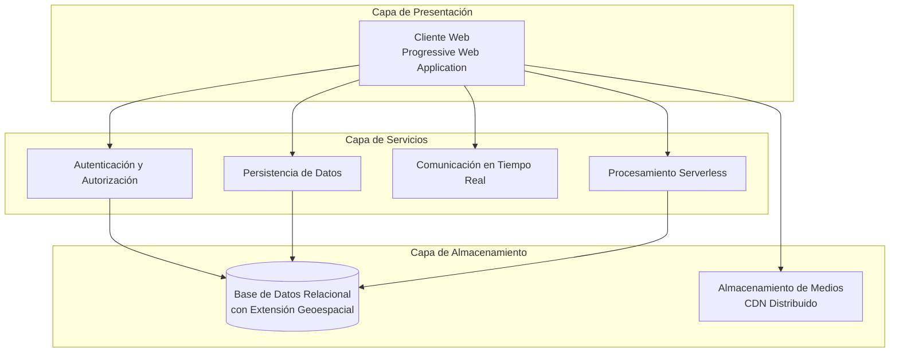
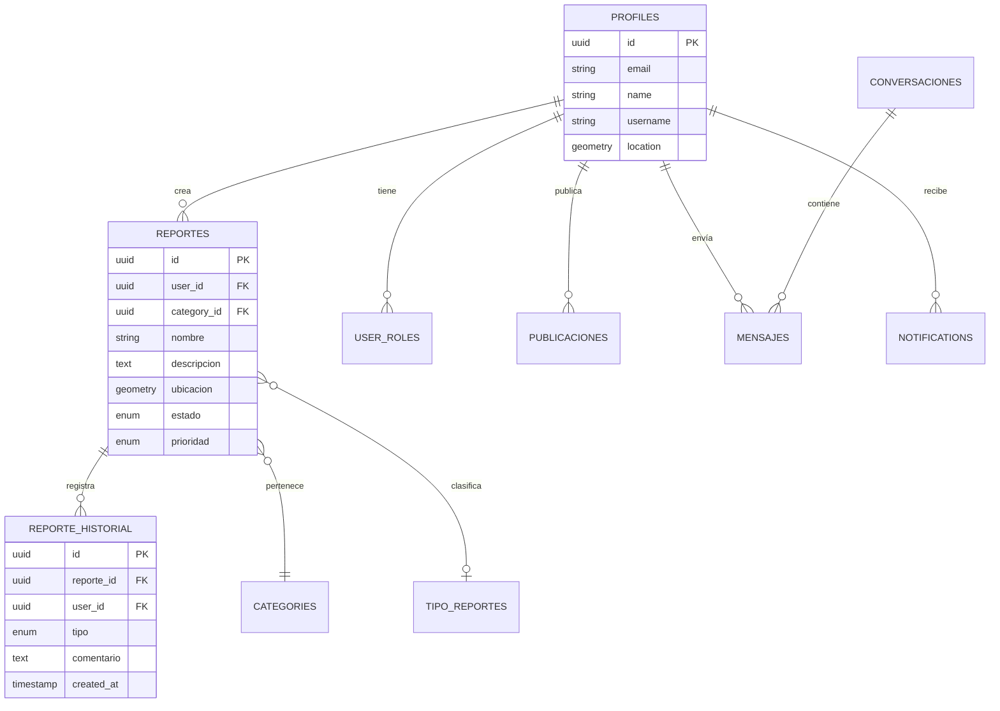
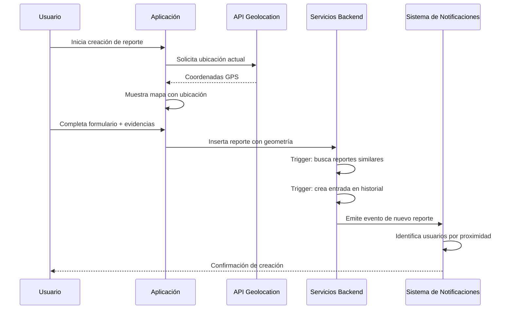
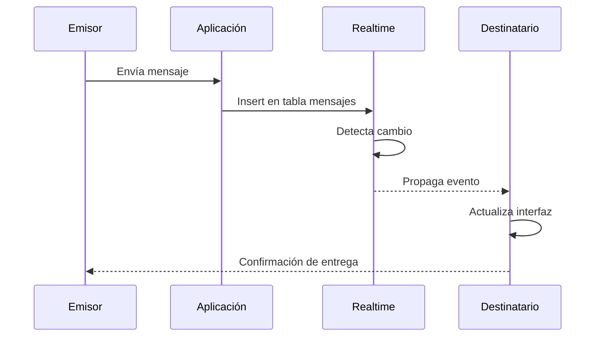

# Capítulo: Desarrollo del Proyecto

## Arquitectura y Plataformas Tecnológicas

### 1. Contextualización de la Problemática en el Entorno del Sistema

UniAlerta UCE surge como respuesta a una necesidad institucional específica: la Universidad Central del Ecuador carecía de un sistema unificado para la gestión de incidentes, reportes y alertas dentro de su extenso campus universitario. Los procesos existentes dependían de comunicaciones dispersas —correos electrónicos, formularios físicos, llamadas telefónicas y mensajería informal— que operaban de manera aislada, sin integración ni trazabilidad.

Esta fragmentación generaba consecuencias operativas directas: los incidentes reportados carecían de un registro centralizado que permitiera su seguimiento; la ubicación de los eventos se describía textualmente, dificultando la localización precisa; no existía retroalimentación hacia los usuarios reportantes sobre el estado de sus solicitudes; y la asignación de personal para atención dependía de coordinaciones manuales sin criterios objetivos como la proximidad geográfica.

El software desarrollado aborda esta problemática mediante una plataforma web integral que centraliza el ciclo completo de gestión de incidentes: desde la captura georreferenciada del reporte hasta su resolución con trazabilidad completa, incorporando comunicación bidireccional en tiempo real y notificaciones instantáneas.

### 2. Problemática Específica que Fundamenta la Arquitectura

El diseño arquitectónico de UniAlerta UCE responde a limitaciones concretas identificadas en el contexto operativo de la institución. Estas limitaciones determinaron los requerimientos técnicos que la plataforma debía satisfacer:

#### 2.1 Limitaciones que Condicionaron las Decisiones Arquitectónicas

| Limitación Identificada | Requerimiento Derivado | Decisión Arquitectónica |
|------------------------|------------------------|-------------------------|
| Canales de comunicación dispersos sin registro común | Punto único de acceso multiplataforma | Progressive Web Application (PWA) accesible desde cualquier dispositivo con navegador |
| Descripciones textuales ambiguas de ubicaciones | Captura de coordenadas precisas y visualización cartográfica | Integración de API Geolocation, Leaflet y almacenamiento PostGIS |
| Ausencia de seguimiento del ciclo de vida de reportes | Registro automático de cada cambio de estado y acción | Modelo de datos con tabla de historial y triggers de auditoría |
| Comunicación unidireccional sin retroalimentación | Canal de mensajería integrado al flujo de gestión | Sistema de conversaciones con suscripciones en tiempo real |
| Demoras en asignación por coordinación manual | Mecanismos de notificación instantánea | Supabase Realtime con WebSocket para eventos en tiempo real |
| Inexistencia de métricas operativas | Agregación de datos para análisis y toma de decisiones | Dashboard con consultas analíticas y visualización de indicadores |

#### 2.2 Restricciones Técnicas del Contexto

El entorno institucional impuso condiciones adicionales que influyeron en la selección de plataformas:

- **Diversidad de dispositivos**: Los usuarios acceden desde computadoras de escritorio, laptops y dispositivos móviles con diferentes sistemas operativos y capacidades.
- **Conectividad variable**: La infraestructura de red del campus presenta zonas con conectividad limitada, requiriendo tolerancia a conexiones intermitentes.
- **Recursos de infraestructura**: La institución no disponía de servidores dedicados ni personal especializado para administración de sistemas backend.
- **Presupuesto acotado**: La solución debía minimizar costos de licenciamiento y operación.

Estas restricciones orientaron la arquitectura hacia un modelo que aprovecha servicios gestionados en la nube, minimizando la dependencia de infraestructura propia y maximizando la accesibilidad desde cualquier dispositivo.

### 3. Justificación de la Arquitectura Adoptada

La arquitectura de UniAlerta UCE se estructura en tres capas diferenciadas, cada una con responsabilidades específicas que responden a los requerimientos derivados de la problemática:

#### 3.1 Capa de Presentación: Progressive Web Application

La decisión de implementar UniAlerta UCE como Progressive Web Application responde directamente a la problemática de acceso disperso y diversidad de dispositivos:

**Justificación en el contexto del sistema:**
- **Accesibilidad universal**: Una única base de código sirve a todos los dispositivos, eliminando la necesidad de desarrollar aplicaciones nativas separadas para cada plataforma móvil.
- **Instalabilidad opcional**: Los usuarios pueden instalar la aplicación en sus dispositivos móviles, obteniendo acceso directo desde la pantalla de inicio sin depender de tiendas de aplicaciones.
- **Funcionamiento offline parcial**: El service worker permite operación con conectividad limitada, almacenando en caché recursos estáticos y datos frecuentes.
- **Actualizaciones transparentes**: Los cambios se despliegan automáticamente sin requerir intervención del usuario.

El frontend se construye sobre un framework de componentes que permite estructurar la interfaz de manera modular, facilitando el mantenimiento y la extensibilidad del sistema.

#### 3.2 Capa de Servicios: Backend como Servicio

La capa de servicios adopta un modelo Backend-as-a-Service (BaaS) que provee funcionalidades preconfiguradas sin requerir desarrollo ni administración de infraestructura propia:

**Justificación en el contexto del sistema:**
- **Autenticación gestionada**: El sistema de autenticación maneja registro, inicio de sesión, recuperación de contraseñas y gestión de sesiones sin desarrollo adicional.
- **Base de datos con API automática**: Las tablas definidas exponen automáticamente endpoints para operaciones CRUD, reduciendo la cantidad de código backend requerido.
- **Suscripciones en tiempo real**: Los cambios en la base de datos se propagan instantáneamente a los clientes suscritos, habilitando la comunicación en tiempo real sin infraestructura de WebSocket dedicada.
- **Funciones serverless**: Lógica de negocio específica se ejecuta en funciones bajo demanda, sin servidores persistentes que administrar.

Este modelo resuelve la restricción de recursos de infraestructura identificada en el contexto, delegando la administración de servidores, escalabilidad y disponibilidad al proveedor del servicio.

#### 3.3 Capa de Almacenamiento: Persistencia Especializada

La capa de almacenamiento combina una base de datos relacional con extensiones geoespaciales y un servicio de distribución de contenido multimedia:

**Justificación en el contexto del sistema:**
- **Modelo relacional**: La naturaleza estructurada de los datos del sistema —reportes, usuarios, categorías, mensajes— se mapea naturalmente a tablas relacionales con integridad referencial.
- **Extensión geoespacial**: El almacenamiento de coordenadas geográficas y la ejecución de consultas por proximidad requieren tipos de datos y funciones especializadas que la extensión PostGIS provee.
- **CDN para medios**: Las evidencias fotográficas adjuntas a los reportes se almacenan en un servicio de distribución de contenido que optimiza la entrega según la ubicación del usuario.

### 4. Plataformas Tecnológicas Seleccionadas

La selección de plataformas tecnológicas responde a los requerimientos específicos derivados de la problemática, privilegiando soluciones que maximizan la funcionalidad con mínima complejidad operativa:

#### 4.1 Plataforma de Frontend

| Componente | Función en el Sistema |
|------------|----------------------|
| **Framework de componentes** | Estructuración modular de la interfaz con componentes reutilizables |
| **Tipado estático** | Detección temprana de errores y documentación implícita del código |
| **Herramienta de construcción** | Empaquetado optimizado y servidor de desarrollo con recarga instantánea |
| **Sistema de estilos utilitarios** | Diseño responsivo consistente sin archivos CSS personalizados extensos |
| **Enrutamiento declarativo** | Navegación entre vistas sin recarga completa de página |
| **Gestión de estado del servidor** | Caché de datos remotos con actualizaciones optimistas |
| **Biblioteca de mapas** | Visualización cartográfica interactiva con soporte para marcadores, polígonos y capas |

#### 4.2 Plataforma de Backend

| Servicio | Función en el Sistema |
|----------|----------------------|
| **Autenticación** | Gestión de identidad: registro, login, tokens JWT, recuperación de contraseñas |
| **Base de datos** | Almacenamiento relacional con 44 tablas interrelacionadas |
| **Extensión geoespacial** | Tipos de datos geográficos, índices espaciales y funciones de proximidad |
| **Suscripciones en tiempo real** | Propagación instantánea de cambios a clientes suscritos |
| **Funciones serverless** | Ejecución de lógica backend bajo demanda |
| **Seguridad a nivel de fila** | Políticas declarativas que controlan el acceso a datos según el usuario autenticado |

#### 4.3 Servicios Complementarios

| Servicio | Función en el Sistema |
|----------|----------------------|
| **CDN de medios** | Almacenamiento, transformación y distribución de imágenes y videos |
| **Proveedor de tiles cartográficos** | Imágenes de mapa base sin costos de licenciamiento |

### 5. Arquitectura de Datos

El modelo de datos de UniAlerta UCE se estructura para soportar los procesos identificados en la problemática. Las entidades principales y sus relaciones reflejan el flujo operativo del sistema:

El modelo incorpora:
- **Trazabilidad completa**: Cada modificación a un reporte genera un registro en la tabla de historial.
- **Georreferenciación nativa**: Las ubicaciones se almacenan como tipos de datos geométricos que soportan índices espaciales.
- **Sistema de roles y permisos**: La relación entre perfiles y roles determina las capacidades de cada usuario.
- **Soft delete**: Las entidades principales utilizan marcas de eliminación lógica para preservar integridad referencial.

### 6. Flujos de Información

La arquitectura soporta flujos de información que resuelven las limitaciones operativas identificadas:

#### 6.1 Flujo de Creación de Reporte con Geolocalización

Este flujo resuelve la problemática de ubicaciones ambiguas mediante la captura automática de coordenadas GPS, mientras que los triggers de base de datos garantizan la creación automática del historial sin intervención adicional.

#### 6.2 Flujo de Comunicación en Tiempo Real

La comunicación bidireccional elimina la necesidad de canales externos, integrando la mensajería directamente en el flujo de gestión de reportes.

### 7. Consideraciones de Seguridad

La arquitectura incorpora mecanismos de seguridad que protegen los datos y controlan el acceso:

| Mecanismo | Implementación | Propósito |
|-----------|----------------|-----------|
| **Autenticación JWT** | Tokens firmados con expiración | Verificación de identidad en cada solicitud |
| **Row Level Security** | Políticas SQL declarativas | Control de acceso a nivel de registro |
| **Sistema de roles** | Tabla `user_roles` con permisos asociados | Autorización granular por funcionalidad |
| **Auditoría automática** | Triggers en tablas principales | Registro de acciones para accountability |
| **Encriptación en tránsito** | HTTPS obligatorio | Protección de datos en comunicación |

Las políticas de seguridad a nivel de fila garantizan que los usuarios solo accedan a los datos para los cuales tienen autorización, sin requerir validaciones adicionales en el código de la aplicación.

### 8. Síntesis Arquitectónica

La arquitectura de UniAlerta UCE se diseñó como respuesta directa a la problemática identificada en el contexto institucional. La selección de una Progressive Web Application como capa de presentación resuelve la necesidad de acceso multiplataforma sin multiplicar esfuerzos de desarrollo. El modelo Backend-as-a-Service elimina la dependencia de infraestructura propia, delegando la administración de servidores y escalabilidad a servicios gestionados. La integración de capacidades geoespaciales permite la captura, almacenamiento y consulta de ubicaciones con precisión cartográfica. Los mecanismos de tiempo real habilitan la comunicación bidireccional que estaba ausente en los procesos tradicionales.

Esta configuración arquitectónica establece las bases técnicas sobre las cuales se implementan los módulos funcionales del sistema: gestión de reportes, mensajería, notificaciones, dashboard analítico, auditoría y rastreo en tiempo real, cuyo desarrollo detallado corresponde a secciones posteriores de este documento.
