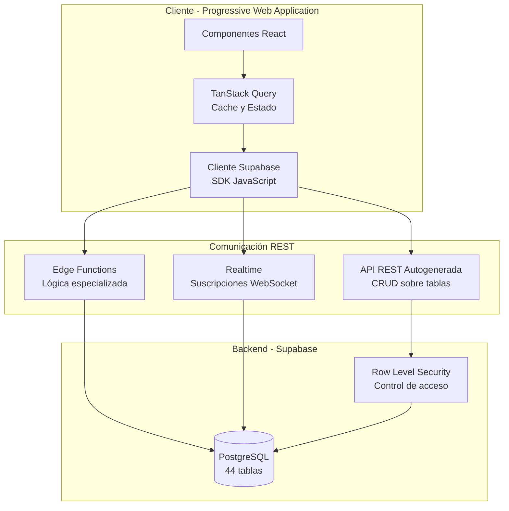
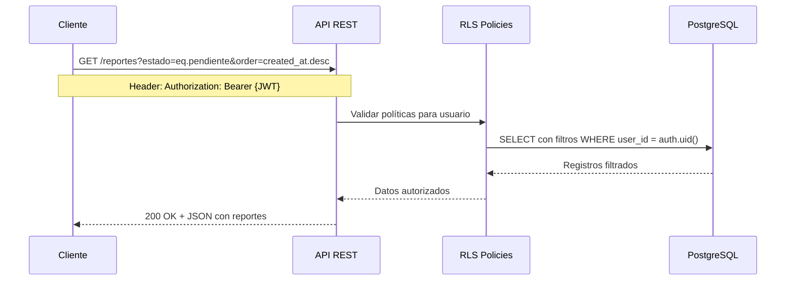
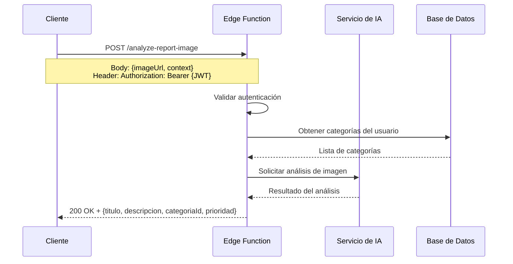
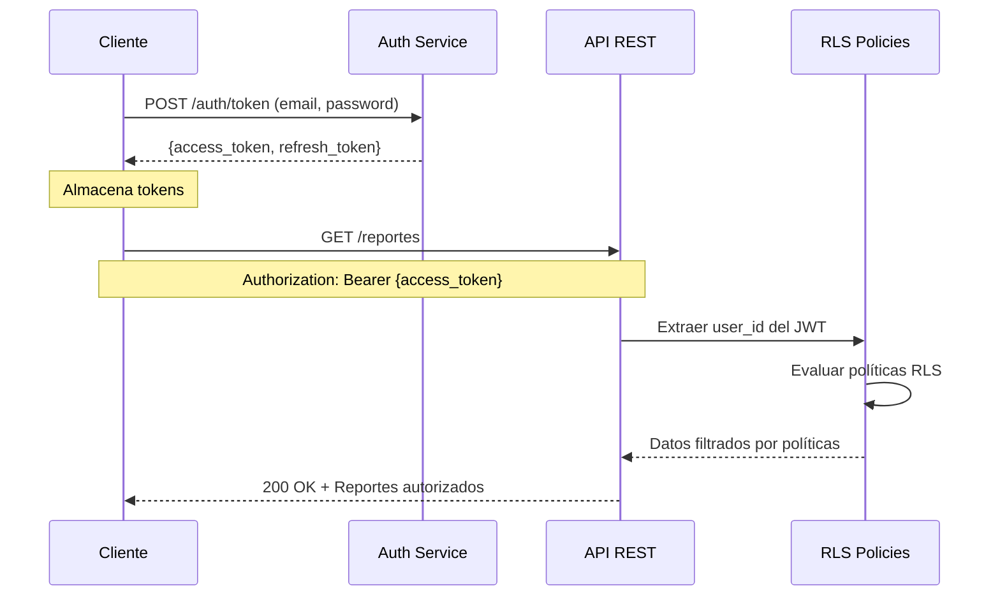
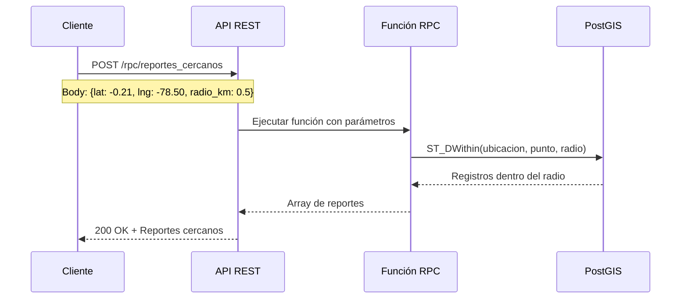
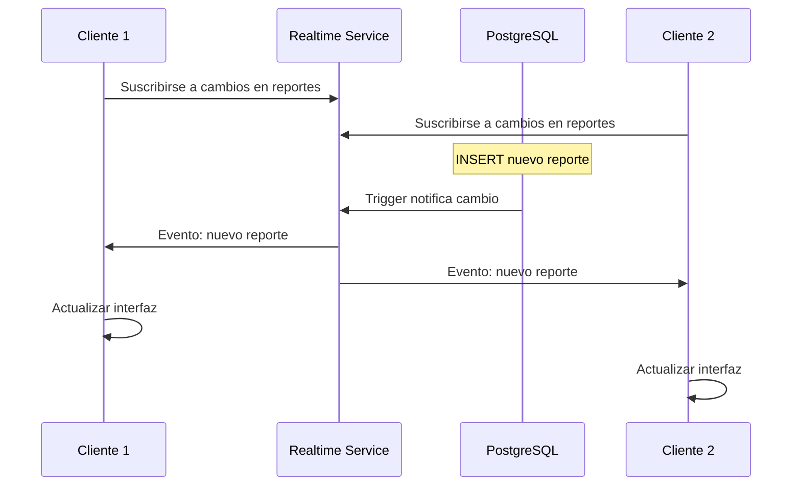
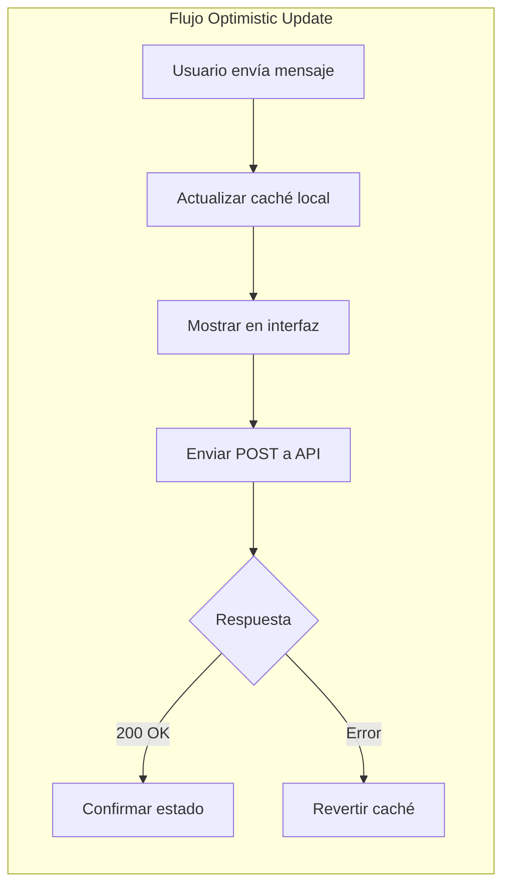

# Capítulo: Desarrollo del Proyecto

## Arquitectura de Transferencia de Estado Representacional (REST)

### 1. Contextualización de la Problemática de Comunicación

UniAlerta UCE opera como una aplicación web distribuida donde el cliente (navegador) y los servicios de backend residen en sistemas separados. Esta separación impone la necesidad de establecer mecanismos de comunicación que permitan al cliente solicitar datos, enviar información y ejecutar operaciones sobre los recursos del sistema —reportes, usuarios, mensajes, notificaciones— de manera estructurada y predecible.

El contexto operativo del sistema presenta requerimientos específicos de comunicación:

- **Operaciones CRUD sobre múltiples entidades**: El sistema gestiona 44 tablas interrelacionadas que requieren operaciones de creación, lectura, actualización y eliminación.
- **Consultas con filtros dinámicos**: Los usuarios necesitan filtrar reportes por estado, categoría, fecha, ubicación geográfica y otros criterios combinables.
- **Comunicación en tiempo real**: Los cambios en reportes, mensajes y notificaciones deben propagarse instantáneamente a los clientes interesados.
- **Procesamiento especializado**: Ciertas operaciones requieren lógica de negocio que no puede ejecutarse en el cliente, como el análisis de imágenes mediante inteligencia artificial o la limpieza de datos obsoletos.

Estas necesidades determinaron la adopción de una arquitectura de comunicación basada en los principios REST, complementada con suscripciones en tiempo real para eventos que requieren propagación inmediata.

### 2. Problemática Específica de Comunicación en el Sistema

Antes de definir la arquitectura de comunicación, se identificaron limitaciones y requerimientos que condicionaron las decisiones técnicas:

#### 2.1 Limitaciones que Motivaron la Arquitectura REST

| Limitación Identificada | Manifestación en el Sistema | Solución Requerida |
|------------------------|----------------------------|-------------------|
| Diversidad de clientes | Usuarios acceden desde navegadores de escritorio, móviles y tabletas con diferentes capacidades | Interfaz de comunicación estándar e independiente del cliente |
| Operaciones heterogéneas | Desde consultas simples hasta transacciones complejas con múltiples entidades | Endpoints con semántica clara y operaciones predecibles |
| Estado distribuido | Los datos residen en el servidor pero la interfaz se renderiza en el cliente | Transferencia de estado representacional sin acoplamiento |
| Autenticación distribuida | Las solicitudes provienen de usuarios autenticados cuya identidad debe validarse en cada petición | Tokens portables que acompañan cada solicitud |
| Consultas geoespaciales | Los reportes requieren filtrado por proximidad geográfica | Parámetros de consulta que soporten coordenadas y radios de búsqueda |

#### 2.2 Requerimientos de Comunicación Derivados

El análisis de los procesos del sistema identificó patrones de comunicación recurrentes:

**Operaciones de lectura con filtrado dinámico:**
- Obtener reportes filtrados por estado, categoría, fecha y usuario creador
- Listar mensajes de una conversación con paginación
- Consultar notificaciones no leídas del usuario autenticado
- Buscar usuarios por proximidad geográfica a un punto

**Operaciones de escritura con validación:**
- Crear reportes con coordenadas geográficas y evidencias multimedia
- Actualizar estados de reportes con registro automático en historial
- Enviar mensajes con adjuntos y menciones
- Modificar configuraciones del usuario

**Operaciones especializadas:**
- Análisis de imágenes mediante inteligencia artificial para sugerir categorización
- Limpieza de ubicaciones de usuarios desconectados
- Detección de reportes duplicados por proximidad geográfica y temporal

### 3. Arquitectura REST Adoptada en el Sistema

La arquitectura de comunicación de UniAlerta UCE implementa los principios REST mediante dos mecanismos complementarios: una API REST autogenerada por la plataforma de backend y funciones serverless para operaciones especializadas.



#### 3.1 API REST Autogenerada

La plataforma de backend genera automáticamente endpoints REST para cada tabla definida en el esquema de base de datos. Esta generación automática garantiza consistencia entre el modelo de datos y la interfaz de comunicación.

**Características de la API autogenerada:**

| Característica | Implementación en el Sistema |
|---------------|------------------------------|
| **Endpoints por tabla** | Cada tabla expone un endpoint REST con operaciones CRUD estándar |
| **Verbos HTTP semánticos** | GET para lectura, POST para creación, PATCH para actualización parcial, DELETE para eliminación |
| **Filtrado por parámetros** | Los query parameters permiten filtrar por cualquier columna con operadores de comparación |
| **Paginación integrada** | Parámetros `limit` y `offset` para control de resultados |
| **Ordenamiento configurable** | Parámetro `order` con columna y dirección |
| **Selección de columnas** | Parámetro `select` para obtener solo las columnas necesarias |
| **Relaciones anidadas** | La sintaxis de select permite incluir datos de tablas relacionadas |

**Ejemplo conceptual de comunicación REST para reportes:**



#### 3.2 Funciones Serverless (Edge Functions)

Las operaciones que requieren lógica de negocio no expresable en consultas SQL se implementan como funciones serverless. Estas funciones exponen endpoints REST independientes que ejecutan código bajo demanda.

**Funciones implementadas en UniAlerta UCE:**

| Función | Propósito | Endpoint REST |
|---------|-----------|---------------|
| `analyze-report-image` | Analiza imágenes mediante IA para sugerir categoría, tipo y prioridad de reportes | POST /functions/v1/analyze-report-image |
| `cleanup-user-locations` | Elimina ubicaciones de usuarios inactivos o desconectados | POST /functions/v1/cleanup-user-locations |

**Flujo de comunicación con Edge Functions:**



Las Edge Functions siguen los principios REST:
- **Interfaz uniforme**: Reciben solicitudes HTTP con verbos estándar
- **Sin estado**: Cada solicitud contiene toda la información necesaria (token JWT)
- **Representación de recursos**: Retornan datos en formato JSON

### 4. Representación de Recursos

Los recursos del sistema se representan en formato JSON, siguiendo convenciones consistentes que facilitan el procesamiento en el cliente.

#### 4.1 Estructura de Recursos Principales

**Recurso Reporte:**
```
{
  "id": "uuid",
  "nombre": "string",
  "descripcion": "string",
  "estado": "pendiente|en_proceso|resuelto|rechazado",
  "prioridad": "bajo|medio|alto|urgente",
  "ubicacion": {"lat": number, "lng": number},
  "imagenes": ["url", ...],
  "category_id": "uuid",
  "user_id": "uuid",
  "created_at": "timestamp",
  "updated_at": "timestamp"
}
```

**Recurso Usuario (Perfil):**
```
{
  "id": "uuid",
  "name": "string",
  "username": "string",
  "email": "string",
  "avatar": "url",
  "estado": "activo|inactivo|suspendido",
  "created_at": "timestamp"
}
```

**Recurso Mensaje:**
```
{
  "id": "uuid",
  "contenido": "string",
  "conversacion_id": "uuid",
  "user_id": "uuid",
  "imagenes": ["url", ...],
  "created_at": "timestamp"
}
```

#### 4.2 Respuestas de la API

Las respuestas REST siguen patrones predecibles según el tipo de operación:

| Operación | Código HTTP | Cuerpo de Respuesta |
|-----------|-------------|---------------------|
| Lectura exitosa (lista) | 200 OK | Array de recursos JSON |
| Lectura exitosa (único) | 200 OK | Objeto JSON del recurso |
| Creación exitosa | 201 Created | Recurso creado con ID asignado |
| Actualización exitosa | 200 OK | Recurso actualizado |
| Eliminación exitosa | 204 No Content | Sin cuerpo |
| Error de validación | 400 Bad Request | Objeto con descripción del error |
| No autenticado | 401 Unauthorized | Objeto con mensaje de error |
| No autorizado | 403 Forbidden | Objeto con mensaje de error |
| Recurso no encontrado | 404 Not Found | Objeto con mensaje de error |
| Error interno | 500 Internal Server Error | Objeto con descripción del error |

### 5. Autenticación en la Comunicación REST

Cada solicitud REST incluye un token JWT (JSON Web Token) que identifica al usuario autenticado. Este token se transmite en el encabezado Authorization y es validado automáticamente por la plataforma de backend.



El modelo de autenticación REST implementado garantiza:
- **Tokens autocontenidos**: El JWT incluye la identidad del usuario sin requerir consultas adicionales
- **Expiración controlada**: Los tokens tienen tiempo de vida limitado, requiriendo renovación periódica
- **Refresh transparente**: El cliente renueva tokens expirados automáticamente usando el refresh token
- **Transmisión segura**: Todas las comunicaciones utilizan HTTPS

### 6. Consultas Geoespaciales REST

El sistema extiende las capacidades REST estándar para soportar consultas geoespaciales, fundamentales para la funcionalidad de reportes geolocalizados.

**Operaciones geoespaciales expuestas:**

| Operación | Descripción | Implementación REST |
|-----------|-------------|---------------------|
| Reportes por proximidad | Obtener reportes dentro de un radio desde un punto | Función RPC invocada via POST |
| Usuarios cercanos | Listar usuarios con ubicación dentro de un área | Función RPC con parámetros de coordenadas |
| Detección de duplicados | Identificar reportes similares por proximidad | Función RPC combinando distancia y tiempo |



### 7. Comunicación en Tiempo Real

Complementando la arquitectura REST tradicional, el sistema implementa suscripciones en tiempo real para eventos que requieren propagación inmediata. Esta funcionalidad utiliza WebSocket como transporte, manteniendo los principios de representación de recursos.

**Eventos en tiempo real del sistema:**

| Evento | Recurso | Propagación |
|--------|---------|-------------|
| Nuevo mensaje | Mensajes | Participantes de la conversación |
| Cambio de estado de reporte | Reportes | Creador y usuarios asignados |
| Nueva notificación | Notificaciones | Usuario destinatario |
| Actualización de ubicación | User Locations | Usuarios rastreando al operador |
| Nuevo reporte cercano | Reportes | Usuarios en el radio definido |



### 8. Manejo de Estado en el Cliente

El cliente implementa una capa de caché que optimiza la comunicación REST, minimizando solicitudes redundantes y proporcionando actualizaciones optimistas.

**Estrategias de caché implementadas:**

| Estrategia | Aplicación | Beneficio |
|------------|------------|-----------|
| **Stale-While-Revalidate** | Datos frecuentes (dashboard) | Respuesta inmediata con revalidación en background |
| **Cache-First** | Datos estáticos (categorías) | Reducción de solicitudes para datos poco cambiantes |
| **Network-First** | Datos críticos (mensajes) | Prioridad a datos actualizados |
| **Optimistic Updates** | Operaciones de escritura | Retroalimentación inmediata al usuario |



### 9. Síntesis de la Arquitectura REST

La arquitectura de comunicación de UniAlerta UCE implementa los principios REST para establecer una interfaz predecible entre el cliente y los servicios de backend. La API autogenerada proporciona endpoints CRUD para las 44 tablas del sistema, mientras que las Edge Functions exponen operaciones especializadas que requieren lógica de negocio no expresable en consultas directas.

La autenticación mediante JWT garantiza que cada solicitud porte la identidad del usuario, permitiendo que las políticas de seguridad a nivel de fila filtren los datos según los permisos correspondientes. Las extensiones geoespaciales habilitan consultas por proximidad fundamentales para el contexto de reportes geolocalizados.

La complementación con suscripciones en tiempo real permite que los eventos críticos —mensajes, notificaciones, cambios de estado— se propaguen instantáneamente sin polling, mientras que la capa de caché en el cliente optimiza el rendimiento reduciendo solicitudes redundantes y proporcionando retroalimentación inmediata mediante actualizaciones optimistas.
