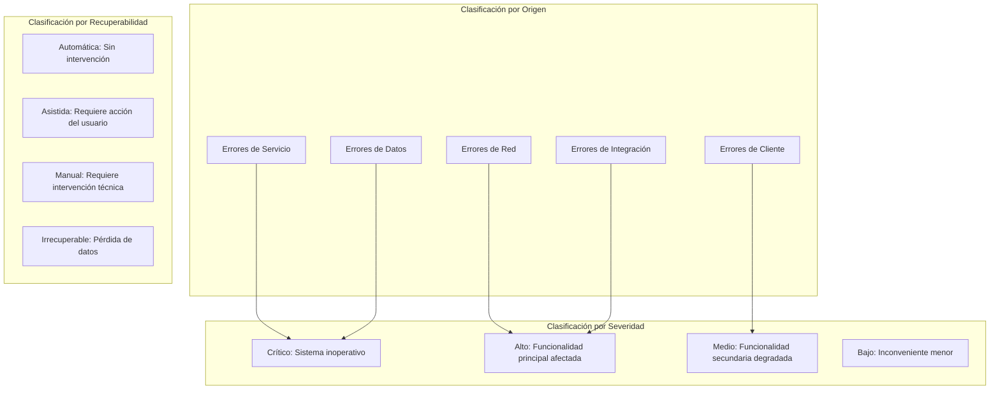
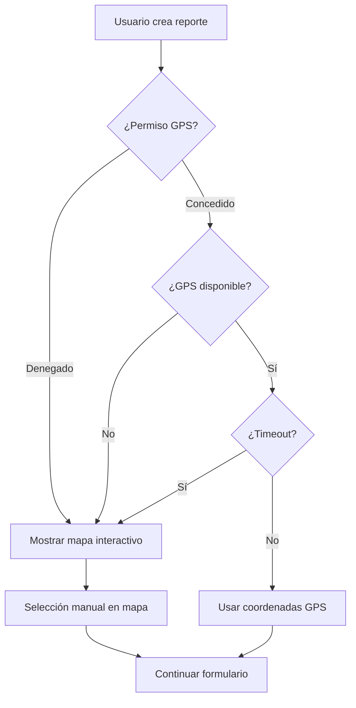
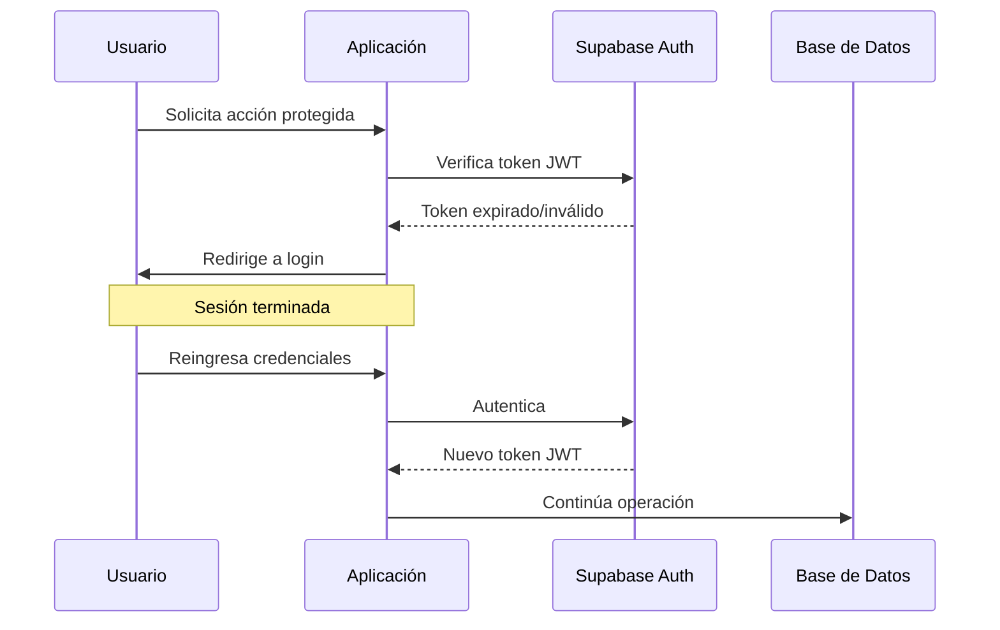
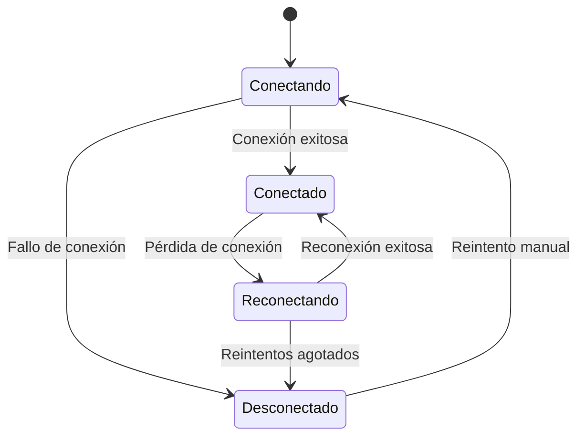
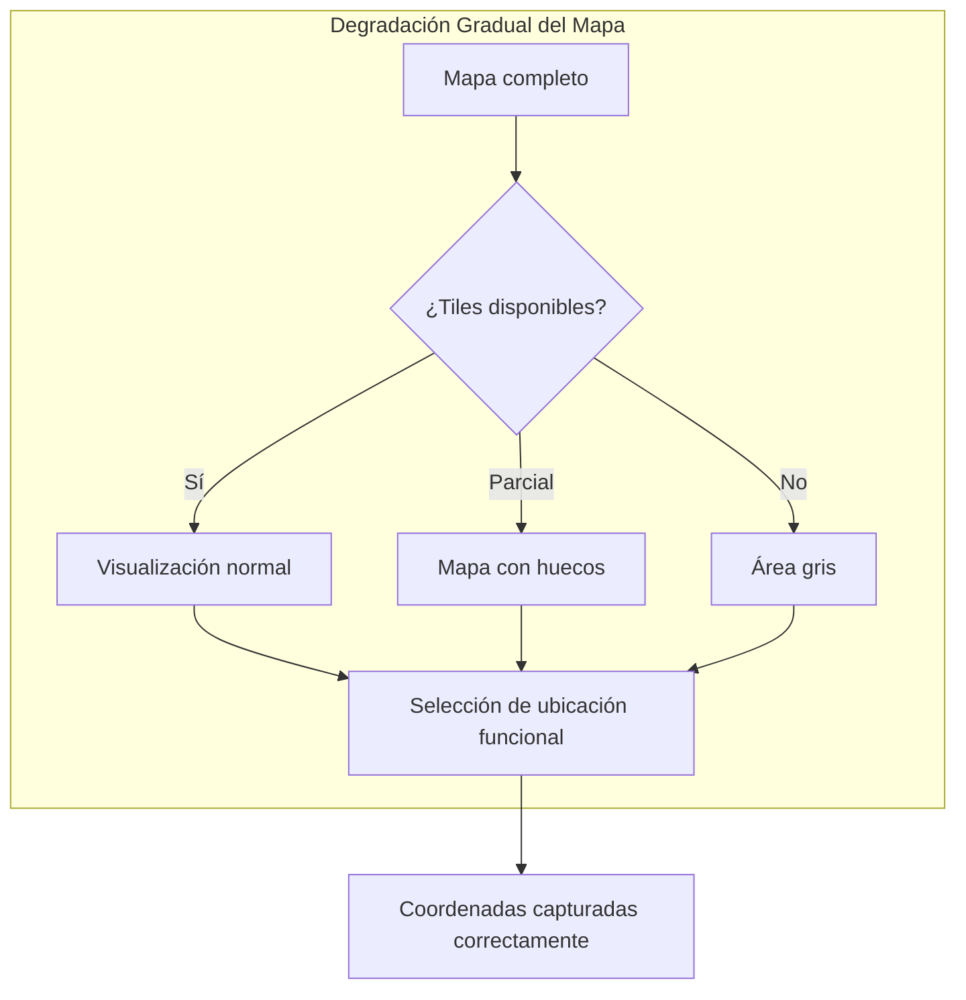
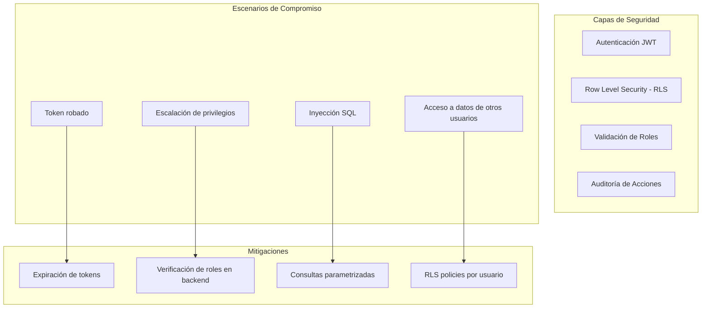
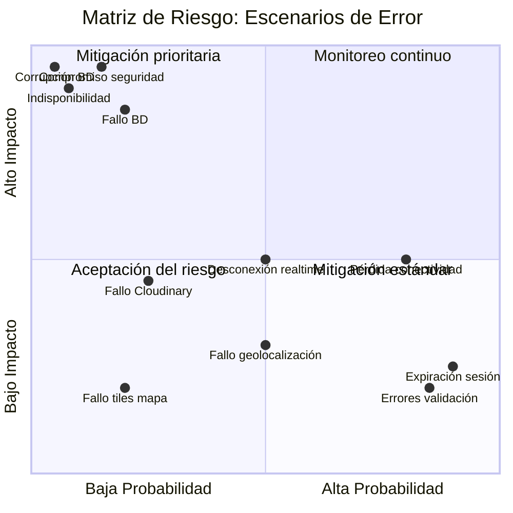

# Capítulo: Desarrollo del Proyecto

## Clasificación de Escenarios de Error y Desastre

### Contextualización del Problema

UniAlerta UCE, como plataforma de gestión de incidentes universitarios, opera en un entorno donde la disponibilidad continua y la integridad de los datos resultan críticas para el cumplimiento de su propósito. El sistema procesa reportes que pueden involucrar situaciones de seguridad, infraestructura o servicios que requieren atención oportuna; por tanto, la identificación anticipada de escenarios de fallo constituye un elemento esencial para garantizar la confiabilidad operativa de la plataforma.

La naturaleza distribuida de la arquitectura —aplicación cliente ejecutándose en navegadores, servicios backend en la nube, base de datos PostgreSQL, almacenamiento de medios en CDN externo y dependencias de APIs de terceros para geolocalización— introduce múltiples puntos de falla potencial que deben ser caracterizados según su origen, impacto y estrategias de mitigación aplicables.

### Taxonomía de Escenarios de Error

Los escenarios de error en UniAlerta UCE se clasifican según el componente afectado, la severidad del impacto y la capacidad de recuperación del sistema:

### Escenarios de Error en la Capa de Cliente

#### Pérdida de Conectividad Durante Operación

**Descripción del escenario**: El usuario pierde conexión a internet mientras interactúa con la aplicación, ya sea durante la creación de un reporte, envío de mensajes o navegación general.

**Manifestación en UniAlerta UCE**: La aplicación, construida como Progressive Web Application (PWA), detecta la pérdida de conectividad e informa al usuario mediante indicadores visuales. Las operaciones de escritura (crear reporte, enviar mensaje) quedan suspendidas hasta la restauración de la conexión.

**Impacto funcional**:

| Funcionalidad | Comportamiento Offline | Severidad |
|---------------|----------------------|-----------|
| Visualización de datos cacheados | Disponible (datos previos) | Bajo |
| Creación de nuevos reportes | Suspendida | Alto |
| Envío de mensajes | Suspendida | Medio |
| Geolocalización | Disponible (GPS local) | Bajo |
| Carga de imágenes | Suspendida | Medio |

**Estrategia de mitigación implementada**: TanStack Query mantiene en caché las consultas previas, permitiendo visualización de datos históricos. Las mutaciones pendientes se gestionan mediante el estado de la consulta, notificando al usuario cuando la operación no puede completarse.

#### Fallo en la Obtención de Geolocalización

**Descripción del escenario**: El navegador no puede obtener la ubicación del dispositivo debido a denegación de permisos, falta de GPS, o timeout en la adquisición de coordenadas.

**Manifestación en UniAlerta UCE**: El formulario de creación de reportes requiere ubicación geográfica. Si el sistema no puede obtener coordenadas automáticamente, se presenta el mapa interactivo para selección manual.

**Impacto funcional**: La funcionalidad de reportes no se bloquea; el usuario conserva la capacidad de indicar ubicación mediante alternativas visuales. Sin embargo, la precisión depende de la habilidad del usuario para identificar el punto correcto en el mapa.

#### Errores de Validación en Formularios

**Descripción del escenario**: Los datos ingresados por el usuario no cumplen con las reglas de validación definidas en el esquema (campos requeridos vacíos, formatos incorrectos, valores fuera de rango).

**Manifestación en UniAlerta UCE**: El sistema emplea Zod para validación de esquemas y React Hook Form para gestión de formularios. Los errores se presentan de manera contextual junto a cada campo afectado, sin pérdida de los datos ya ingresados.

| Campo | Validación | Mensaje de Error |
|-------|------------|------------------|
| Nombre del reporte | Requerido, mínimo 3 caracteres | "El nombre debe tener al menos 3 caracteres" |
| Email | Formato válido | "Ingrese un correo electrónico válido" |
| Contraseña | Mínimo 8 caracteres, complejidad | "La contraseña debe incluir mayúsculas, minúsculas y números" |
| Ubicación | Coordenadas dentro del campus | "Seleccione una ubicación válida" |
| Imágenes | Formato permitido, tamaño máximo | "El archivo debe ser JPG, PNG o WebP, máximo 10MB" |

**Estrategia de mitigación**: Validación en tiempo real (on blur y on change) para retroalimentación inmediata. Persistencia del estado del formulario ante recarga accidental mediante el estado local del componente.

### Escenarios de Error en la Capa de Servicios

#### Fallo de Autenticación y Sesión

**Descripción del escenario**: El token de sesión del usuario expira, es revocado, o el servicio de autenticación no está disponible.

**Manifestación en UniAlerta UCE**: El AuthContext detecta la invalidez de la sesión y redirige al usuario a la pantalla de inicio de sesión. Las operaciones en curso se interrumpen con notificación al usuario.

**Impacto funcional**:

| Tipo de Fallo | Causa | Consecuencia | Recuperación |
|---------------|-------|--------------|--------------|
| Token expirado | Tiempo de sesión agotado | Redirección a login | Automática tras reautenticación |
| Token revocado | Cambio de contraseña, logout en otro dispositivo | Sesión terminada | Manual: nuevo login |
| Servicio no disponible | Falla en Supabase Auth | Imposibilidad de autenticar | Esperar restauración del servicio |

**Estrategia de mitigación**: El sistema implementa refresh tokens para renovación automática de sesiones antes de la expiración. El hook `useSessionPersistence` mantiene la sesión sincronizada entre pestañas del navegador.

#### Fallo en Operaciones de Base de Datos

**Descripción del escenario**: Las operaciones de lectura o escritura en la base de datos PostgreSQL fallan debido a violación de restricciones, timeout de conexión, o indisponibilidad del servicio.

**Manifestación en UniAlerta UCE**: Los hooks de entidades (`useOptimizedReportes`, `useOptimizedUsers`, etc.) capturan errores de Supabase y los propagan al componente para manejo visual. Las mutaciones fallidas muestran notificaciones toast con descripción del error.

| Tipo de Error | Código | Causa Típica | Manejo |
|---------------|--------|--------------|--------|
| Violación de unicidad | 23505 | Email o username duplicado | Mensaje específico al usuario |
| Violación de foreign key | 23503 | Referencia a registro inexistente | Recarga de datos relacionados |
| Violación de check | 23514 | Valor fuera de rango permitido | Mensaje de validación |
| Timeout | 57014 | Consulta excede tiempo límite | Reintento automático |
| Conexión rechazada | - | Servicio no disponible | Mensaje de servicio no disponible |

**Estrategia de mitigación**: TanStack Query implementa reintentos automáticos con backoff exponencial para errores transitorios. Los errores de validación de datos se capturan antes del envío mediante validación del lado cliente.

#### Fallo en Suscripciones de Tiempo Real

**Descripción del escenario**: Las conexiones WebSocket para actualizaciones en tiempo real (mensajes, notificaciones, cambios de estado) se interrumpen o fallan al establecerse.

**Manifestación en UniAlerta UCE**: El sistema emplea Supabase Realtime para suscripciones a cambios en tablas críticas. Una desconexión del canal WebSocket provoca que el usuario deje de recibir actualizaciones inmediatas.

**Impacto funcional**:

| Funcionalidad Afectada | Consecuencia | Alternativa |
|------------------------|--------------|-------------|
| Mensajería en tiempo real | Mensajes no aparecen inmediatamente | Polling manual al abrir conversación |
| Notificaciones push | Alertas retrasadas | Recarga de página |
| Estado de presencia online | Usuarios aparecen offline | Consulta al recargar |
| Actualizaciones de reportes | Cambios de estado no reflejados | Refetch en intervalo |

**Estrategia de mitigación**: El cliente de Supabase implementa reconexión automática con backoff. Los componentes críticos combinan suscripciones realtime con refetch periódico como fallback.

### Escenarios de Error en Integraciones Externas

#### Fallo en Servicio de Almacenamiento de Medios (Cloudinary)

**Descripción del escenario**: El servicio de Cloudinary no está disponible o rechaza las solicitudes de carga de imágenes.

**Manifestación en UniAlerta UCE**: El hook `useCloudinaryUpload` detecta fallos en la carga y notifica al usuario. El reporte puede guardarse sin imágenes, con opción de adjuntar evidencias posteriormente.

| Tipo de Fallo | Causa | Impacto | Mitigación |
|---------------|-------|---------|------------|
| Timeout de carga | Conexión lenta, archivo grande | Imagen no adjuntada | Compresión previa, reintentos |
| Rechazo por tamaño | Archivo excede límite | Carga rechazada | Validación previa del tamaño |
| Servicio no disponible | Cloudinary offline | Todas las cargas fallan | Permitir guardado sin imágenes |
| Cuota excedida | Límite de almacenamiento | Cargas rechazadas | Alerta a administradores |

**Estrategia de mitigación**: Validación del lado cliente para formato y tamaño antes de intentar la carga. El formulario de reportes permite guardar sin imágenes y adjuntarlas posteriormente cuando el servicio esté disponible.

#### Fallo en Servicio de Mapas (OpenStreetMap/Leaflet)

**Descripción del escenario**: Los tiles del mapa no cargan debido a indisponibilidad del servidor de OpenStreetMap o problemas de red.

**Manifestación en UniAlerta UCE**: El componente de mapa muestra un área gris o con tiles faltantes. La funcionalidad de selección de ubicación permanece operativa (las coordenadas se capturan independientemente de la visualización).

**Impacto funcional**: La degradación es visual; la captura de coordenadas mediante GPS o click en el área del mapa continúa funcionando. El usuario puede experimentar dificultad para orientarse sin referencia visual del campus.

### Escenarios de Desastre y Pérdida de Datos

#### Corrupción o Pérdida de Datos en Base de Datos

**Descripción del escenario**: Fallo catastrófico en la base de datos que resulta en pérdida o corrupción de registros.

**Contexto en UniAlerta UCE**: Supabase gestiona la base de datos PostgreSQL con políticas de respaldo automático. La aplicación cliente no tiene control directo sobre la recuperación de desastres a nivel de infraestructura, pero implementa prácticas que minimizan el riesgo de inconsistencias.

| Medida Preventiva | Implementación | Propósito |
|-------------------|----------------|-----------|
| Soft delete | Campo `deleted_at` en tablas críticas | Recuperación de registros eliminados accidentalmente |
| Historial de cambios | Tabla `reporte_historial` | Trazabilidad y posibilidad de reversión |
| Transacciones atómicas | Operaciones complejas en funciones PostgreSQL | Consistencia de datos relacionados |
| Validación de integridad | Foreign keys y constraints | Prevención de datos huérfanos |

**Estrategia de recuperación**: Los respaldos automáticos de Supabase permiten restauración a puntos anteriores. Las tablas de historial (`reporte_historial`, `incident_history`) preservan el estado anterior de registros modificados.

#### Compromiso de Seguridad y Acceso No Autorizado

**Descripción del escenario**: Acceso no autorizado a datos sensibles debido a vulnerabilidad explotada o credenciales comprometidas.

**Contexto en UniAlerta UCE**: El sistema implementa múltiples capas de seguridad para mitigar riesgos de acceso no autorizado.

**Medidas implementadas**:

| Capa | Mecanismo | Protección |
|------|-----------|------------|
| Autenticación | Supabase Auth con JWT | Verificación de identidad |
| Autorización | RLS policies en todas las tablas | Acceso solo a datos propios o según rol |
| Sesión | Tokens con expiración, refresh automático | Limitación de ventana de exposición |
| Auditoría | Registro en `notifications` y tablas de historial | Trazabilidad de acciones |
| Contraseñas | Bloqueo tras intentos fallidos, complejidad requerida | Prevención de fuerza bruta |

#### Indisponibilidad Prolongada del Servicio

**Descripción del escenario**: El servicio backend (Supabase) experimenta una interrupción prolongada que impide todas las operaciones del sistema.

**Impacto en UniAlerta UCE**:

| Funcionalidad | Estado Durante Interrupción |
|---------------|----------------------------|
| Autenticación | Inoperativa |
| Creación de reportes | Inoperativa |
| Consulta de reportes existentes | Datos cacheados disponibles temporalmente |
| Mensajería | Inoperativa |
| Notificaciones | Inoperativas |
| Visualización de mapas | Operativa (no depende de Supabase) |

**Estrategia de comunicación**: La aplicación detecta la indisponibilidad y presenta un mensaje informativo al usuario, evitando la percepción de error no controlado. El estado de la aplicación se preserva localmente para evitar pérdida de datos en formularios parcialmente completados.

### Matriz de Clasificación de Escenarios

La siguiente matriz consolida los escenarios identificados según su probabilidad de ocurrencia y severidad de impacto:

| Escenario | Probabilidad | Severidad | Prioridad de Mitigación |
|-----------|--------------|-----------|------------------------|
| Pérdida de conectividad del usuario | Alta | Media | Alta |
| Fallo en geolocalización | Media | Baja | Media |
| Errores de validación en formularios | Alta | Baja | Media |
| Expiración de sesión | Alta | Baja | Alta |
| Fallo en operaciones de BD | Baja | Alta | Alta |
| Desconexión de tiempo real | Media | Media | Media |
| Fallo en Cloudinary | Baja | Media | Media |
| Fallo en tiles de mapa | Baja | Baja | Baja |
| Corrupción de base de datos | Muy Baja | Crítica | Alta |
| Compromiso de seguridad | Baja | Crítica | Crítica |
| Indisponibilidad prolongada | Muy Baja | Crítica | Alta |

### Principios de Diseño para Tolerancia a Fallos

La arquitectura de UniAlerta UCE incorpora principios de diseño que favorecen la resiliencia ante los escenarios de error identificados:

**Degradación gradual**: Las funcionalidades secundarias pueden fallar sin afectar las operaciones críticas. Un fallo en la carga de imágenes no impide la creación del reporte; una desconexión de WebSocket no bloquea la consulta de datos.

**Feedback inmediato al usuario**: Cada error se comunica mediante notificaciones contextuales (toast) que informan qué ocurrió y, cuando es posible, qué acciones puede tomar el usuario para resolver o mitigar el problema.

**Preservación del estado**: Los formularios en progreso mantienen su estado ante errores transitorios, evitando que el usuario pierda información ya ingresada. El caché de TanStack Query preserva datos consultados previamente.

**Separación de responsabilidades**: La modularización en hooks especializados (`controlador`, `entidades`, `estados`, `messages`) permite aislar fallos a componentes específicos sin propagación a todo el sistema.

**Registro y trazabilidad**: Las operaciones críticas generan registros en tablas de auditoría e historial, permitiendo la reconstrucción de eventos ante incidentes y facilitando la identificación de causas raíz.

La clasificación de escenarios presentada en esta sección constituye la base para las estrategias de manejo de errores implementadas en el código y para la definición de procedimientos operativos de recuperación ante fallos en el entorno de producción.
