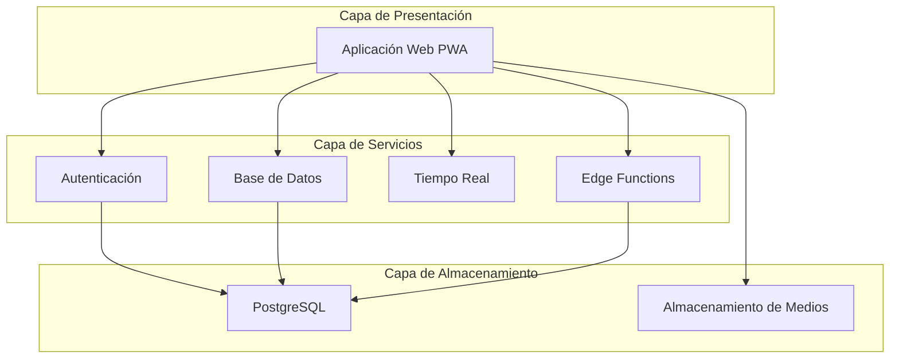
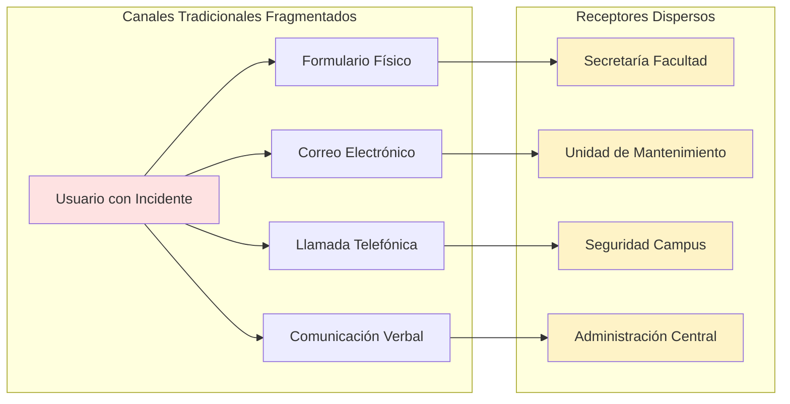
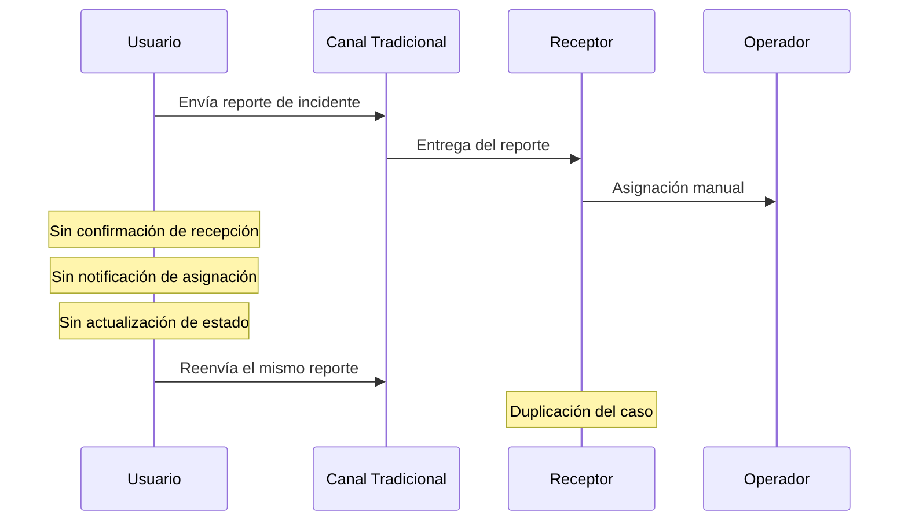
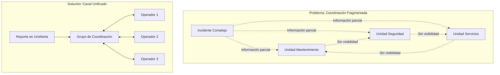
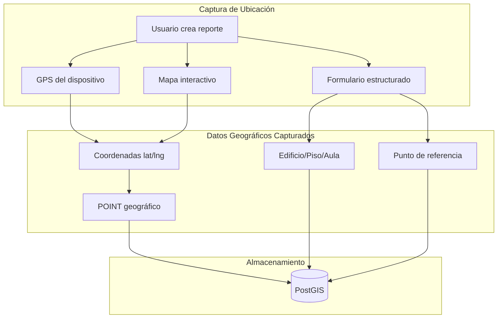
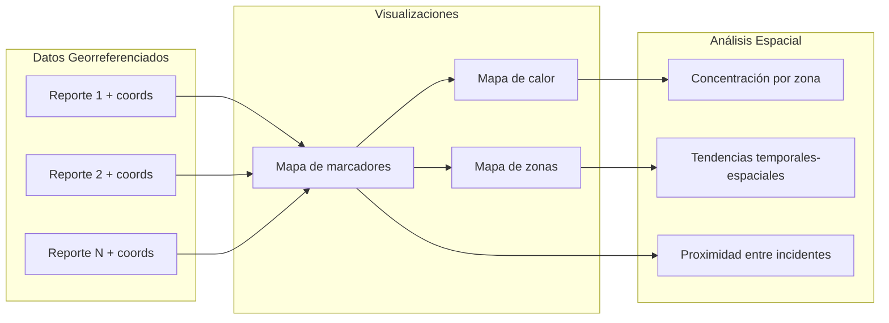
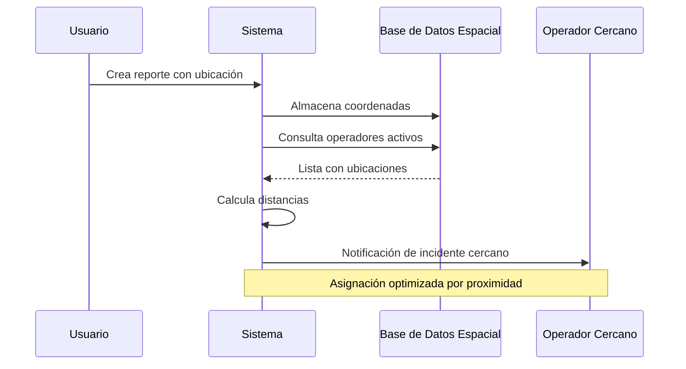

# Capítulo: Desarrollo del Proyecto

## Contextualización de la Problemática y Necesidad

### Identificación del Problema

La Universidad Central del Ecuador (UCE) enfrenta desafíos operativos significativos en la gestión de incidentes e irregularidades que ocurren dentro de su extenso campus universitario. La ausencia de un sistema centralizado para el registro, seguimiento y resolución de reportes genera fragmentación en la información, demoras en la atención y falta de trazabilidad en los procesos de respuesta institucional.

Los mecanismos tradicionales de comunicación —formularios físicos, llamadas telefónicas o correos electrónicos— resultan insuficientes para atender la diversidad de situaciones que requieren atención oportuna: desde problemas de infraestructura hasta incidentes de seguridad. Esta dispersión de canales dificulta la priorización de casos, la asignación eficiente de recursos humanos y el seguimiento del ciclo de vida de cada incidente reportado.

### Limitaciones Funcionales Identificadas

El análisis del contexto operativo reveló las siguientes limitaciones que justificaron el desarrollo de **UniAlerta UCE**:

| Limitación | Descripción | Impacto |
|------------|-------------|---------|
| **Ausencia de geolocalización** | Los reportes carecían de ubicación precisa, dificultando la localización del incidente | Demoras en la respuesta y asignación incorrecta de personal |
| **Comunicación fragmentada** | No existía un canal unificado entre reportantes y operadores | Pérdida de información y duplicación de esfuerzos |
| **Falta de trazabilidad** | Sin historial de cambios ni registro de acciones realizadas | Imposibilidad de auditar procesos y medir tiempos de respuesta |
| **Clasificación inconsistente** | Categorización manual y variable según el receptor del reporte | Estadísticas poco confiables y dificultad para identificar patrones |
| **Notificaciones inexistentes** | Los usuarios desconocían el estado de sus reportes | Insatisfacción del usuario y consultas repetitivas |

### Justificación de la Necesidad del Sistema

El desarrollo de UniAlerta UCE responde a requerimientos específicos derivados de las limitaciones identificadas:

**Requerimiento de centralización**: Unificar el registro de todos los tipos de incidentes en una plataforma única, accesible desde cualquier dispositivo con navegador web, eliminando la dependencia de formularios físicos o canales dispersos.

**Requerimiento de georreferenciación**: Incorporar la ubicación exacta de cada incidente mediante mapas interactivos, permitiendo a los operadores visualizar la distribución espacial de reportes y optimizar la asignación de personal según proximidad geográfica.

**Requerimiento de trazabilidad**: Implementar un registro completo del historial de cambios, estados y asignaciones de cada reporte, garantizando la auditoría de todas las acciones realizadas sobre el incidente.

**Requerimiento de comunicación**: Establecer canales de mensajería integrados que permitan la interacción directa entre reportantes, operadores y supervisores, reduciendo la pérdida de información contextual.

**Requerimiento de notificaciones**: Mantener informados a los usuarios sobre el estado de sus reportes mediante alertas en tiempo real, mejorando la percepción del servicio y reduciendo consultas redundantes.

### Contexto Técnico del Sistema

UniAlerta UCE se concibe como una **Progressive Web Application (PWA)** que opera sobre una arquitectura de tres capas, aprovechando tecnologías modernas que permiten escalabilidad y mantenimiento eficiente:

La plataforma contempla una jerarquía de roles que refleja la estructura organizacional de la institución, desde usuarios estándar que generan reportes hasta administradores con capacidad de configuración del sistema:

| Rol | Función Principal |
|-----|-------------------|
| Usuario Estándar | Creación y seguimiento de reportes propios |
| Operador | Atención y gestión de reportes asignados |
| Supervisor | Supervisión de operadores y asignación de casos |
| Moderador | Gestión de contenido en el módulo de red social |
| Administrador | Configuración del sistema y gestión de usuarios |
| Super Administrador | Control total de la plataforma |

### Alcance del Software Desarrollado

El sistema implementado abarca los siguientes módulos funcionales, cada uno diseñado para atender aspectos específicos de la problemática identificada:

- **Gestión de Reportes**: Registro, clasificación, asignación y seguimiento de incidentes con soporte para evidencias multimedia y geolocalización.
- **Dashboard Analítico**: Visualización de métricas operativas mediante gráficos interactivos para la toma de decisiones.
- **Red Social Institucional**: Espacio de interacción comunitaria con publicaciones, comentarios y sistema de relaciones entre usuarios.
- **Mensajería en Tiempo Real**: Comunicación directa entre usuarios del sistema, individual y grupal.
- **Rastreo Geográfico**: Seguimiento en tiempo real de operadores asignados a reportes activos.
- **Sistema de Auditoría**: Registro exhaustivo de todas las actividades realizadas en la plataforma.
- **Notificaciones**: Alertas en tiempo real sobre cambios de estado, menciones y reportes cercanos.

Esta contextualización establece el marco operativo y técnico que fundamenta las decisiones de diseño e implementación desarrolladas en las secciones subsiguientes del presente documento.

## Deficiencias de los Canales de Comunicación Tradicionales

### Fragmentación de los Medios de Reporte

Previo al desarrollo de UniAlerta UCE, la Universidad Central del Ecuador gestionaba los reportes de incidentes a través de múltiples canales desarticulados: formularios físicos en dependencias administrativas, correos electrónicos dirigidos a diferentes unidades, llamadas telefónicas a extensiones específicas y, en algunos casos, comunicaciones verbales directas. Esta multiplicidad de vías generaba un escenario de fragmentación informativa donde cada canal operaba de manera independiente, sin sincronización ni registro centralizado.

### Pérdida de Información Contextual

Los canales tradicionales presentaban limitaciones estructurales para capturar información esencial del incidente. Los formularios físicos carecían de campos para ubicación georreferenciada, restringiéndose a descripciones textuales ambiguas como "cerca del edificio de Ingeniería" o "frente a la biblioteca". Los correos electrónicos dependían de la capacidad descriptiva del remitente, frecuentemente omitiendo detalles críticos para la atención del caso. Las llamadas telefónicas, aunque permitían interacción inmediata, no generaban registro documental permanente ni evidencia multimedia.

| Canal Tradicional | Información Perdida | Consecuencia Operativa |
|-------------------|---------------------|------------------------|
| Formulario físico | Coordenadas GPS, fotografías del incidente | Dificultad para localizar el punto exacto del problema |
| Correo electrónico | Contexto visual, urgencia real del caso | Subestimación o sobrestimación de la prioridad |
| Llamada telefónica | Registro documental, evidencia verificable | Imposibilidad de auditar el reporte original |
| Comunicación verbal | Trazabilidad completa, fecha y hora exactas | Desconocimiento del origen y responsable del reporte |

### Ausencia de Retroalimentación al Usuario

Un déficit crítico de los canales tradicionales radicaba en la inexistencia de mecanismos de retroalimentación. El usuario que reportaba un incidente desconocía si su comunicación había sido recibida, asignada o atendida. Esta opacidad generaba dos problemas operativos: la duplicación de reportes por usuarios que, ante la falta de respuesta, volvían a comunicar el mismo incidente por diferentes vías; y la percepción de ineficiencia institucional que desincentivaba la participación activa de la comunidad universitaria en la identificación de problemas.

### Demoras en el Ciclo de Atención

La naturaleza asíncrona y manual de los canales tradicionales introducía demoras significativas en cada etapa del ciclo de atención. Desde la recepción del reporte hasta su registro formal podían transcurrir horas o días, dependiendo de la carga de trabajo del personal receptor. La asignación a un operador requería coordinación manual, frecuentemente mediante reuniones presenciales o cadenas de correos. El seguimiento del avance demandaba consultas directas al responsable, sin visibilidad para supervisores ni para el usuario reportante.

| Etapa del Ciclo | Demora Típica (Canal Tradicional) | Factor Causante |
|-----------------|-----------------------------------|-----------------|
| Recepción → Registro | 4-24 horas | Procesamiento manual de formularios |
| Registro → Asignación | 1-3 días | Coordinación entre dependencias |
| Asignación → Inicio de atención | 1-5 días | Falta de notificación inmediata al operador |
| Atención → Cierre | Variable | Sin seguimiento sistemático |

### Imposibilidad de Comunicación Directa

Los canales tradicionales establecían una comunicación unidireccional: el usuario emitía el reporte y esperaba pasivamente su resolución. No existía un medio estructurado para que operadores solicitaran información adicional, notificaran avances parciales o coordinaran con el reportante para verificaciones in situ. Esta limitación resultaba particularmente problemática en incidentes complejos que requerían precisiones sobre la naturaleza del problema o su ubicación exacta.

UniAlerta UCE aborda estas deficiencias mediante la implementación de un sistema de mensajería en tiempo real integrado al flujo de gestión de reportes, permitiendo:

- Comunicación bidireccional entre reportantes y operadores asignados
- Notificaciones automáticas ante cambios de estado del reporte
- Envío de evidencias multimedia durante el proceso de atención
- Creación de conversaciones grupales para incidentes que requieren coordinación entre múltiples operadores
- Historial de comunicaciones asociado permanentemente a cada reporte

### Falta de Escalamiento y Coordinación

Los incidentes que requerían intervención de múltiples unidades —por ejemplo, un problema de infraestructura eléctrica que afectaba la seguridad— demandaban coordinación manual entre dependencias. Cada unidad recibía información parcial, frecuentemente contradictoria, sin visibilidad sobre las acciones realizadas por otros involucrados. La ausencia de un espacio común de coordinación prolongaba los tiempos de resolución y diluía la responsabilidad sobre el caso.

Las deficiencias documentadas en esta sección evidencian la necesidad de un sistema que unifique los canales de comunicación, garantice la captura completa de información contextual y establezca mecanismos de retroalimentación continua entre todos los actores involucrados en el ciclo de gestión de incidentes.

## Pertinencia de las Tecnologías de Geolocalización y SIG

### Naturaleza Espacial de los Incidentes Universitarios

Los incidentes reportados en el campus de la Universidad Central del Ecuador poseen una dimensión inherentemente espacial. Cada reporte —ya sea una falla de infraestructura, un problema de seguridad o una anomalía en servicios— ocurre en una ubicación física específica que determina su jurisdicción, los recursos necesarios para atenderlo y el personal más adecuado para su resolución. La gestión eficiente de estos incidentes requiere, por tanto, la capacidad de capturar, almacenar, visualizar y analizar información georreferenciada.

El campus universitario abarca un área extensa con múltiples edificios, áreas verdes, estacionamientos y vías de circulación. La descripción textual de ubicaciones —método empleado en los canales tradicionales— resulta insuficiente para identificar con precisión el punto exacto de un incidente, particularmente en zonas con denominaciones ambiguas o estructuras repetitivas.

### Limitaciones del Direccionamiento Descriptivo

Previo a la implementación de UniAlerta UCE, los reportes dependían de descripciones textuales para indicar la ubicación del incidente. Este enfoque presentaba múltiples deficiencias:

| Descripción Tradicional | Ambigüedad Resultante |
|------------------------|----------------------|
| "Baño del segundo piso" | ¿De qué edificio? ¿Ala norte o sur? |
| "Cerca de la cancha" | ¿Cuál de las múltiples canchas del campus? |
| "Pasillo principal de Ingeniería" | ¿Ingeniería Civil, Sistemas, Eléctrica? |
| "Estacionamiento de profesores" | Sin referencia a zona específica dentro del área |
| "Frente a la biblioteca" | ¿Entrada principal, lateral, posterior? |

Estas ambigüedades generaban demoras en la localización del incidente, visitas fallidas de operadores a ubicaciones incorrectas y, en casos críticos, atención tardía de situaciones que requerían respuesta inmediata.

### Requerimientos de Georreferenciación en UniAlerta UCE

El sistema implementa capacidades de geolocalización para abordar las limitaciones del direccionamiento descriptivo:

**Captura de coordenadas GPS**: Al crear un reporte, el usuario puede autorizar el acceso a la ubicación de su dispositivo, permitiendo al sistema registrar automáticamente las coordenadas precisas (latitud y longitud) del punto donde se encuentra. Esta información se almacena en formato geográfico estandarizado (SRID 4326) compatible con sistemas de información geográfica.

**Selección manual en mapa**: Para incidentes donde el usuario no se encuentra físicamente en el lugar del problema, el sistema proporciona un mapa interactivo que permite señalar la ubicación exacta mediante interacción táctil o con cursor.

**Información contextual complementaria**: Las coordenadas se complementan con campos estructurados para edificio, piso, aula/sala y punto de referencia, combinando precisión geográfica con contexto semántico comprensible.

### Visualización Espacial de Reportes

La dimensión geográfica de los datos permite visualizaciones que serían imposibles con información puramente textual:

**Mapas de distribución**: Visualización simultánea de todos los reportes activos sobre el mapa del campus, permitiendo identificar patrones espaciales, zonas con alta concentración de incidentes y áreas desatendidas.

**Mapas de calor (Heatmaps)**: Representación de densidad de incidentes que facilita la identificación de puntos críticos recurrentes, información valiosa para la planificación preventiva y la asignación de recursos.

**Filtrado geográfico**: Capacidad de consultar reportes por proximidad a un punto, dentro de un radio específico o pertenecientes a una zona delimitada del campus.

### Rastreo de Operadores en Tiempo Real

Más allá de la georreferenciación de reportes, UniAlerta UCE implementa capacidades de rastreo en tiempo real para operadores asignados a incidentes activos. Esta funcionalidad permite:

- Visualizar la posición actual del operador respecto al incidente asignado
- Estimar tiempos de llegada basados en distancia geográfica
- Reasignar casos a operadores más cercanos cuando la situación lo requiere
- Documentar el recorrido realizado durante la atención del incidente

| Funcionalidad de Rastreo | Beneficio Operativo |
|-------------------------|---------------------|
| Posición en tiempo real | Supervisión del avance hacia el incidente |
| Cálculo de distancia | Asignación óptima por proximidad |
| Historial de ubicaciones | Auditoría del proceso de atención |
| Notificaciones por proximidad | Alertas automáticas de incidentes cercanos |

### Notificaciones Basadas en Proximidad

El sistema aprovecha la información de ubicación para generar alertas contextuales:

**Reportes cercanos al usuario**: Cuando se registra un incidente en proximidad a la ubicación actual del usuario, el sistema puede notificarle para su conocimiento o para evitar la zona afectada.

**Asignación por cercanía**: Los supervisores visualizan qué operadores se encuentran más próximos a un nuevo incidente, facilitando asignaciones que minimicen tiempos de desplazamiento.

**Detección de similares**: El sistema identifica reportes existentes en las cercanías del punto donde un usuario intenta crear un nuevo reporte, reduciendo duplicaciones y permitiendo agregar información a casos ya registrados.

### Integración con Servicios de Mapas Abiertos

UniAlerta UCE utiliza OpenStreetMap como fuente cartográfica base, evitando dependencias de servicios propietarios con costos asociados por uso. Esta decisión permite:

- Visualización de mapas sin restricciones de cuota o licenciamiento
- Personalización de la capa cartográfica según necesidades institucionales
- Operación en entornos con conectividad limitada mediante cacheo de tiles
- Contribución potencial a la base cartográfica abierta del campus

La biblioteca Leaflet proporciona la interfaz de mapas interactivos, mientras que las extensiones especializadas (leaflet.heat) habilitan las visualizaciones de densidad requeridas para el análisis espacial de incidentes.

La integración de tecnologías de geolocalización en UniAlerta UCE transforma la gestión de incidentes de un proceso basado en descripciones textuales ambiguas a un sistema con precisión espacial verificable, visualizaciones analíticas y capacidades de optimización basadas en proximidad geográfica.
