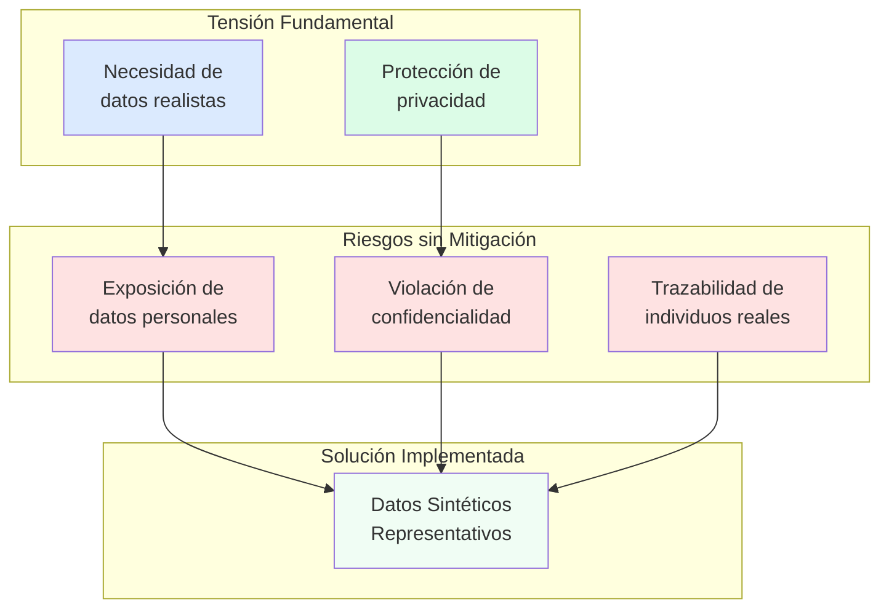
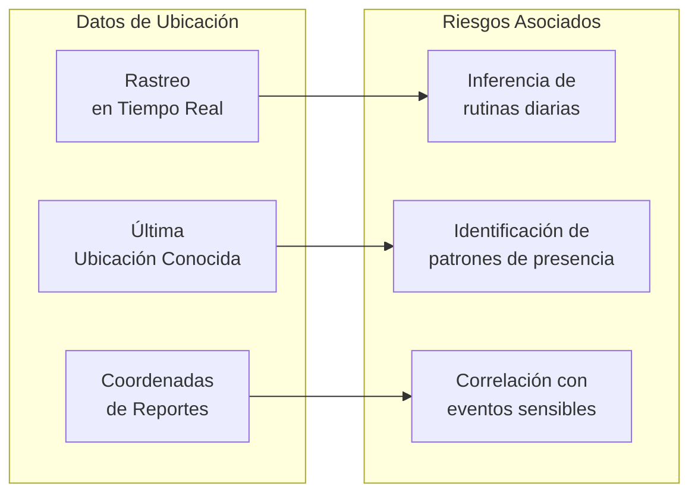
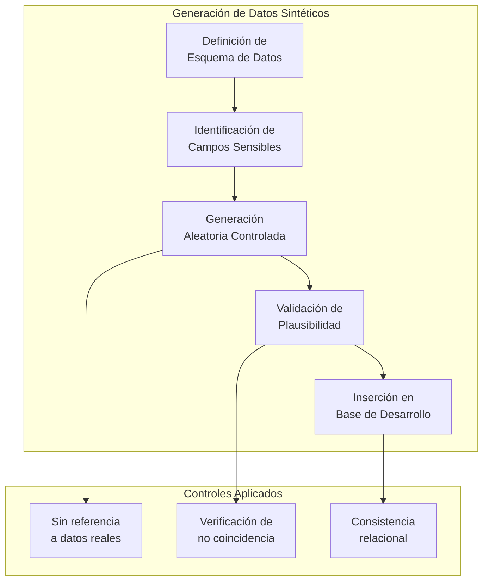
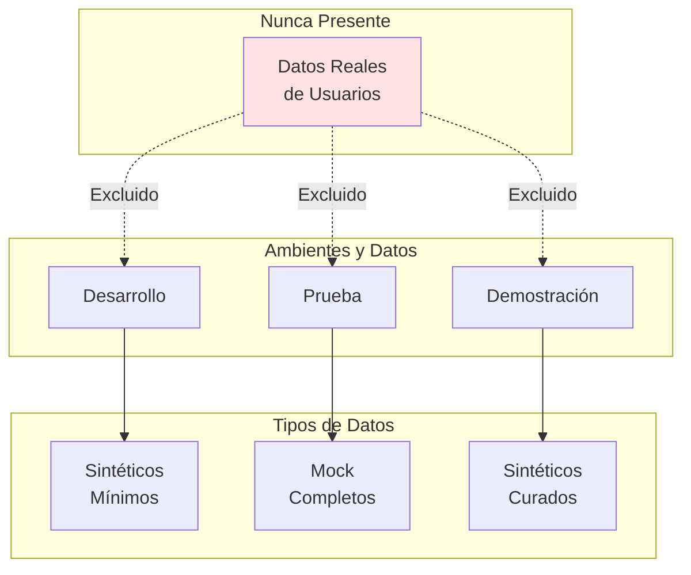
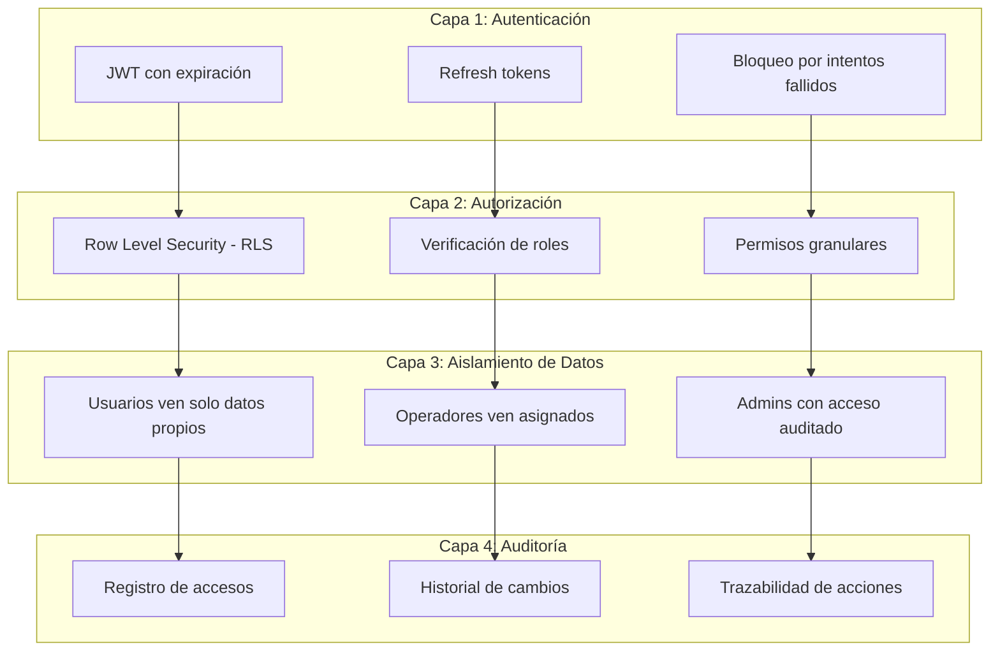
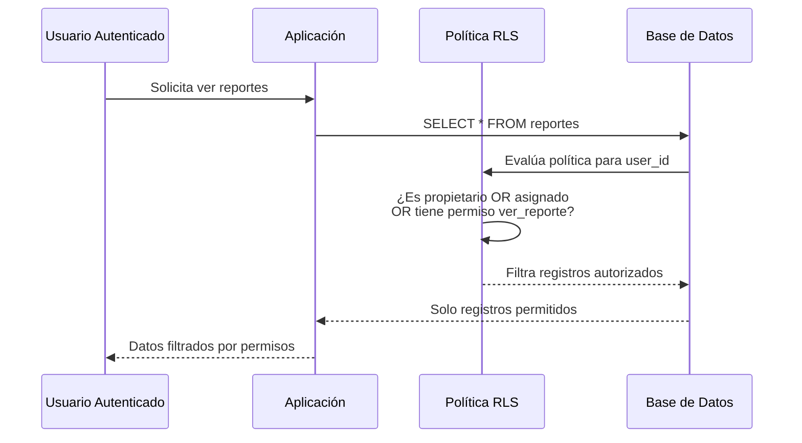
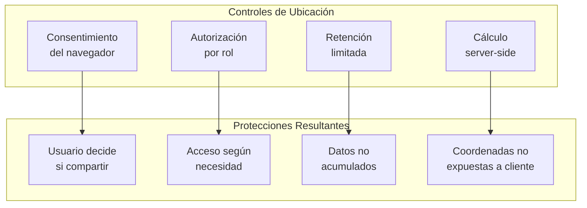
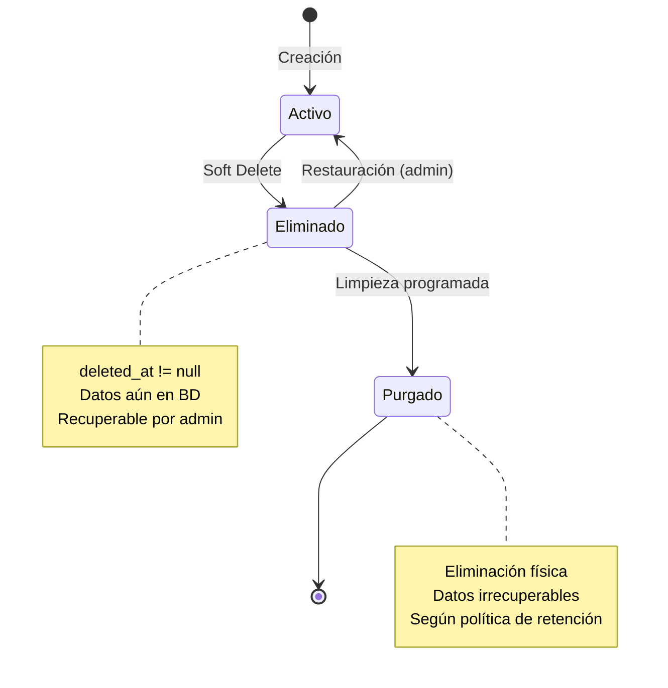
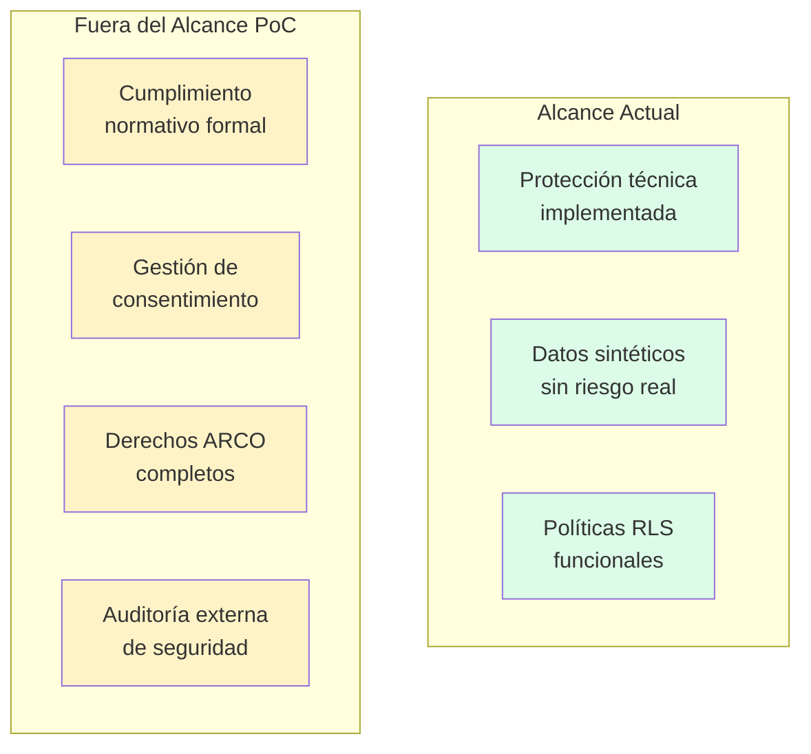

# Capítulo: Desarrollo del Proyecto

## Datos Sintéticos y Protección de la Privacidad

### Contextualización de la Problemática

UniAlerta UCE gestiona información inherentemente sensible: datos personales de usuarios (nombre, correo electrónico, ubicación), contenido de reportes que pueden involucrar situaciones de seguridad o conflicto, coordenadas geográficas que revelan patrones de presencia, y comunicaciones privadas entre miembros de la comunidad universitaria. Esta naturaleza de los datos impone obligaciones de protección que trascienden consideraciones técnicas y se enmarcan en principios de privacidad, confidencialidad y uso ético de la información.

El desarrollo del sistema como Prueba de Concepto enfrenta una tensión inherente: por un lado, requiere datos suficientemente realistas para validar funcionalidades y demostrar factibilidad; por otro, no debe exponer información real de personas que no han consentido su uso en un entorno de desarrollo. Esta tensión fundamenta la estrategia de datos sintéticos implementada en UniAlerta UCE.

### Tipología de Datos Sensibles en el Sistema

El modelo de datos de UniAlerta UCE contempla categorías de información con diferentes niveles de sensibilidad:

#### Datos de Identidad Personal

La tabla `profiles` almacena información que permite identificar individuos:

| Campo | Nivel de Sensibilidad | Justificación |
|-------|----------------------|---------------|
| `email` | Alto | Identificador único vinculado a identidad real |
| `name` | Alto | Nombre completo de la persona |
| `username` | Medio | Puede contener información identificable |
| `avatar` | Medio | Fotografía del usuario |
| `bio` | Bajo | Texto libre de presentación |
| `user_id` | Crítico | Vínculo con sistema de autenticación |

#### Datos de Ubicación Geográfica

Los reportes y el sistema de rastreo generan información geoespacial:

| Fuente | Tipo de Dato | Implicación de Privacidad |
|--------|--------------|---------------------------|
| Reportes (`geolocation`) | Coordenadas del incidente | Puede revelar presencia del reportante |
| Rastreo activo (`active_trackings`) | Posición en tiempo real | Seguimiento continuo del operador |
| Ubicaciones de usuarios (`user_locations`) | Última posición conocida | Patrón de movimiento individual |

#### Contenido de Comunicaciones

El sistema de mensajería almacena comunicaciones privadas:

| Tabla | Contenido | Consideración de Privacidad |
|-------|-----------|----------------------------|
| `mensajes` | Texto de conversaciones | Comunicación privada entre usuarios |
| `mensajes.imagenes` | Archivos multimedia | Contenido visual potencialmente sensible |
| `mensajes.shared_post` | Referencias a publicaciones | Contexto de intereses y relaciones |

#### Contenido de Reportes

Los reportes pueden contener información delicada:

| Campo | Riesgo Potencial |
|-------|------------------|
| `descripcion` | Narrativa de situaciones que involucran terceros |
| `imagenes` | Evidencia visual de incidentes |
| `location` | Datos estructurados de edificio, piso, aula |

### Estrategia de Datos Sintéticos

#### Principios de Generación

Los datos sintéticos de UniAlerta UCE se generan siguiendo principios que equilibran representatividad con protección de privacidad:

**No derivación de datos reales**: Los datos sintéticos no se generan a partir de transformaciones de datos reales (anonimización, pseudonimización), sino que se crean ex nihilo sin referencia a individuos existentes.

**Plausibilidad sin correspondencia**: Los nombres, correos y ubicaciones generados son plausibles dentro del contexto universitario pero no corresponden a personas, cuentas o lugares específicos reales.

**Diversidad controlada**: La variabilidad de los datos sintéticos cubre el espectro de casos que el sistema debe manejar, sin replicar patrones que pudieran inferirse de operación real.

#### Datos Sintéticos por Entidad

La siguiente tabla detalla el enfoque de generación para cada categoría de datos sensibles:

| Entidad | Campo Sensible | Estrategia de Síntesis |
|---------|----------------|------------------------|
| Usuarios | `email` | Dominios ficticios (@ejemplo.test, @prueba.local) |
| Usuarios | `name` | Combinaciones aleatorias de nombres comunes |
| Usuarios | `username` | Prefijos genéricos + sufijos numéricos |
| Reportes | `descripcion` | Textos genéricos de incidentes tipo |
| Reportes | `geolocation` | Coordenadas dentro del perímetro del campus |
| Reportes | `imagenes` | URLs a imágenes genéricas de prueba |
| Mensajes | `contenido` | Textos placeholder sin información real |
| Ubicaciones | coordenadas | Puntos aleatorios en áreas públicas del campus |

#### Separación de Datos por Contexto

El sistema mantiene separación entre datos de diferentes contextos operativos:

| Contexto | Datos Utilizados | Propósito |
|----------|------------------|-----------|
| Desarrollo local | Datos sintéticos mínimos | Pruebas de funcionalidad |
| Ambiente de prueba | Conjunto completo de datos mock | Validación de integración |
| Demostración | Datos sintéticos curados | Presentación de funcionalidades |

### Mecanismos de Protección de Privacidad Implementados

#### Arquitectura de Seguridad en Capas

UniAlerta UCE implementa protección de privacidad mediante múltiples capas de seguridad:

#### Row Level Security (RLS)

Las políticas RLS de PostgreSQL implementan el principio de mínimo privilegio a nivel de base de datos:

| Tabla | Política de Lectura | Política de Escritura |
|-------|--------------------|-----------------------|
| `profiles` | Usuario propio o con permiso `ver_usuario` | Solo perfil propio o con permiso `editar_usuario` |
| `reportes` | Propios, asignados, o con permiso `ver_reporte` | Propios o con permiso `editar_reporte` |
| `mensajes` | Solo participantes de la conversación | Solo emisor del mensaje |
| `publicaciones` | Según visibilidad configurada | Solo autor de la publicación |
| `notificaciones` | Solo destinatario | Solo sistema |

**Ejemplo conceptual de política RLS aplicada:**

#### Minimización de Datos en Vistas

El sistema expone vistas que limitan los datos accesibles:

| Vista | Datos Excluidos | Propósito |
|-------|-----------------|-----------|
| `profiles_public` | `email`, `user_id`, `must_change_password` | Perfil visible para otros usuarios |
| `public_reportes_anonymized` | Datos del creador en reportes anónimos | Reportes con visibilidad anónima |

#### Controles de Acceso a Ubicación

La información de ubicación requiere protecciones específicas:

| Funcionalidad | Control Aplicado |
|---------------|------------------|
| Geolocalización de reportes | Consentimiento explícito del usuario |
| Rastreo en tiempo real | Solo para operadores en seguimiento activo |
| Historial de ubicaciones | Retención limitada, purga automática |
| Reportes cercanos | Cálculo en backend, no exposición de coordenadas de terceros |

### Protección en el Ciclo de Vida de los Datos

#### Creación de Datos

Al momento de registro o creación de contenido:

| Acción | Protección Aplicada |
|--------|---------------------|
| Registro de usuario | Contraseña hasheada (Supabase Auth) |
| Creación de reporte | Opción de visibilidad privada/anónima |
| Envío de mensaje | Cifrado en tránsito (HTTPS) |
| Carga de imagen | Almacenamiento en CDN con URLs firmadas |

#### Almacenamiento de Datos

Durante la persistencia:

| Aspecto | Implementación |
|---------|----------------|
| Base de datos | PostgreSQL gestionado por Supabase (cifrado en reposo) |
| Archivos multimedia | Cloudinary con acceso controlado |
| Sesiones | Tokens JWT con expiración |
| Logs | Retención limitada en Supabase Analytics |

#### Eliminación de Datos

El sistema implementa soft delete para entidades principales:

| Tabla | Campo de Eliminación | Comportamiento |
|-------|---------------------|----------------|
| `profiles` | `deleted_at` | Perfil marcado, no eliminado físicamente |
| `reportes` | `deleted_at` | Reporte oculto pero recuperable |
| `publicaciones` | `deleted_at` | Publicación removida de feeds |
| `mensajes` | `deleted_at` | Mensaje oculto en conversación |

### Consideraciones para Transición a Producción

#### Datos Sintéticos vs. Datos de Producción

La estrategia de datos sintéticos es específica de la fase de Prueba de Concepto. Una eventual transición a producción requeriría:

| Aspecto | Estado Actual (PoC) | Requerimiento Producción |
|---------|---------------------|--------------------------|
| Origen de datos | Sintéticos generados | Reales de usuarios |
| Consentimiento | No aplicable | Obligatorio y documentado |
| Política de privacidad | No publicada | Requerida legalmente |
| Derecho al olvido | No implementado | Funcionalidad obligatoria |
| Portabilidad de datos | No implementada | Según normativa aplicable |

#### Controles Adicionales Requeridos

Para operación con datos reales, el sistema requeriría:

| Control | Descripción | Estado Actual |
|---------|-------------|---------------|
| Consentimiento informado | Aceptación explícita de términos | No implementado |
| Panel de privacidad | Usuario gestiona sus datos | Parcial (editar perfil) |
| Exportación de datos | Descarga de información propia | No implementado |
| Eliminación completa | Borrado físico a solicitud | No implementado |
| Notificación de brechas | Comunicación ante incidentes | No aplicable |

### Limitaciones del Enfoque Actual

La estrategia de datos sintéticos presenta limitaciones reconocidas:

| Limitación | Implicación |
|------------|-------------|
| No valida comportamiento con datos reales | Patrones de uso podrían diferir |
| No ejercita flujos de consentimiento | Funcionalidad no implementada |
| No prueba volúmenes de producción | Escalabilidad no verificada |
| No aborda cumplimiento normativo | Requiere análisis legal específico |

### Síntesis del Enfoque

La estrategia de datos sintéticos y protección de privacidad en UniAlerta UCE:

1. **Reconoce la sensibilidad de los datos**: El sistema gestiona información personal, ubicaciones y comunicaciones que requieren protección.

2. **Implementa datos sintéticos**: Durante el desarrollo se utilizan datos generados sin referencia a individuos reales, eliminando riesgos de exposición.

3. **Establece capas de protección técnica**: Autenticación, autorización RLS, minimización en vistas y auditoría conforman una arquitectura de seguridad funcional.

4. **Aplica principio de mínimo privilegio**: Usuarios acceden solo a datos propios o según permisos asignados, verificados a nivel de base de datos.

5. **Reconoce limitaciones del alcance PoC**: El cumplimiento normativo formal y la gestión completa de derechos de privacidad quedan fuera del alcance actual.

6. **Sienta bases para evolución**: Las estructuras implementadas (soft delete, campos de auditoría, políticas RLS) facilitan la incorporación de controles adicionales en fases posteriores.

Esta estrategia permite que UniAlerta UCE demuestre factibilidad funcional sin comprometer privacidad de individuos reales, estableciendo fundamentos técnicos que podrían evolucionar hacia un sistema con cumplimiento normativo completo en una eventual fase de producción.
