# Capítulo: Desarrollo del Proyecto

## Desarrollo de Interfaces Basado en Componentes

### 1. Introducción

La construcción de interfaces de usuario para sistemas de gestión de incidentes presenta desafíos que trascienden la mera disposición visual de elementos en pantalla. UniAlerta UCE requiere interfaces que soporten múltiples módulos funcionales (reportes, mensajería, red social, rastreo, auditoría), mantengan coherencia visual y comportamental entre ellos, y respondan a cambios de estado en tiempo real provenientes de diversos orígenes: interacciones del usuario, actualizaciones de base de datos y eventos de geolocalización.

Esta complejidad demanda un enfoque arquitectónico que permita construir interfaces complejas a partir de unidades funcionales independientes, reutilizables y mantenibles.

### 2. Problemática Identificada

#### 2.1 Contexto Funcional del Sistema

UniAlerta UCE integra funcionalidades que tradicionalmente corresponderían a sistemas separados:

| Módulo | Funcionalidad Principal | Elementos de Interfaz |
|--------|-------------------------|----------------------|
| Reportes | Gestión de incidentes georreferenciados | Formularios, mapas, tablas, líneas de tiempo |
| Mensajería | Comunicación en tiempo real | Listas de conversaciones, burbujas de chat, indicadores de estado |
| Red Social | Interacción comunitaria | Feed de publicaciones, comentarios, perfiles |
| Rastreo | Monitoreo de operadores | Mapas en tiempo real, estadísticas de navegación |
| Dashboard | Visualización analítica | Gráficos, métricas, filtros |
| Auditoría | Registro de actividades | Tablas, paneles de detalle, filtros temporales |

Cada módulo presenta requerimientos específicos de interfaz, pero comparte patrones visuales y comportamentales con los demás: formularios con validación, tablas con paginación, diálogos de confirmación, indicadores de carga, notificaciones de estado.

#### 2.2 Limitaciones del Desarrollo Monolítico de Interfaces

La construcción de interfaces como estructuras monolíticas (páginas completas con toda su lógica y presentación en una única unidad) genera limitaciones que afectan el desarrollo y mantenimiento del sistema:

**Duplicación de código**: Elementos comunes como encabezados de página, tarjetas informativas, botones con estados de carga y formularios de entrada se reimplementan en cada vista que los requiere. Esta duplicación incrementa el volumen de código, introduce inconsistencias visuales y multiplica el esfuerzo de mantenimiento ante cambios de diseño.

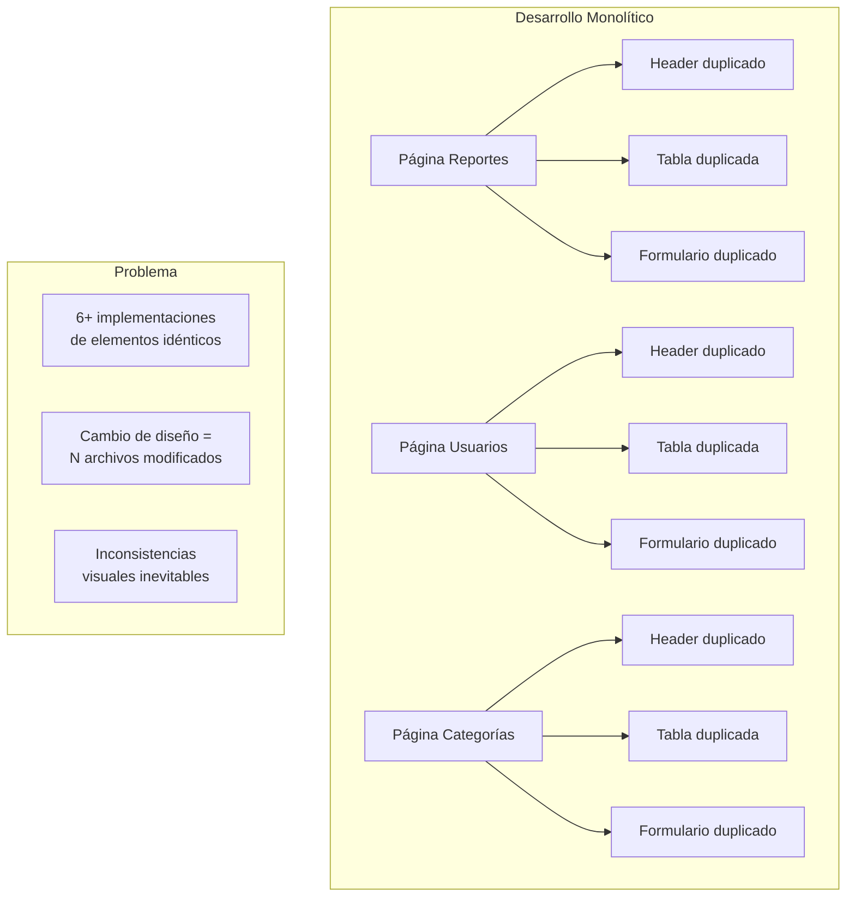

**Acoplamiento entre presentación y lógica**: Cuando la estructura visual, el manejo de estado y las operaciones de datos coexisten en una misma unidad, los cambios en cualquier aspecto afectan potencialmente a los demás. Modificar el diseño de un formulario puede introducir errores en la lógica de validación; ajustar una consulta de datos puede alterar inadvertidamente el comportamiento visual.

**Dificultad de prueba**: Las unidades monolíticas que combinan múltiples responsabilidades resultan difíciles de probar de forma aislada. Verificar el comportamiento de un componente específico requiere instanciar todo el contexto de la página que lo contiene.

**Escalabilidad del desarrollo**: A medida que el sistema crece, las unidades monolíticas se vuelven progresivamente más difíciles de comprender, modificar y extender. Nuevos desarrolladores enfrentan curvas de aprendizaje pronunciadas al intentar localizar funcionalidades específicas dentro de estructuras de código extensas.

#### 2.3 Requerimientos de Coherencia Visual

El sistema atiende a usuarios con diferentes roles y niveles de experiencia técnica: administradores, operadores de mantenimiento, personal de seguridad y usuarios estándar del campus. Esta diversidad demanda interfaces que mantengan:

- **Consistencia de interacción**: Los mismos patrones de uso en todos los módulos (cómo se crea un registro, cómo se confirma una acción, cómo se navega entre vistas).
- **Coherencia visual**: Uso uniforme de colores, tipografía, espaciado e iconografía.
- **Adaptabilidad**: Comportamiento apropiado en dispositivos de escritorio y móviles.
- **Accesibilidad**: Elementos interactivos correctamente etiquetados para tecnologías asistivas.

Mantener estos estándares en un desarrollo monolítico requiere disciplina manual que se erosiona con el tiempo y el crecimiento del equipo.

#### 2.4 Complejidad del Estado de la Interfaz

Las interfaces de UniAlerta UCE gestionan múltiples dimensiones de estado simultáneamente:

| Dimensión | Origen | Ejemplo |
|-----------|--------|---------|
| Estado de autenticación | Contexto global | Usuario autenticado, sesión válida |
| Datos de entidades | Base de datos | Lista de reportes, categorías |
| Estado de formularios | Interacción local | Valores ingresados, errores de validación |
| Estado de conexión | Eventos de red | Online/offline, sincronización pendiente |
| Ubicación del usuario | API del navegador | Coordenadas GPS actualizadas |
| Notificaciones | Tiempo real | Mensajes nuevos, alertas de proximidad |

La propagación de cambios de estado a través de una estructura monolítica genera complejidad exponencial: cada componente visual debe conocer y reaccionar a estados que no le conciernen directamente.

### 3. Fundamentos de la Solución Implementada

#### 3.1 Arquitectura de Componentes

UniAlerta UCE implementa una arquitectura de interfaces basada en componentes que descompone cada vista en unidades funcionales independientes y reutilizables. Un componente encapsula:

- **Estructura visual**: Elementos HTML y estilos que definen su apariencia.
- **Comportamiento local**: Lógica de interacción específica del componente.
- **Interfaz de propiedades**: Contrato que define qué datos recibe y qué eventos emite.

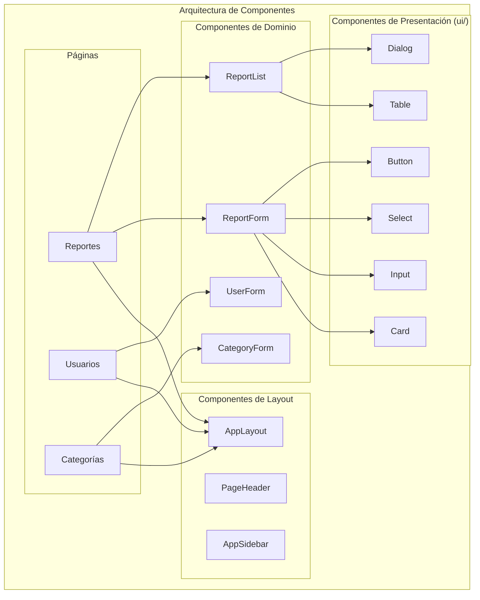

Esta organización jerárquica permite que los cambios en un nivel inferior (componentes de presentación) se propaguen automáticamente a todos los niveles superiores que los utilizan, garantizando coherencia visual sin intervención manual.

#### 3.2 Estratificación de Componentes

El sistema organiza los componentes en capas con responsabilidades diferenciadas:

| Capa | Directorio | Responsabilidad | Ejemplo |
|------|------------|-----------------|---------|
| **Primitivos UI** | `ui/` | Elementos visuales genéricos sin lógica de negocio | `Button`, `Card`, `Input`, `Select` |
| **Componentes de Dominio** | `report/`, `users/`, etc. | Lógica específica de cada módulo funcional | `ReportForm`, `UserForm`, `CategoryForm` |
| **Componentes de Layout** | Raíz de `components/` | Estructura general de la aplicación | `AppLayout`, `PageHeader`, `AppSidebar` |
| **Páginas** | `pages/` | Composición de componentes para rutas específicas | `Reportes`, `Usuarios`, `Dashboard` |

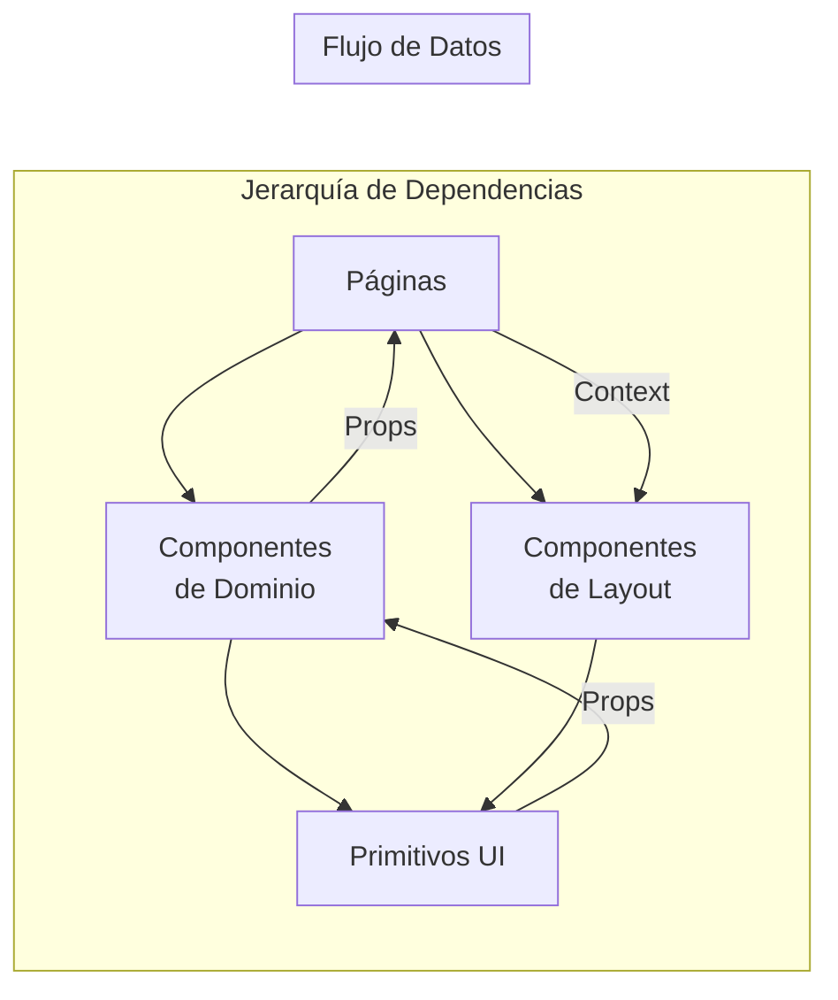

Los componentes de capas inferiores no conocen a los de capas superiores, estableciendo un flujo de dependencias unidireccional que previene acoplamientos circulares.

#### 3.3 Componentes de Presentación Reutilizables

El directorio `ui/` contiene componentes de presentación que implementan los patrones visuales del sistema de diseño:

| Componente | Propósito | Uso en el Sistema |
|------------|-----------|-------------------|
| `Card` | Contenedor visual con borde y sombra | Tarjetas de información, paneles de formulario |
| `Button` | Acción interactiva con variantes | Acciones primarias, secundarias, destructivas |
| `Input` | Campo de entrada de texto | Formularios de todas las entidades |
| `Select` | Selector de opciones | Categorías, estados, prioridades |
| `Table` | Visualización tabular de datos | Listas de reportes, usuarios, auditoría |
| `Dialog` | Modal de confirmación o entrada | Eliminación, detalles, formularios embebidos |
| `Tabs` | Navegación por pestañas | Dashboard, perfiles, detalles de reportes |

Estos componentes reciben propiedades (`props`) que determinan su comportamiento y apariencia, sin conocer el contexto de negocio donde se utilizan:

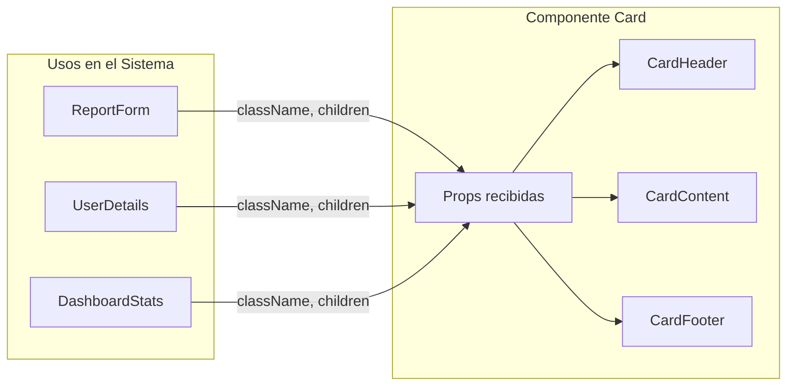

#### 3.4 Componentes de Dominio

Los componentes de dominio encapsulan la lógica específica de cada módulo funcional. Componen primitivos UI y agregan:

- Validación de datos según reglas de negocio.
- Comunicación con servicios de datos (hooks de acceso a Supabase).
- Manejo de estados intermedios (carga, error, éxito).
- Coordinación de efectos secundarios (notificaciones, navegación).

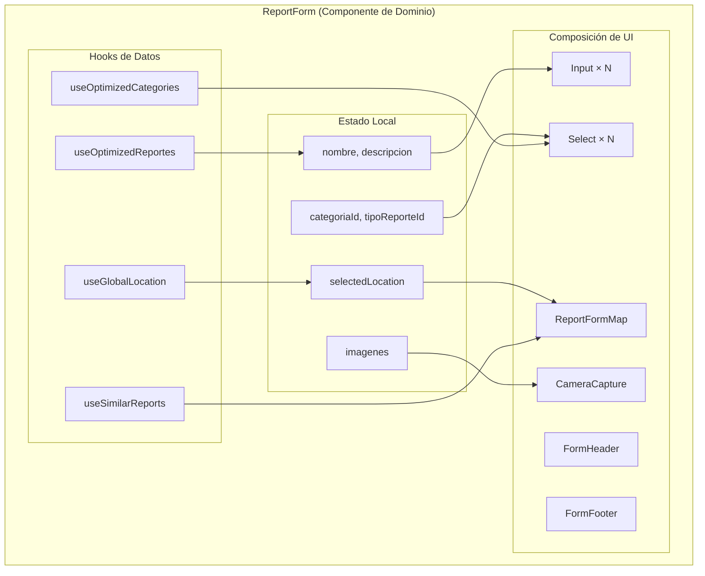

Esta separación permite que múltiples páginas reutilicen el mismo componente de dominio con diferentes configuraciones:

| Componente | Página Crear | Página Editar | Modal Embebido |
|------------|--------------|---------------|----------------|
| `ReportForm` | Sin datos iniciales | Con reporte existente | Con props reducidas |
| `UserForm` | Modo registro | Modo edición | En diálogo de creación rápida |
| `CategoryForm` | Categoría nueva | Categoría existente | En panel lateral |

#### 3.5 Componentes de Layout

Los componentes de layout definen la estructura visual compartida por todas las vistas autenticadas del sistema:

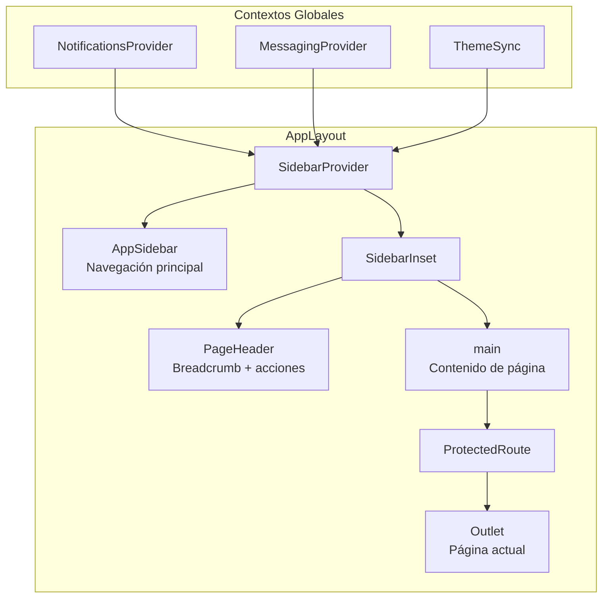

El componente `AppLayout` establece:

- **Barra lateral de navegación**: Acceso a todos los módulos del sistema.
- **Encabezado de página**: Breadcrumbs contextuales y acciones disponibles.
- **Área de contenido**: Espacio donde se renderiza la página actual.
- **Proveedores de contexto**: Estado global de notificaciones, mensajería y tema visual.

Las páginas individuales no implementan esta estructura; heredan automáticamente el layout al renderizarse dentro del `Outlet`.

### 4. Organización Modular del Sistema

#### 4.1 Estructura de Directorios

El sistema organiza los componentes siguiendo una estructura que refleja los módulos funcionales:

```
src/components/
├── ui/                    # Primitivos de presentación
│   ├── button.tsx
│   ├── card.tsx
│   ├── input.tsx
│   ├── table.tsx
│   └── ...
├── report/                # Módulo de reportes
│   ├── ReportForm.tsx
│   ├── ReportDetailsModal.tsx
│   ├── SimilarReportsFound.tsx
│   └── index.ts
├── users/                 # Módulo de usuarios
│   ├── UserForm.tsx
│   ├── UserRolesManager.tsx
│   └── index.ts
├── messages/              # Módulo de mensajería
│   ├── ChatView.tsx
│   ├── ConversationList.tsx
│   ├── MessageBubble.tsx
│   └── index.ts
├── Map/                   # Componentes cartográficos
│   ├── ReportFormMap.tsx
│   ├── LiveTrackingMap.tsx
│   ├── HeatmapLayer.tsx
│   └── index.ts
├── dashboard/             # Componentes analíticos
│   ├── DashboardStats.tsx
│   ├── DashboardCharts.tsx
│   └── index.ts
└── ...
```

Cada módulo expone sus componentes públicos a través de un archivo `index.ts` que actúa como barrera de abstracción:

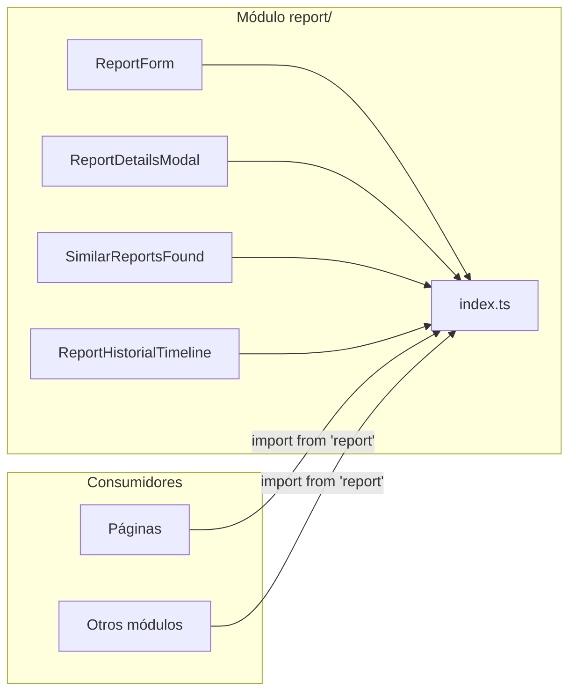

Esta organización permite:

- **Encapsulamiento**: Los componentes internos del módulo pueden reorganizarse sin afectar a los consumidores.
- **Descubribilidad**: Los desarrolladores localizan rápidamente componentes por dominio funcional.
- **Importaciones limpias**: Las páginas importan desde el índice del módulo, no desde archivos individuales.

#### 4.2 Separación de Responsabilidades

El sistema separa las responsabilidades en tres capas complementarias:

| Capa | Ubicación | Responsabilidad |
|------|-----------|-----------------|
| **Componentes** | `components/` | Estructura visual y comportamiento de UI |
| **Hooks** | `hooks/` | Lógica de acceso a datos y efectos secundarios |
| **Contextos** | `contexts/` | Estado global compartido entre componentes |

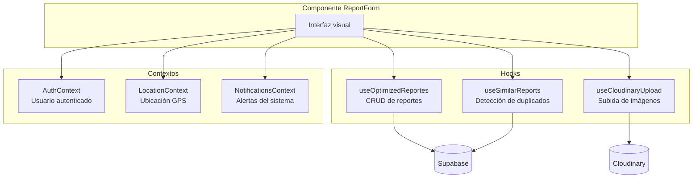

Los componentes consumen hooks y contextos sin conocer los detalles de implementación de la capa de datos. Esta separación permite:

- Sustituir la fuente de datos sin modificar componentes.
- Probar componentes con datos simulados (mocks).
- Reutilizar lógica de datos en diferentes interfaces.

### 5. Patrones de Composición

#### 5.1 Composición de Componentes

Las interfaces complejas se construyen componiendo componentes más simples. El formulario de reportes ejemplifica este patrón:

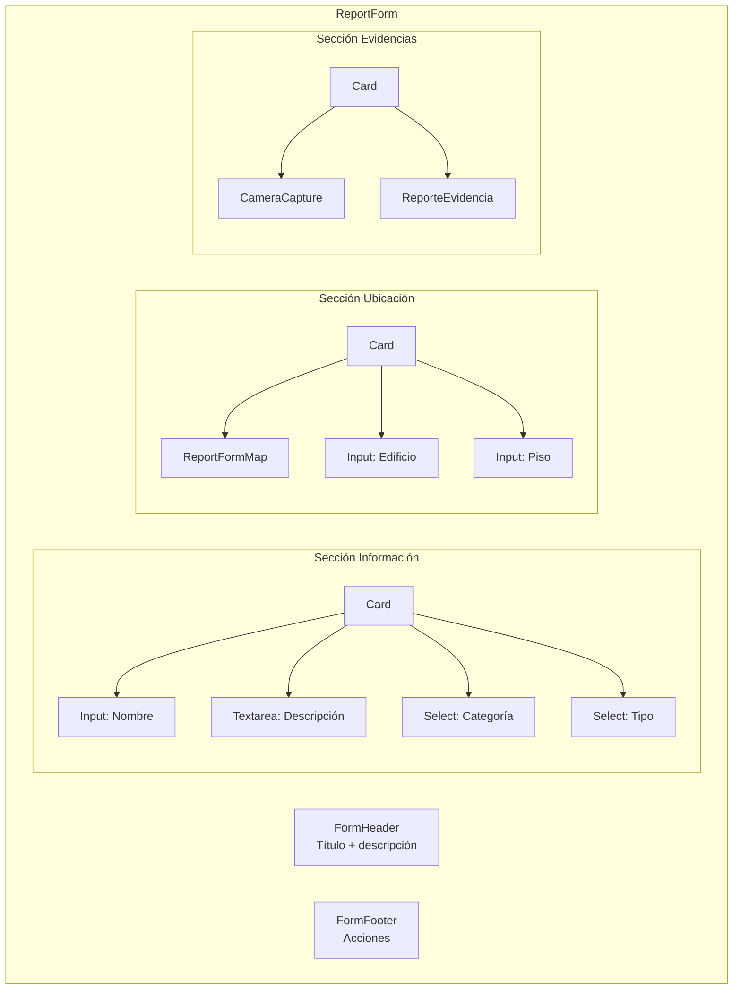

Cada sección se implementa como una composición de primitivos UI dentro de un contenedor `Card`. El componente `ReportForm` orquesta la coordinación entre secciones sin implementar los detalles visuales de cada una.

#### 5.2 Reutilización con Variantes

Los componentes de presentación implementan variantes que adaptan su apariencia y comportamiento según el contexto de uso:

| Componente | Variante | Uso |
|------------|----------|-----|
| `Button` | `default` | Acción estándar |
| `Button` | `destructive` | Eliminación, rechazo |
| `Button` | `outline` | Acción secundaria |
| `Button` | `ghost` | Acción terciaria, iconos |
| `Card` | Por defecto | Contenedor con borde |
| `Card` | Con `className` | Personalización contextual |

Las variantes se especifican mediante propiedades, permitiendo que un mismo componente sirva múltiples propósitos:

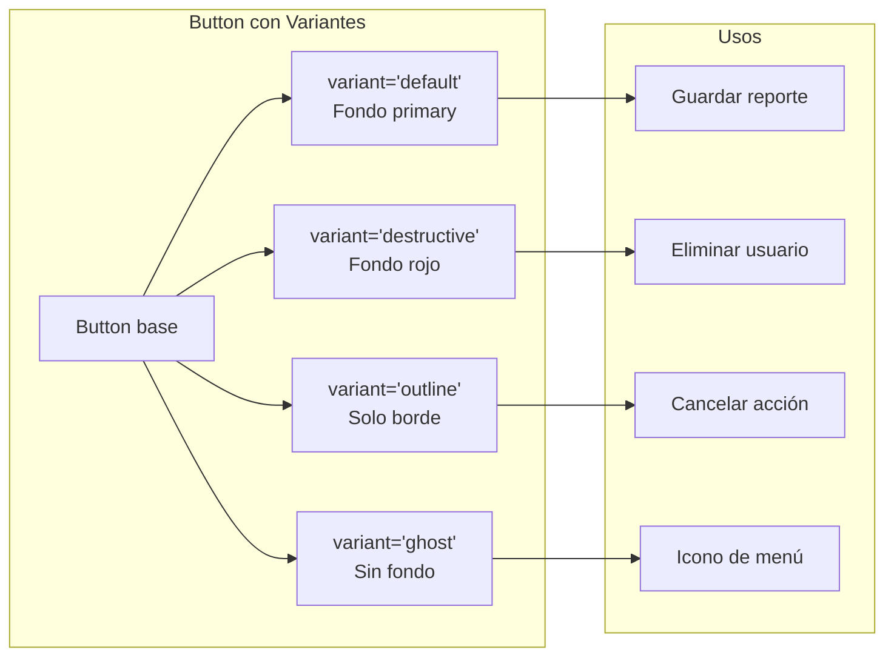

#### 5.3 Componentes Controlados y No Controlados

Los formularios del sistema implementan componentes controlados donde el estado reside en el componente padre:

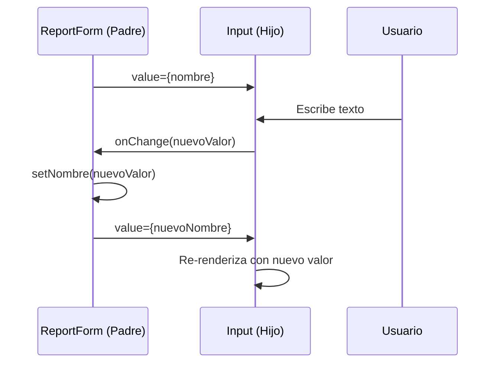

Este patrón centraliza el estado del formulario en un único punto, facilitando:

- Validación cruzada entre campos.
- Persistencia de borradores.
- Restauración de valores iniciales.
- Envío coordinado de datos.

### 6. Beneficios de la Arquitectura de Componentes

La implementación de interfaces basadas en componentes produce beneficios medibles en el desarrollo y mantenimiento del sistema:

#### 6.1 Reutilización Efectiva

| Componente | Instancias en el Sistema | Líneas de Código Únicas |
|------------|--------------------------|-------------------------|
| `Card` | 50+ | ~40 |
| `Button` | 100+ | ~60 |
| `Input` | 80+ | ~30 |
| `Table` | 15+ | ~100 |
| `Dialog` | 20+ | ~80 |

Sin componentización, cada instancia requeriría implementación individual, multiplicando el volumen de código y las oportunidades de inconsistencia.

#### 6.2 Mantenibilidad

Los cambios en el sistema de diseño se propagan automáticamente:

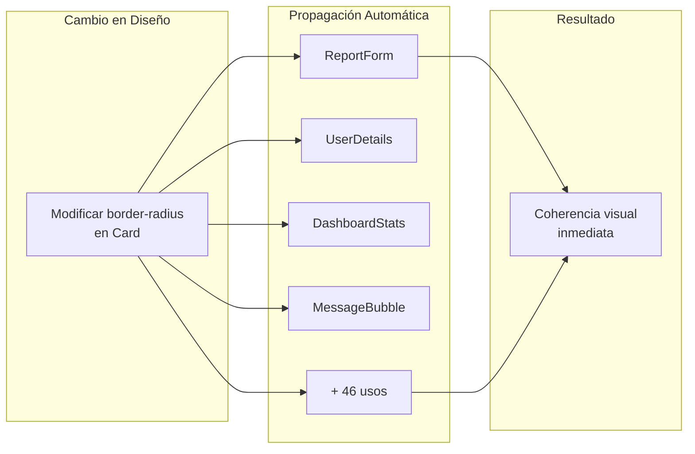

Un único archivo modificado actualiza todas las instancias del componente en el sistema.

#### 6.3 Testabilidad

Los componentes aislados pueden probarse independientemente:

| Nivel de Prueba | Componente | Verificación |
|-----------------|------------|--------------|
| Unitario | `Button` | Renderizado, variantes, estados |
| Integración | `ReportForm` | Validación, envío, manejo de errores |
| E2E | Página Reportes | Flujo completo de creación |

La separación de responsabilidades permite sustituir dependencias (hooks, contextos) con implementaciones de prueba.

### 7. Síntesis

El desarrollo de interfaces basado en componentes resuelve las limitaciones identificadas en el enfoque monolítico:

| Problema | Solución Implementada |
|----------|----------------------|
| Duplicación de código | Componentes reutilizables en `ui/` |
| Acoplamiento presentación-lógica | Separación en componentes, hooks y contextos |
| Inconsistencia visual | Sistema de diseño centralizado en primitivos |
| Dificultad de mantenimiento | Cambios localizados con propagación automática |
| Complejidad de estado | Estado local en componentes, global en contextos |

La arquitectura de componentes establece una base técnica que permite escalar el sistema en funcionalidades sin degradar la coherencia visual ni la mantenibilidad del código. Los patrones de composición, estratificación y separación de responsabilidades descritos en esta sección se aplican uniformemente a todos los módulos del sistema.
