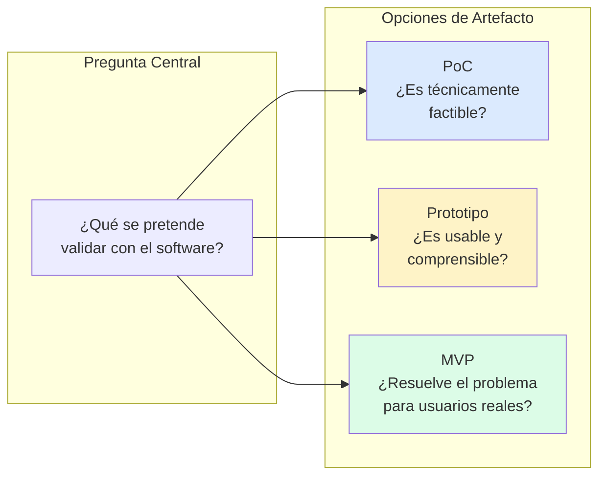
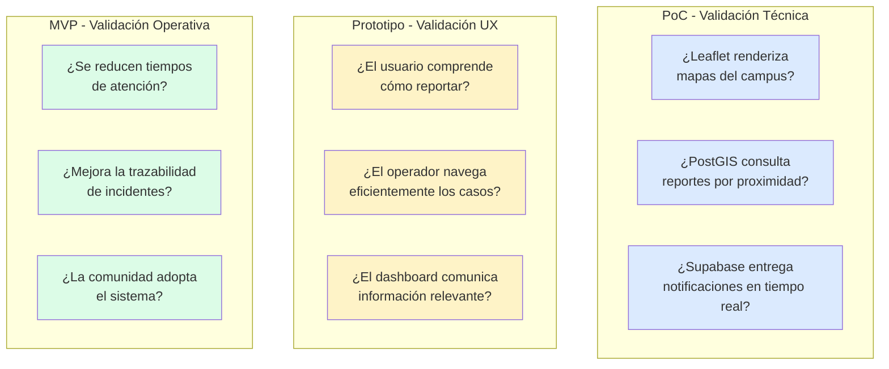
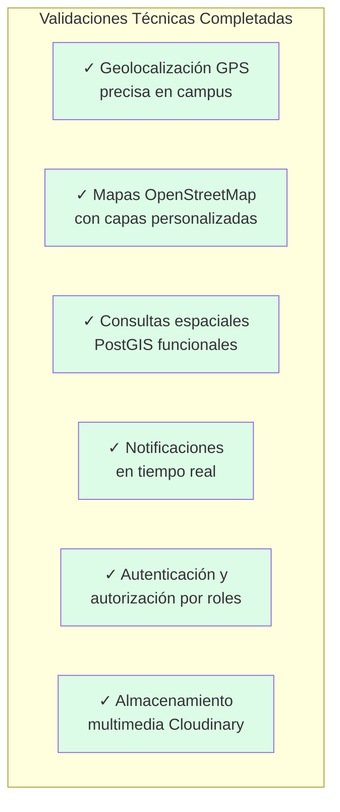
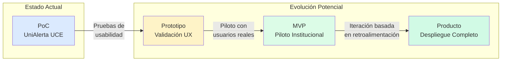

# Capítulo: Desarrollo del Proyecto

## Sección: Diferenciación Conceptual: PoC, Prototipo y MVP

### 1. Necesidad de Diferenciación en el Contexto del Proyecto

El desarrollo de UniAlerta UCE requiere precisar la naturaleza del producto resultante, dado que los términos Prueba de Concepto (PoC), Prototipo y Producto Mínimo Viable (MVP) designan artefactos de software con propósitos, alcances y criterios de éxito fundamentalmente distintos. Esta diferenciación no constituye un ejercicio teórico, sino una decisión de ingeniería que determina las expectativas sobre funcionalidad, robustez y preparación para uso real.

En el contexto de UniAlerta UCE, la elección del tipo de artefacto a desarrollar responde a la pregunta: ¿qué se pretende validar y para quién?

*Figura 1: Pregunta orientadora para determinar el tipo de artefacto*

### 2. Caracterización de Cada Artefacto en el Contexto del Sistema

#### 2.1 Prueba de Concepto (PoC)

Una Prueba de Concepto en el contexto de UniAlerta UCE constituiría un artefacto técnico orientado exclusivamente a demostrar que las tecnologías seleccionadas pueden satisfacer los requerimientos funcionales del sistema. Su propósito es responder interrogantes de factibilidad técnica, no operativa.

**Alcance característico de un PoC para este sistema:**

| Aspecto | Implementación Típica |
|---------|----------------------|
| Geolocalización | Captura de coordenadas GPS y renderizado en mapa, sin persistencia estructurada |
| Tiempo real | Demostración de WebSocket funcional con mensajes de prueba |
| Almacenamiento | Esquema mínimo sin relaciones complejas ni políticas de seguridad |
| Interfaz | Componentes funcionales sin diseño visual ni experiencia de usuario elaborada |
| Usuarios | Un único perfil de usuario sin roles ni permisos diferenciados |

**Criterios de éxito de un PoC:**
- La API Geolocation del navegador captura coordenadas con precisión aceptable (±10 metros)
- Leaflet renderiza mapas OpenStreetMap sin degradación de rendimiento
- Supabase Realtime entrega mensajes con latencia inferior a un segundo
- PostGIS ejecuta consultas de proximidad geográfica correctamente
- Cloudinary procesa y almacena imágenes desde el navegador

Un PoC no aborda preguntas sobre usabilidad, adopción por usuarios, flujos operativos completos ni robustez ante cargas reales.

#### 2.2 Prototipo

Un Prototipo en el contexto de UniAlerta UCE constituiría un artefacto orientado a validar la experiencia de usuario, los flujos de interacción y la comprensibilidad de la interfaz. Su propósito es responder interrogantes de usabilidad antes de invertir en desarrollo completo.

**Alcance característico de un Prototipo para este sistema:**

| Aspecto | Implementación Típica |
|---------|----------------------|
| Flujos de usuario | Navegación completa del ciclo de reporte: creación, seguimiento, cierre |
| Interfaz visual | Diseño final con componentes interactivos, aunque con datos simulados |
| Retroalimentación | Mecanismos para recolectar opiniones de usuarios sobre la experiencia |
| Backend | Simulado o mínimo, suficiente para demostrar flujos sin procesamiento real |
| Datos | Estáticos o generados artificialmente, sin integración con fuentes reales |

**Criterios de éxito de un Prototipo:**
- Los usuarios comprenden cómo crear un reporte sin instrucciones extensas
- El flujo de estados del reporte resulta intuitivo para reportantes y operadores
- La visualización cartográfica comunica efectivamente la ubicación del incidente
- Los tiempos de navegación entre pantallas se perciben como ágiles
- Las notificaciones transmiten información relevante sin generar sobrecarga

Un Prototipo no garantiza que el sistema funcione en producción, soporte múltiples usuarios concurrentes ni mantenga datos de manera persistente y segura.

#### 2.3 Producto Mínimo Viable (MVP)

Un MVP en el contexto de UniAlerta UCE constituiría un artefacto funcional completo, desplegable en producción, que implementa el conjunto mínimo de funcionalidades suficientes para resolver la problemática identificada en usuarios reales. Su propósito es validar que el sistema genera valor operativo, no solo técnico o experiencial.

**Alcance característico de un MVP para este sistema:**

| Aspecto | Implementación Típica |
|---------|----------------------|
| Funcionalidad | Ciclo completo de gestión de incidentes operable por usuarios reales |
| Seguridad | Autenticación robusta, autorización por roles, protección de datos |
| Persistencia | Base de datos con esquema completo, relaciones y políticas RLS |
| Escalabilidad | Arquitectura preparada para crecimiento de usuarios y datos |
| Operación | Despliegue en infraestructura de producción con monitoreo básico |

**Criterios de éxito de un MVP:**
- Los usuarios del campus pueden crear reportes reales y recibir atención efectiva
- Los operadores gestionan incidentes con información geográfica precisa
- Los supervisores obtienen visibilidad sobre métricas operativas
- El sistema mantiene disponibilidad aceptable ante uso concurrente
- Los datos se persisten de manera íntegra y recuperable

Un MVP, aunque funcional, no incluye necesariamente todas las funcionalidades deseables. Define un alcance conscientemente limitado que satisface el caso de uso principal.

### 3. Diferenciación Aplicada a UniAlerta UCE

La siguiente matriz contrasta los tres tipos de artefacto aplicados específicamente al sistema desarrollado:

*Figura 2: Preguntas de validación según tipo de artefacto*

| Dimensión | PoC | Prototipo | MVP |
|-----------|-----|-----------|-----|
| **Pregunta central** | ¿Las tecnologías funcionan para este caso? | ¿Los usuarios comprenden y navegan el sistema? | ¿El sistema resuelve la problemática operativa? |
| **Usuarios objetivo** | Equipo técnico de desarrollo | Muestra representativa de usuarios finales | Usuarios reales en operación cotidiana |
| **Ambiente de ejecución** | Local o desarrollo aislado | Staging con acceso controlado | Producción institucional |
| **Datos utilizados** | Sintéticos o de prueba | Simulados pero representativos | Reales, generados por operación |
| **Robustez esperada** | Suficiente para demostración | Suficiente para sesiones de prueba | Preparada para uso continuo |
| **Seguridad** | Mínima o inexistente | Básica para proteger acceso | Completa con auditoría |
| **Resultado exitoso** | Demostración técnica funcional | Validación de usabilidad positiva | Adopción y mejora operativa medible |

### 4. Clasificación del Sistema Desarrollado

UniAlerta UCE, en su estado actual de desarrollo, exhibe características que lo posicionan como una **Prueba de Concepto** con elementos de transición hacia Prototipo funcional.

#### 4.1 Evidencia de Características de PoC

El sistema valida factibilidad técnica mediante:

**Integración geoespacial demostrada:**
- Captura de coordenadas GPS mediante API Geolocation del navegador
- Almacenamiento en formato geográfico (PostGIS) con tipo `geography(Point, 4326)`
- Consultas de proximidad mediante función `ST_DWithin` para detección de reportes cercanos
- Enriquecimiento semántico vía Nominatim y Overpass API para contexto de ubicación

**Comunicación en tiempo real operativa:**
- Suscripciones Realtime de Supabase para actualizaciones instantáneas
- Sistema de mensajería con entrega de mensajes en tiempo real
- Notificaciones automáticas ante cambios de estado de reportes
- Indicadores de presencia y escritura en conversaciones

**Arquitectura serverless funcional:**
- Backend completamente gestionado mediante Supabase (PostgreSQL, Auth, Realtime, Edge Functions)
- Almacenamiento de medios delegado a Cloudinary
- Ausencia de infraestructura propia que administrar

*Figura 3: Validaciones técnicas completadas en el PoC*

#### 4.2 Evidencia de Transición hacia Prototipo

El sistema incorpora elementos que exceden el alcance típico de un PoC:

**Interfaz de usuario elaborada:**
- Diseño visual consistente mediante sistema de diseño basado en Tailwind CSS y Radix UI
- Componentes reutilizables con variantes y estados definidos
- Navegación estructurada con sidebar, breadcrumbs y flujos definidos
- Modo oscuro/claro con persistencia de preferencia

**Flujos de usuario completos:**
- Ciclo íntegro de creación, asignación, atención y cierre de reportes
- Sistema de roles con seis niveles diferenciados (usuario, operador, supervisor, moderador, administrador, super administrador)
- Dashboard con visualizaciones estadísticas interactivas
- Módulo de mensajería con conversaciones individuales y grupales

**Funcionalidades complementarias implementadas:**
- Red social universitaria con publicaciones, comentarios y reacciones
- Estados efímeros tipo "historias" con vistas y reacciones
- Auditoría de actividades con registro detallado de acciones
- Rastreo en tiempo real de operadores asignados

#### 4.3 Limitaciones Respecto a un MVP

El sistema no alcanza la clasificación de MVP debido a:

**Ausencia de validación operativa:**
- No se ha desplegado en producción institucional con usuarios reales
- No existen métricas de adopción, uso sostenido ni impacto operativo
- La efectividad para reducir tiempos de atención permanece como hipótesis

**Pendientes de robustez:**
- Pruebas de carga y concurrencia no ejecutadas a escala institucional
- Procedimientos de recuperación ante fallos no implementados
- Monitoreo operativo y alertas no configurados

**Alcance funcional por validar:**
- Integración con procesos institucionales existentes no verificada
- Curva de aprendizaje real de usuarios no medida
- Sostenibilidad operativa del sistema no demostrada

### 5. Implicaciones de la Clasificación

La identificación de UniAlerta UCE como Prueba de Concepto establece expectativas correctas sobre el estado del desarrollo:

| Aspecto | Implicación para el Proyecto |
|---------|------------------------------|
| **Propósito demostrado** | Factibilidad técnica de la solución propuesta |
| **Alcance validado** | Tecnologías, integraciones y flujos básicos |
| **Usuarios contemplados** | Equipo de desarrollo y evaluadores académicos |
| **Ambiente de operación** | Desarrollo y demostración, no producción |
| **Evolución requerida** | Iteración hacia Prototipo completo y posteriormente MVP |

*Figura 4: Trayectoria de evolución del sistema*

### 6. Síntesis de la Diferenciación

La diferenciación entre PoC, Prototipo y MVP aplicada a UniAlerta UCE permite establecer con precisión:

1. **El sistema desarrollado constituye una Prueba de Concepto** que demuestra la factibilidad técnica de integrar geolocalización, tiempo real, mensajería y visualización cartográfica para la gestión de incidentes universitarios.

2. **El alcance implementado excede un PoC típico** al incorporar interfaz elaborada, flujos completos y funcionalidades complementarias, posicionándolo en transición hacia Prototipo funcional.

3. **El sistema no constituye un MVP** dado que no ha sido validado con usuarios reales en operación sostenida, y carece de las métricas de adopción e impacto que caracterizan a un producto mínimo viable.

4. **La clasificación como PoC establece expectativas apropiadas** sobre el propósito del desarrollo: demostrar que la solución propuesta es técnicamente viable, sin afirmar aún que resuelve efectivamente la problemática operativa en condiciones reales.

Esta diferenciación resulta fundamental para contextualizar los resultados del proyecto dentro del ciclo de desarrollo de software, reconociendo que la validación técnica constituye un paso necesario pero no suficiente para confirmar el éxito de la solución.
