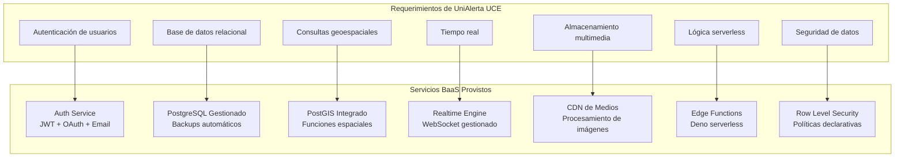
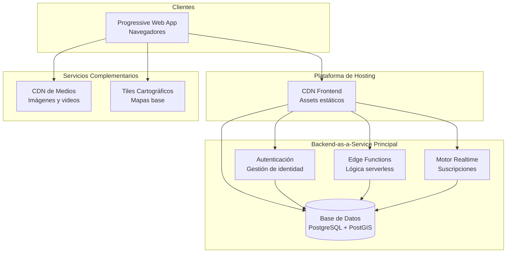
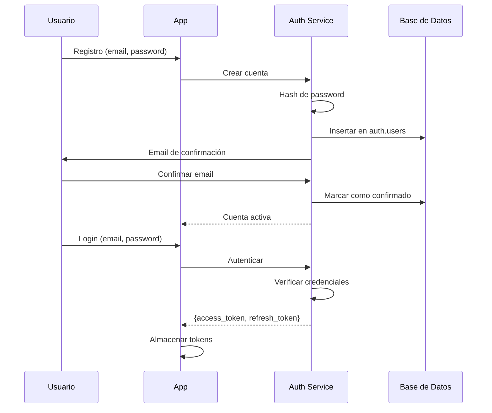
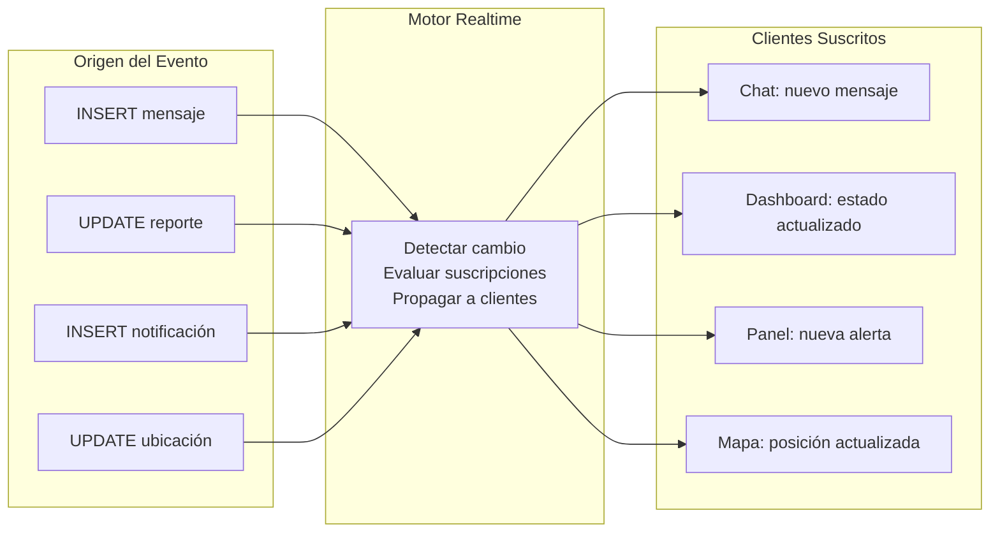
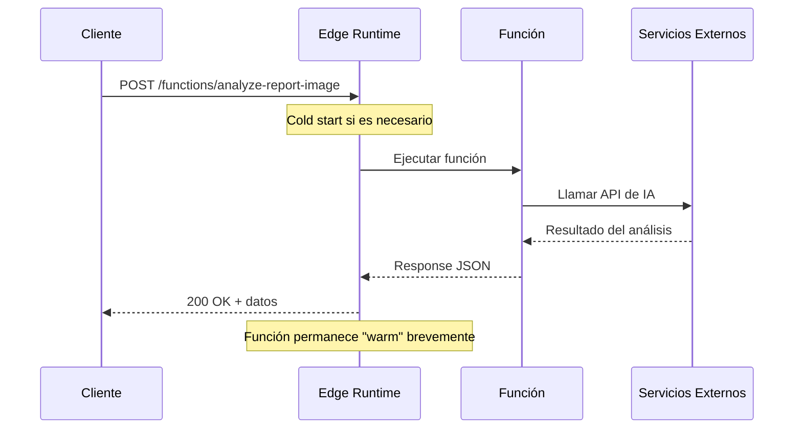
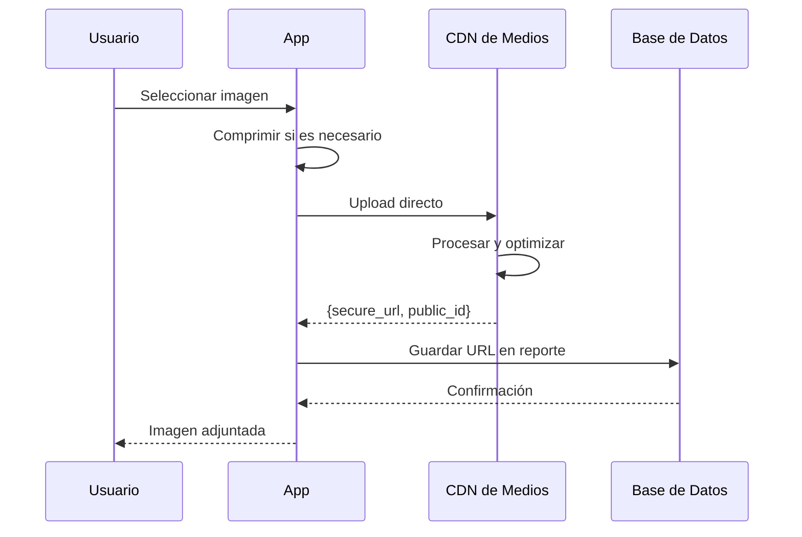

# Capítulo: Desarrollo del Proyecto

## Ecosistema Backend-as-a-Service (BaaS) y Computación en la Nube

### 1. Contextualización de la Problemática de Infraestructura

El desarrollo de UniAlerta UCE enfrentó desde su concepción un desafío estructural: la necesidad de construir un sistema con funcionalidades de backend complejas —autenticación, base de datos relacional, comunicación en tiempo real, procesamiento geoespacial, almacenamiento de archivos y ejecución de lógica serverless— sin disponer de infraestructura propia de servidores ni personal dedicado a la administración de sistemas.

El contexto institucional imponía restricciones que limitaban las opciones de implementación tradicionales:

- **Ausencia de infraestructura de servidores**: La institución no contaba con data centers ni servidores dedicados disponibles para el proyecto.
- **Sin personal de operaciones**: No existía equipo de DevOps o administradores de sistemas asignados al mantenimiento de infraestructura.
- **Presupuesto restringido**: Los recursos económicos no contemplaban adquisición de hardware ni licencias de software de servidor.
- **Requerimiento de disponibilidad continua**: El sistema debía operar 24/7 sin interrupciones por mantenimiento manual.
- **Escalabilidad impredecible**: El número de usuarios concurrentes podía variar significativamente según eventos del campus.

Estas condiciones descartaban el modelo tradicional de desarrollo backend donde el equipo implementa, despliega y administra servidores propios. La problemática exigía una alternativa que proveyera capacidades de backend completas sin transferir la complejidad operativa al equipo de desarrollo.

### 2. Problemática Específica que Motivó la Adopción del Modelo BaaS

El análisis de los requerimientos funcionales de UniAlerta UCE reveló un conjunto de servicios de backend indispensables para el funcionamiento del sistema:

#### 2.1 Servicios de Backend Requeridos

| Servicio Requerido | Funcionalidad en el Sistema | Complejidad de Implementación Tradicional |
|-------------------|----------------------------|------------------------------------------|
| **Autenticación** | Registro, login, recuperación de contraseñas, gestión de sesiones, tokens JWT | Implementación de flujos OAuth, almacenamiento seguro de credenciales, manejo de tokens |
| **Base de datos relacional** | Almacenamiento de 44 tablas interrelacionadas con integridad referencial | Instalación, configuración, backups, replicación, optimización de PostgreSQL |
| **Extensiones geoespaciales** | Consultas por proximidad, almacenamiento de coordenadas, índices espaciales | Configuración de PostGIS, funciones espaciales, optimización de consultas geográficas |
| **Comunicación en tiempo real** | Propagación instantánea de mensajes, notificaciones, cambios de estado | Infraestructura de WebSocket, manejo de conexiones persistentes, broadcasting |
| **Almacenamiento de archivos** | Evidencias fotográficas de reportes, avatares, imágenes de publicaciones | Servidores de archivos, CDN, procesamiento de imágenes, gestión de cuotas |
| **Funciones serverless** | Análisis de imágenes con IA, limpieza de datos obsoletos | Orquestación de contenedores, escalado automático, gestión de cold starts |
| **Seguridad a nivel de datos** | Control de acceso por usuario, políticas por tabla y operación | Implementación de middleware, validaciones en cada endpoint |

#### 2.2 Carga Operativa de Implementación Tradicional

La implementación tradicional de estos servicios habría requerido:

```mermaid
graph TB
    subgraph "Modelo Tradicional - Complejidad Evitada"
        A[Servidores Físicos/Virtuales] --> B[Configuración de SO]
        B --> C[Instalación PostgreSQL + PostGIS]
        C --> D[Servidor de Aplicaciones]
        D --> E[Servidor WebSocket]
        E --> F[Servidor de Archivos]
        F --> G[Balanceador de Carga]
        G --> H[Certificados SSL]
        H --> I[Monitoreo 24/7]
        I --> J[Backups Automatizados]
        J --> K[Actualizaciones de Seguridad]
        K --> L[Escalado Manual]
    end
    
    style A fill:#fee2e2
    style I fill:#fee2e2
    style K fill:#fee2e2
    style L fill:#fee2e2
```



Esta complejidad operativa resultaba incompatible con las restricciones del proyecto: sin infraestructura, sin personal de operaciones y con presupuesto limitado.

### 3. Justificación del Ecosistema BaaS para UniAlerta UCE

La adopción de un ecosistema Backend-as-a-Service resolvió la problemática de infraestructura al transferir la responsabilidad de administración de servicios de backend a proveedores especializados en la nube, permitiendo que el equipo de desarrollo se concentrara exclusivamente en la lógica de la aplicación.

#### 3.1 Correspondencia entre Requerimientos y Servicios BaaS

El ecosistema BaaS adoptado provee cada servicio requerido como funcionalidad gestionada:



#### 3.2 Beneficios Obtenidos en el Contexto del Sistema

La adopción del modelo BaaS proporcionó beneficios directos que resolvieron las restricciones identificadas:

| Restricción Original | Solución BaaS | Resultado en UniAlerta UCE |
|---------------------|---------------|---------------------------|
| Sin servidores propios | Infraestructura en la nube completamente gestionada | Base de datos, autenticación y funciones operando sin hardware propio |
| Sin personal de operaciones | Mantenimiento, actualizaciones y monitoreo delegados al proveedor | Cero intervención manual para operación continua |
| Presupuesto limitado | Modelo de pago por uso con tier gratuito generoso | Desarrollo y operación inicial sin costos de licencias |
| Disponibilidad 24/7 | SLA garantizado por el proveedor | Sistema operativo continuamente sin mantenimiento programado |
| Escalabilidad variable | Escalado automático según demanda | Capacidad de absorber picos de uso sin configuración previa |

### 4. Arquitectura de Servicios en la Nube

UniAlerta UCE opera sobre un ecosistema de servicios distribuidos en la nube, donde cada componente cumple una función específica dentro del flujo de la aplicación:



#### 4.1 Servicio de Autenticación

El servicio de autenticación en la nube gestiona el ciclo completo de identidad de usuarios:

**Funcionalidades provistas:**
- Registro de usuarios con validación de email
- Inicio de sesión con generación de tokens JWT
- Recuperación de contraseñas mediante enlaces temporales
- Gestión de sesiones con refresh tokens
- Protección contra ataques de fuerza bruta

**Flujo de autenticación en el sistema:**



#### 4.2 Base de Datos Relacional Gestionada

El servicio de base de datos proporciona una instancia PostgreSQL completamente administrada con extensiones especializadas:

**Características del servicio:**
- PostgreSQL con configuración optimizada
- Extensión PostGIS para datos geoespaciales
- Backups automáticos diarios
- Restauración point-in-time
- API REST autogenerada para cada tabla
- Políticas de seguridad a nivel de fila (RLS)

**Modelo de datos de UniAlerta UCE:**

| Dominio | Tablas | Propósito |
|---------|--------|-----------|
| Usuarios | profiles, user_roles, settings | Identidad, roles y preferencias |
| Reportes | reportes, categories, tipo_categories, reporte_historial | Gestión de incidentes |
| Red Social | publicaciones, comentarios, interacciones, hashtags | Interacción comunitaria |
| Mensajería | conversaciones, mensajes, participantes_conversacion | Comunicación directa |
| Notificaciones | notifications | Alertas y avisos |
| Auditoría | user_audit | Registro de actividades |
| Geolocalización | user_locations, active_trackings | Ubicaciones en tiempo real |

#### 4.3 Motor de Comunicación en Tiempo Real

El servicio de tiempo real mantiene conexiones WebSocket persistentes entre el cliente y el backend, propagando cambios instantáneamente:

**Eventos propagados en UniAlerta UCE:**



**Beneficios del tiempo real gestionado:**
- Sin configuración de servidores WebSocket
- Escalado automático de conexiones concurrentes
- Reconexión automática ante pérdida de conectividad
- Filtrado de eventos por políticas RLS

#### 4.4 Funciones Serverless (Edge Functions)

Las Edge Functions permiten ejecutar lógica de backend personalizada sin administrar servidores:

**Funciones implementadas en UniAlerta UCE:**

| Función | Trigger | Propósito |
|---------|---------|-----------|
| `analyze-report-image` | Invocación HTTP | Analizar imágenes con IA para sugerir categorización de reportes |
| `cleanup-user-locations` | Invocación HTTP / Cron | Eliminar ubicaciones de usuarios inactivos o desconectados |

**Modelo de ejecución serverless:**



**Características del modelo serverless:**
- Ejecución bajo demanda sin servidores persistentes
- Escalado automático según carga de solicitudes
- Facturación por tiempo de ejecución
- Aislamiento entre invocaciones

#### 4.5 Almacenamiento de Medios en CDN

Las evidencias fotográficas de reportes y las imágenes de la red social se almacenan en un servicio de CDN especializado:

**Flujo de almacenamiento multimedia:**



**Beneficios del CDN de medios:**
- Distribución global con baja latencia
- Transformaciones de imagen automáticas
- Optimización de formatos según dispositivo
- Sin gestión de almacenamiento de archivos

### 5. Seguridad en el Ecosistema de Nube

El modelo BaaS implementa múltiples capas de seguridad que protegen los datos de UniAlerta UCE:

#### 5.1 Seguridad a Nivel de Fila (Row Level Security)

Las políticas RLS garantizan que cada usuario solo acceda a los datos autorizados:

```mermaid
graph TB
    subgraph "Solicitud del Cliente"
        R[GET /reportes<br/>Authorization: Bearer {JWT}]
    end
    
    subgraph "Evaluación de Políticas"
        P1{¿Usuario autenticado?}
        P2{¿Política permite SELECT?}
        P3{¿Fila cumple condición<br/>auth.uid() = user_id?}
    end
    
    subgraph "Resultado"
        D[Datos filtrados<br/>Solo filas autorizadas]
        E[Error 403<br/>Acceso denegado]
    end
    
    R --> P1
    P1 -->|Sí| P2
    P1 -->|No| E
    P2 -->|Sí| P3
    P2 -->|No| E
    P3 -->|Sí| D
    P3 -->|No| E
```

#### 5.2 Capas de Seguridad del Ecosistema

| Capa | Mecanismo | Protección Provista |
|------|-----------|---------------------|
| **Transporte** | HTTPS obligatorio | Encriptación de datos en tránsito |
| **Autenticación** | JWT con expiración | Verificación de identidad en cada solicitud |
| **Autorización** | Políticas RLS | Acceso a datos según reglas declarativas |
| **Almacenamiento** | Encriptación at-rest | Datos protegidos en disco |
| **Edge Functions** | Variables de entorno secretas | Credenciales no expuestas en código |

### 6. Integración de Servicios de Nube

Los servicios del ecosistema BaaS operan de manera integrada, compartiendo el contexto de autenticación y comunicándose a través de APIs estándar:

```mermaid
graph TB
    subgraph "Flujo Integrado: Crear Reporte con Imagen"
        A[Usuario captura foto] --> B[Upload a CDN]
        B --> C[Obtener URL segura]
        C --> D[Invocar Edge Function]
        D --> E[Análisis IA de imagen]
        E --> F[Sugerir categoría]
        F --> G[Usuario confirma datos]
        G --> H[INSERT en PostgreSQL]
        H --> I[Trigger: crear historial]
        I --> J[Realtime: notificar cercanos]
    end
    
    style B fill:#e0f2fe
    style D fill:#fef3c7
    style H fill:#dcfce7
    style J fill:#f3e8ff
```



**Leyenda de servicios:**
- Azul: CDN de Medios
- Amarillo: Edge Functions
- Verde: Base de Datos PostgreSQL
- Púrpura: Motor Realtime

### 7. Síntesis del Ecosistema BaaS

La adopción del modelo Backend-as-a-Service para UniAlerta UCE resolvió la problemática fundamental de infraestructura: proveer servicios de backend empresariales sin disponer de servidores propios ni personal de operaciones. El ecosistema de nube seleccionado integra autenticación gestionada, base de datos relacional con extensiones geoespaciales, comunicación en tiempo real, funciones serverless y almacenamiento multimedia distribuido en una plataforma unificada.

Este modelo permitió que el desarrollo se concentrara en la lógica de la aplicación —gestión de reportes, red social, mensajería, dashboard— mientras la complejidad de administrar infraestructura, garantizar disponibilidad, ejecutar backups, aplicar actualizaciones de seguridad y escalar según demanda permanece delegada a proveedores especializados con SLAs garantizados.

La arquitectura resultante opera sobre servicios distribuidos globalmente, con encriptación en tránsito y en reposo, políticas de seguridad a nivel de datos y escalabilidad automática que permite absorber variaciones de carga sin intervención manual.
