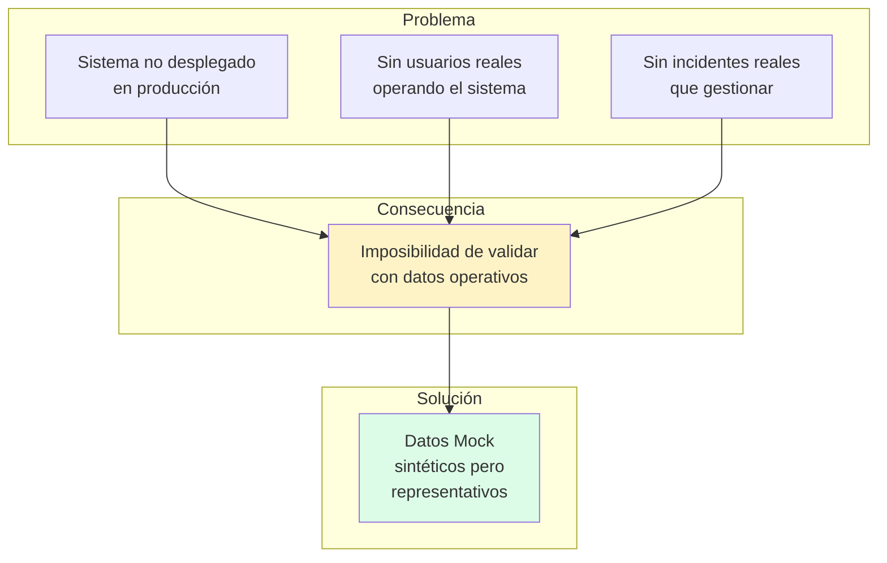
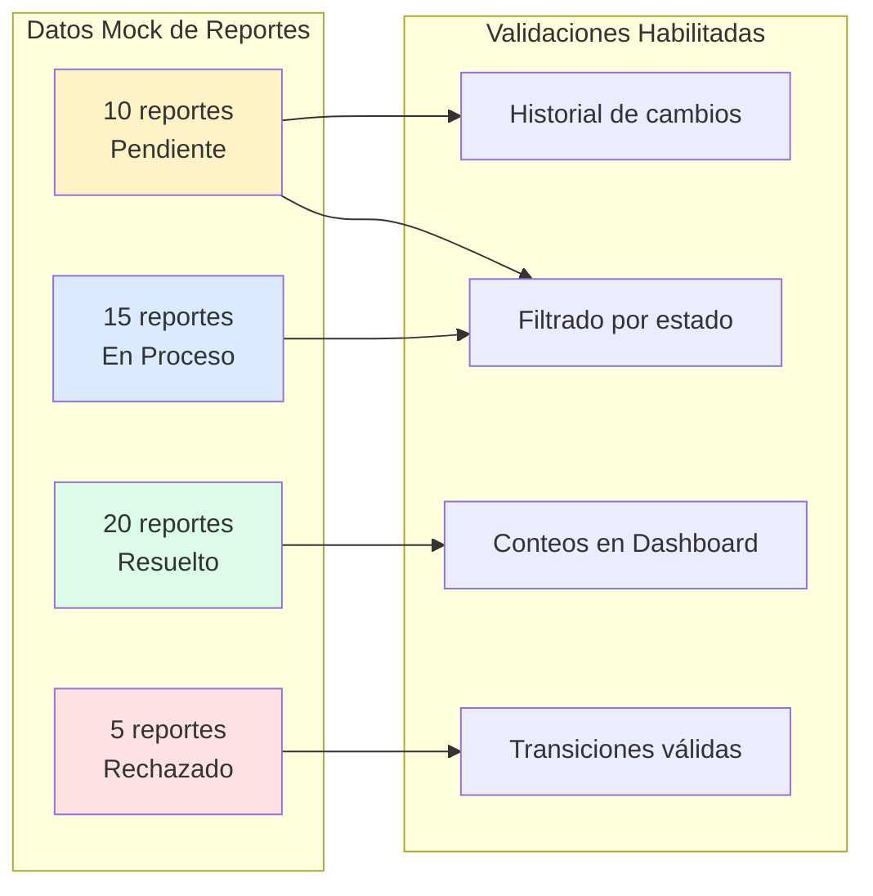
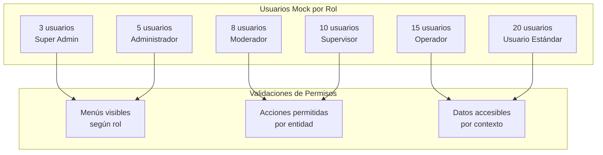
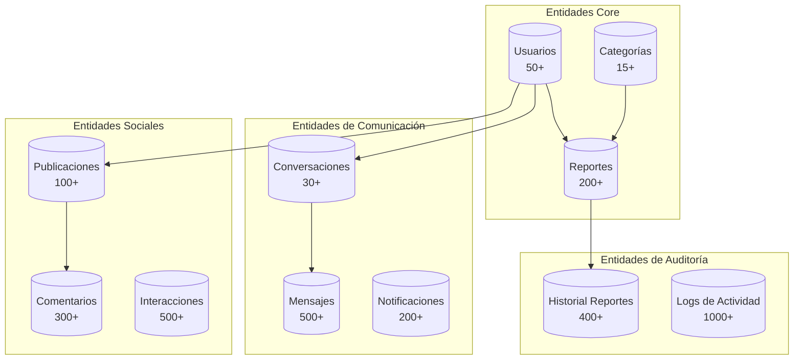
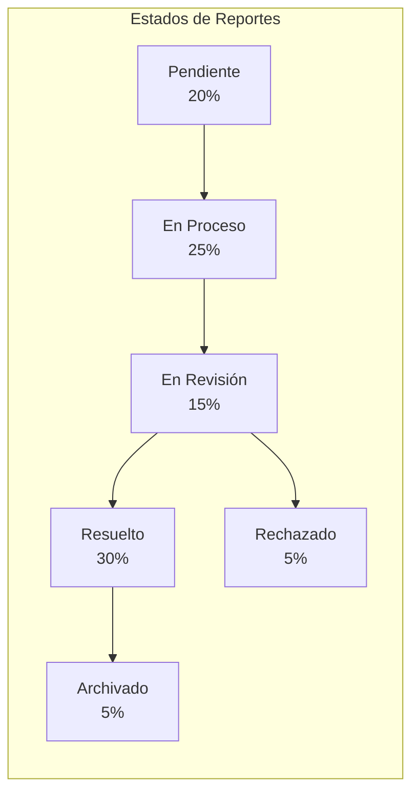
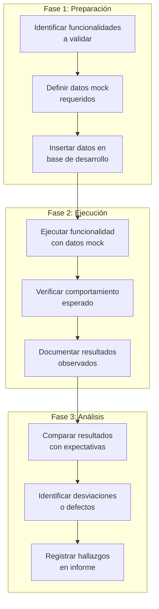
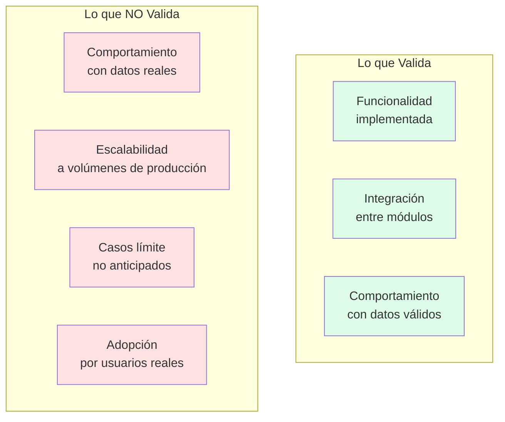

# Capítulo: Desarrollo del Proyecto

## Sección: Estrategia de Validación con Datos Mock

### 1. Necesidad de Datos Controlados en el Contexto del Sistema

El desarrollo de UniAlerta UCE enfrenta una restricción inherente a su naturaleza de Prueba de Concepto: la ausencia de operación institucional real que genere datos auténticos de incidentes, usuarios y flujos de atención. Esta situación plantea un desafío metodológico: ¿cómo validar que el sistema satisface los requerimientos funcionales cuando no existen datos operativos reales contra los cuales contrastar su comportamiento?

La estrategia de validación con datos mock constituye la respuesta metodológica a esta restricción, estableciendo un conjunto de datos sintéticos pero representativos que permiten ejercitar las funcionalidades del sistema bajo condiciones controladas y reproducibles.

*Figura 1: Contexto que fundamenta la estrategia de datos mock*

### 2. Definición Operativa de Datos Mock en UniAlerta UCE

En el contexto de este sistema, los datos mock constituyen registros sintéticos insertados en la base de datos PostgreSQL que simulan el estado operativo que tendría el sistema tras un período de uso real. Estos datos no son generados en tiempo de ejecución ni almacenados en memoria; persisten en la base de datos de desarrollo con la misma estructura y restricciones que aplicarían a datos reales.

**Características distintivas de los datos mock en este proyecto:**

| Característica | Implementación |
|----------------|----------------|
| **Persistencia** | Almacenados en PostgreSQL, no en memoria |
| **Integridad referencial** | Respetan todas las foreign keys y constraints del esquema |
| **Políticas de seguridad** | Sujetos a las mismas políticas RLS que datos reales |
| **Representatividad** | Cubren variabilidad de casos: estados, categorías, ubicaciones |
| **Reproducibilidad** | Conjunto estable que permite pruebas repetibles |

Esta definición distingue los datos mock de UniAlerta UCE de otras aproximaciones como stubs (respuestas simuladas sin persistencia) o fixtures temporales (datos efímeros para pruebas unitarias).

### 3. Propósitos de la Validación con Datos Mock

La estrategia de datos mock en UniAlerta UCE persigue objetivos específicos alineados con las funcionalidades del sistema:

#### 3.1 Validación de Flujos de Gestión de Incidentes

El módulo de reportes implementa un ciclo de vida con múltiples estados, asignaciones y transiciones. Los datos mock permiten validar:

- Visualización de reportes en diferentes estados (pendiente, en proceso, resuelto, rechazado)
- Transiciones de estado con registro de historial
- Asignación de operadores y trazabilidad de responsabilidades
- Detección de reportes similares por proximidad geográfica

*Figura 2: Distribución de estados en datos mock de reportes*

#### 3.2 Validación de Funcionalidades Geoespaciales

El sistema integra geolocalización mediante PostGIS, mapas Leaflet y servicios OpenStreetMap. Los datos mock incluyen coordenadas geográficas distribuidas en el área del campus universitario para validar:

- Renderizado de marcadores en mapas interactivos
- Consultas de proximidad (reportes cercanos a una ubicación)
- Agrupación en mapas de calor por densidad de incidentes
- Enriquecimiento semántico de ubicaciones (edificio, área)

| Aspecto Geoespacial | Datos Mock Requeridos |
|---------------------|----------------------|
| Visualización en mapa | Reportes con coordenadas válidas dentro del campus |
| Detección de similares | Grupos de reportes próximos (< 100 metros) |
| Mapa de calor | Concentraciones de 5+ reportes en áreas específicas |
| Rastreo de operadores | Ubicaciones de usuarios asignados a reportes activos |

#### 3.3 Validación del Sistema de Roles y Permisos

UniAlerta UCE implementa seis roles diferenciados con permisos granulares. Los datos mock incluyen usuarios con cada rol para validar:

- Visibilidad diferenciada según permisos del usuario
- Restricciones de acceso a funcionalidades por rol
- Jerarquía de roles en asignaciones y supervisión
- Auditoría de acciones por tipo de usuario

*Figura 3: Distribución de roles en usuarios mock*

#### 3.4 Validación del Dashboard Analítico

El módulo de dashboard presenta métricas agregadas y visualizaciones estadísticas. Los datos mock deben generar distribuciones que permitan validar:

- Gráficos de barras por categoría de reporte
- Gráficos circulares por estado y prioridad
- Tendencias temporales (últimos 7 días, 30 días)
- Comparativas entre períodos

| Visualización | Requisito de Datos Mock |
|---------------|------------------------|
| Distribución por categoría | Al menos 5 categorías con reportes asociados |
| Tendencia temporal | Reportes distribuidos en los últimos 30 días |
| Distribución por prioridad | Reportes en alta, media y baja prioridad |
| Métricas de resolución | Reportes con estados finales y fechas de cierre |

#### 3.5 Validación de Comunicación en Tiempo Real

El sistema integra mensajería instantánea y notificaciones. Los datos mock incluyen conversaciones y mensajes para validar:

- Carga de historial de conversaciones
- Indicadores de mensajes no leídos
- Estructura de conversaciones grupales
- Referencias a reportes compartidos en mensajes

### 4. Composición del Conjunto de Datos Mock

El conjunto de datos mock de UniAlerta UCE está estructurado para cubrir las entidades principales del sistema con volúmenes suficientes para ejercitar cada funcionalidad:

| Entidad | Cantidad | Variabilidad Cubierta |
|---------|----------|----------------------|
| **Usuarios** | 50+ | 6 roles, estados activo/inactivo/bloqueado |
| **Reportes** | 200+ | 6 estados, 4 prioridades, 15+ categorías |
| **Categorías** | 15+ | Con y sin tipos de reporte asociados |
| **Tipos de Reporte** | 30+ | Distribuidos entre categorías |
| **Publicaciones** | 100+ | Con imágenes, hashtags, menciones |
| **Comentarios** | 300+ | Respuestas anidadas, menciones |
| **Conversaciones** | 30+ | Individuales y grupales |
| **Mensajes** | 500+ | Texto, imágenes, reportes compartidos |
| **Notificaciones** | 200+ | Leídas y no leídas, diferentes tipos |
| **Registros de Auditoría** | 1000+ | Todas las entidades, múltiples acciones |

*Figura 4: Estructura relacional de datos mock*

### 5. Criterios de Representatividad

Los datos mock de UniAlerta UCE no constituyen registros arbitrarios; siguen criterios de representatividad que aseguran su utilidad para validación:

#### 5.1 Cobertura de Estados y Transiciones

Cada entidad que implementa máquina de estados incluye registros en cada estado posible:

*Figura 5: Distribución proporcional de estados en reportes mock*

#### 5.2 Distribución Geográfica Coherente

Las coordenadas geográficas de los reportes mock corresponden a ubicaciones dentro del perímetro del campus universitario, con concentraciones en edificios principales y áreas de alta circulación:

| Zona del Campus | Porcentaje de Reportes Mock |
|-----------------|----------------------------|
| Edificios académicos | 40% |
| Áreas de servicio | 25% |
| Espacios de circulación | 20% |
| Áreas verdes | 10% |
| Perímetro | 5% |

#### 5.3 Distribución Temporal Realista

Los timestamps de creación y modificación de registros están distribuidos en un período que simula operación sostenida:

- Reportes distribuidos en los últimos 90 días
- Mayor concentración en días laborables
- Variación horaria entre 7:00 y 20:00
- Picos de actividad en horarios de clase

#### 5.4 Relaciones Consistentes

Las referencias entre entidades respetan la lógica del negocio:

- Reportes asignados solo a usuarios con rol operador o superior
- Historial de cambios con secuencia temporal coherente
- Mensajes en conversaciones con orden cronológico
- Notificaciones referenciando entidades existentes

### 6. Proceso de Validación con Datos Mock

La estrategia de validación con datos mock en UniAlerta UCE sigue un proceso estructurado:

*Figura 6: Proceso de validación con datos mock*

#### 6.1 Validación de Consultas y Filtros

Los datos mock permiten verificar que las consultas del sistema retornan los registros esperados:

| Consulta Validada | Expectativa con Datos Mock |
|-------------------|---------------------------|
| Reportes por estado "Pendiente" | Retorna exactamente los 40 reportes pendientes |
| Reportes en radio de 100m | Retorna grupos conocidos de reportes cercanos |
| Usuarios con rol "Operador" | Retorna los 15 operadores mock definidos |
| Mensajes no leídos | Retorna mensajes marcados como no leídos |

#### 6.2 Validación de Agregaciones

Las métricas del dashboard se contrastan con conteos conocidos:

| Métrica | Valor Esperado | Fuente de Verificación |
|---------|----------------|----------------------|
| Total de reportes | 200 | COUNT(*) en tabla reportes |
| Reportes por categoría | Distribución conocida | GROUP BY categoria_id |
| Tendencia 7 días | Valores pre-calculados | Registros con timestamps controlados |

#### 6.3 Validación de Permisos

Las restricciones de acceso se verifican con usuarios de cada rol:

| Acción | Usuario Admin | Usuario Operador | Usuario Estándar |
|--------|--------------|------------------|------------------|
| Ver todos los reportes | ✓ Permitido | ✓ Permitido | ✗ Solo propios |
| Cambiar estado | ✓ Permitido | ✓ Permitido | ✗ Denegado |
| Eliminar usuario | ✓ Permitido | ✗ Denegado | ✗ Denegado |
| Acceder a auditoría | ✓ Permitido | ✗ Denegado | ✗ Denegado |

### 7. Limitaciones de la Validación con Datos Mock

La estrategia de datos mock presenta limitaciones inherentes que deben reconocerse:

| Limitación | Implicación para el Proyecto |
|------------|------------------------------|
| **Ausencia de variabilidad operativa** | Los datos mock no capturan la diversidad de situaciones que generaría uso real |
| **Patrones predefinidos** | La distribución de datos responde a diseño, no a comportamiento emergente |
| **Sin validación de carga** | Los volúmenes mock no representan escala de producción institucional |
| **Sesgo de confirmación** | Los datos se diseñan para ejercitar funcionalidades conocidas, no para descubrir casos límite |

*Figura 7: Alcance y limitaciones de la validación con datos mock*

### 8. Transición hacia Datos Reales

La estrategia de datos mock constituye una fase transitoria del ciclo de desarrollo. La evolución hacia validación con datos reales requeriría:

| Fase de Evolución | Características |
|-------------------|-----------------|
| **Piloto controlado** | Grupo reducido de usuarios reales generando datos en ambiente de prueba |
| **Coexistencia** | Datos mock y datos reales conviviendo con identificación clara |
| **Migración** | Depuración de datos mock y operación exclusiva con datos reales |
| **Producción** | Sistema operando con datos generados por uso institucional |

### 9. Síntesis de la Estrategia

La estrategia de validación con datos mock en UniAlerta UCE:

1. **Responde a una restricción contextual**: la ausencia de operación real que genere datos auténticos durante el desarrollo de la Prueba de Concepto.

2. **Establece un conjunto de datos representativos**: 50+ usuarios, 200+ reportes, 500+ mensajes y demás entidades con distribución controlada de estados, ubicaciones y relaciones.

3. **Habilita la verificación de funcionalidades**: consultas, filtros, agregaciones, permisos y flujos operativos pueden ejercitarse con resultados predecibles.

4. **Reconoce limitaciones inherentes**: no sustituye validación con usuarios reales ni garantiza comportamiento ante variabilidad operativa.

5. **Constituye una fase transitoria**: la evolución hacia MVP requeriría incorporación progresiva de datos reales generados por uso institucional.

Esta estrategia permite que UniAlerta UCE demuestre factibilidad funcional dentro de las restricciones propias de una Prueba de Concepto, estableciendo la base para validaciones más rigurosas en fases posteriores del ciclo de desarrollo.
