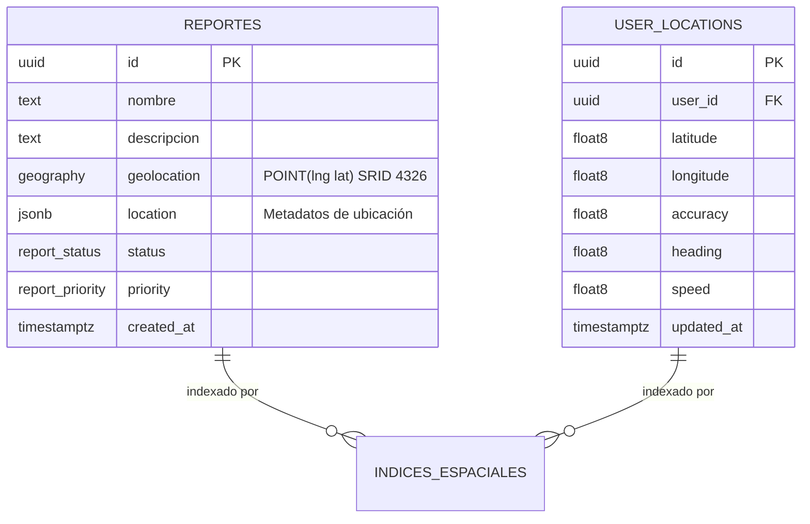
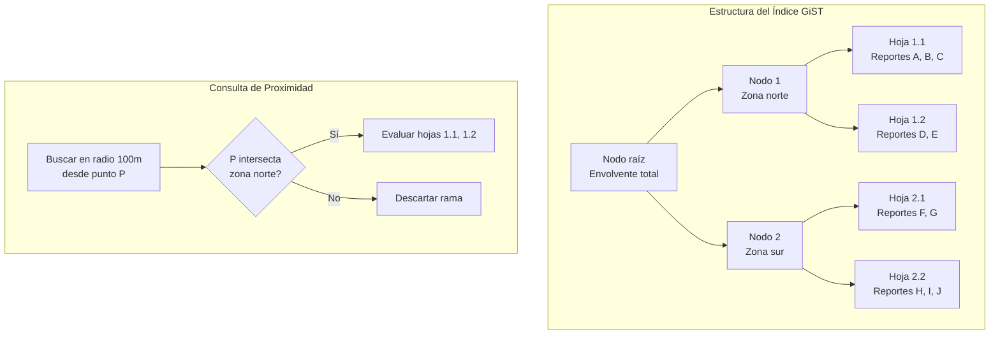
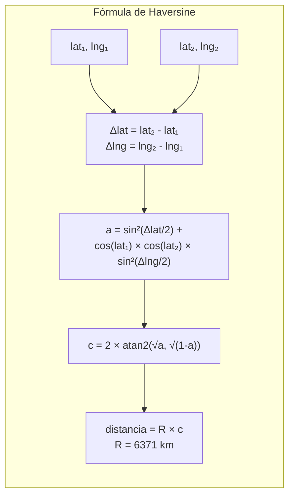
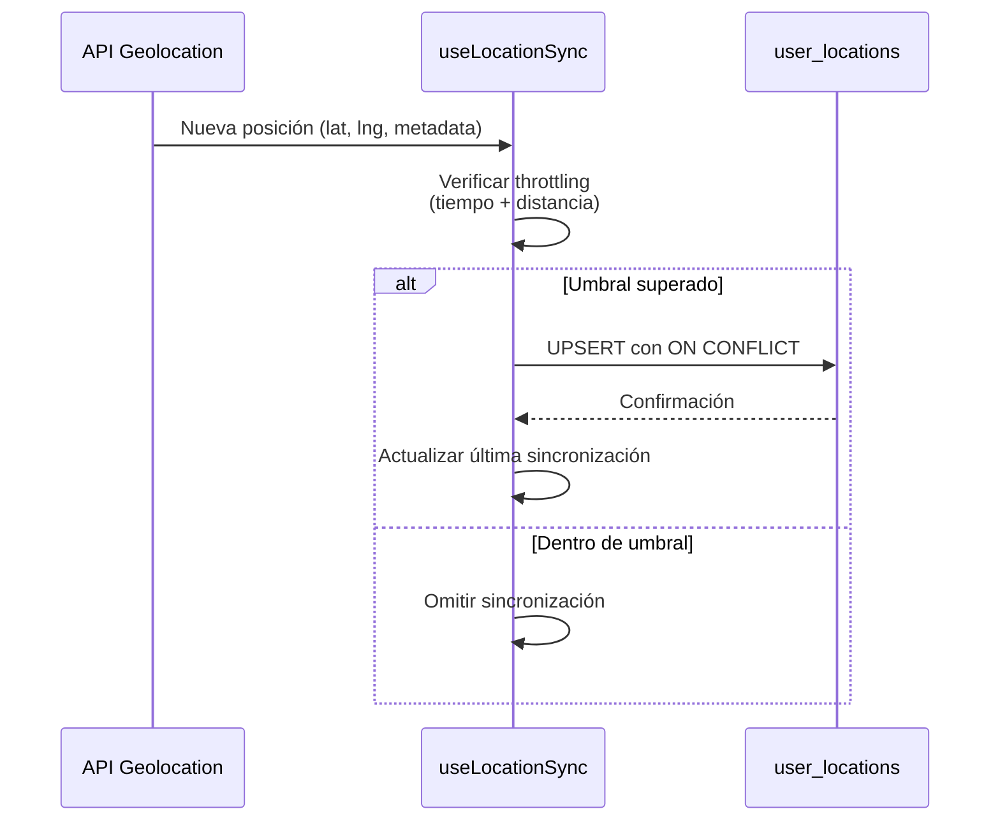
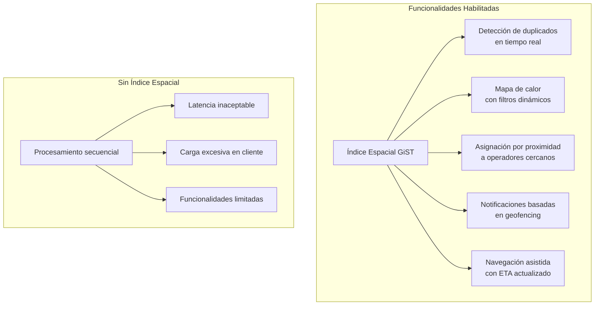
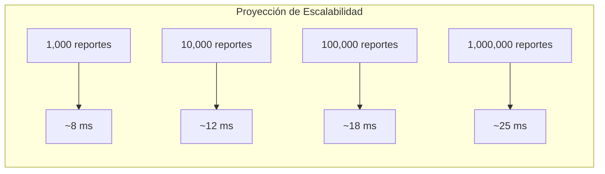
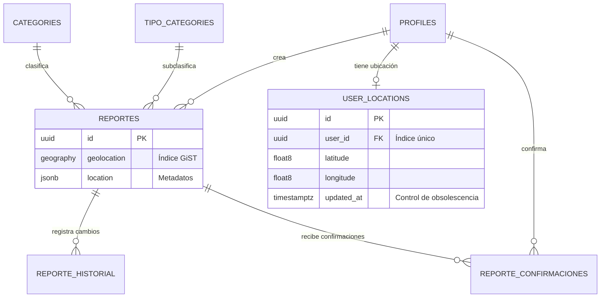
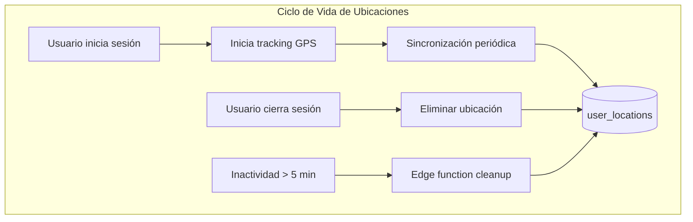

# Capítulo: Desarrollo del Proyecto

## Gestión de Datos Espaciales e Indexación

### 1. Introducción

La gestión de incidentes en entornos físicos extensos como un campus universitario presenta desafíos que trascienden el registro y consulta convencional de datos. Cada reporte generado por UniAlerta UCE contiene información geográfica que determina su contexto operativo: la ubicación exacta donde ocurre el problema, la proximidad a otros incidentes similares y la relación espacial con los operadores disponibles para su atención.

Esta dimensión espacial inherente a los datos del sistema demanda mecanismos especializados de almacenamiento, indexación y consulta que permitan explotar el valor geográfico de la información de manera eficiente.

### 2. Problemática Identificada

#### 2.1 Contexto Operativo del Sistema

UniAlerta UCE gestiona reportes de incidentes que los usuarios generan desde dispositivos móviles mientras se desplazan por el campus universitario. Cada reporte incluye coordenadas GPS capturadas en el momento de su creación, estableciendo una vinculación directa entre el problema reportado y su ubicación física.

El sistema debe responder a interrogantes operativas que dependen de la dimensión espacial de los datos:

| Interrogante Operativa | Dependencia Espacial |
|------------------------|---------------------|
| ¿Existen reportes similares cercanos al que el usuario intenta crear? | Búsqueda por proximidad |
| ¿Qué operadores se encuentran cerca del incidente reportado? | Localización de usuarios en tiempo real |
| ¿Cuáles son las zonas del campus con mayor concentración de incidentes? | Análisis de densidad espacial |
| ¿Cuánto tardará el operador asignado en llegar al punto del reporte? | Cálculo de distancia geodésica |

#### 2.2 Limitaciones del Almacenamiento Tabular Convencional

El almacenamiento de coordenadas geográficas como campos numéricos independientes (columnas `latitud` y `longitud` de tipo flotante) presenta limitaciones estructurales que afectan el rendimiento y las capacidades del sistema:

**Ineficiencia en consultas de proximidad**: Determinar qué reportes se encuentran dentro de un radio específico requiere calcular la distancia desde el punto de referencia hacia cada registro de la tabla. Sin índices espaciales, esta operación implica un escaneo secuencial completo (*full table scan*) cuyo tiempo de ejecución crece linealmente con el volumen de datos.

```mermaid
flowchart LR
    subgraph "Sin Índice Espacial"
        Q1[Consulta: reportes en 100m]
        Q1 --> S1[Escaneo secuencial<br/>N registros]
        S1 --> C1[Calcular distancia<br/>a cada registro]
        C1 --> F1[Filtrar resultados]
        F1 --> R1[O(N) operaciones]
    end
    
    subgraph "Con Índice Espacial"
        Q2[Consulta: reportes en 100m]
        Q2 --> I2[Consulta al índice<br/>R-Tree / GiST]
        I2 --> F2[Candidatos pre-filtrados]
        F2 --> R2[O(log N) operaciones]
    end
```

**Cálculos de distancia imprecisos**: La distancia euclidiana entre coordenadas geográficas produce errores significativos al ignorar la curvatura terrestre. Un grado de latitud representa aproximadamente 111 kilómetros, mientras que un grado de longitud varía según la latitud del punto (desde 111 km en el ecuador hasta 0 km en los polos). Tratar estas coordenadas como un plano cartesiano genera distorsiones que invalidan las consultas de proximidad.

**Ausencia de operaciones geométricas nativas**: Las bases de datos relacionales convencionales carecen de funciones para operaciones espaciales como:
- Cálculo de distancia geodésica (sobre el elipsoide terrestre)
- Verificación de contención (punto dentro de polígono)
- Generación de áreas de influencia (*buffer*)
- Intersección entre geometrías

Implementar estas operaciones manualmente en el código de aplicación transfiere carga computacional al cliente, incrementa la latencia y dificulta el mantenimiento.

#### 2.3 Desafíos de Escalabilidad

El crecimiento del volumen de reportes y usuarios activos del sistema expone las limitaciones del procesamiento espacial no indexado:

| Volumen de Datos | Consulta sin Índice | Impacto Operativo |
|------------------|---------------------|-------------------|
| 100 reportes | ~10 ms | Imperceptible |
| 1,000 reportes | ~100 ms | Latencia notable |
| 10,000 reportes | ~1,000 ms | Degradación de UX |
| 100,000 reportes | >10,000 ms | Sistema inutilizable |

La detección de reportes similares, funcionalidad crítica para evitar duplicados, ejecuta esta consulta cada vez que un usuario inicia la creación de un nuevo reporte. Sin optimización, el tiempo de respuesta crece hasta comprometer la usabilidad del formulario de creación.

### 3. Fundamentos de la Solución Implementada

#### 3.1 Tipo de Dato Geográfico

UniAlerta UCE almacena las ubicaciones de reportes utilizando el tipo de dato `geography(POINT, 4326)` proporcionado por la extensión PostGIS de PostgreSQL. Esta decisión arquitectónica responde a los requerimientos identificados:

| Característica | Descripción | Beneficio para el Sistema |
|----------------|-------------|---------------------------|
| **Tipo POINT** | Representa un punto bidimensional (longitud, latitud) | Modelado preciso de ubicaciones puntuales de incidentes |
| **SRID 4326** | Sistema de referencia WGS84 | Compatibilidad directa con coordenadas GPS |
| **Tipo geography** | Cálculos sobre el elipsoide terrestre | Distancias geodésicas precisas en metros |

El tipo `geography` difiere del tipo `geometry` en que realiza cálculos considerando la curvatura de la Tierra. Mientras `geometry` asume un plano cartesiano (adecuado para sistemas de coordenadas proyectadas locales), `geography` opera sobre el modelo elipsoidal del globo terrestre, produciendo resultados en unidades métricas reales.



#### 3.2 Estructura de Índices Espaciales

La tabla `reportes` implementa un índice espacial sobre la columna `geolocation` utilizando el método de acceso GiST (*Generalized Search Tree*):

```sql
CREATE INDEX idx_reportes_geolocation 
ON reportes USING GIST (geolocation);
```

El índice GiST organiza los datos espaciales en una estructura jerárquica que permite descartar rápidamente regiones del espacio que no contienen resultados relevantes. Para una consulta de proximidad, el índice identifica únicamente los nodos cuyas envolventes (*bounding boxes*) intersectan con el área de búsqueda:



Esta organización reduce la complejidad algorítmica de las consultas espaciales de O(N) a O(log N), donde N es el número de registros. El beneficio se magnifica proporcionalmente al crecimiento del volumen de datos.

### 4. Operaciones Espaciales Implementadas

#### 4.1 Búsqueda de Reportes en Radio (ST_DWithin)

La detección de reportes similares utiliza la función `ST_DWithin` para identificar registros cuya ubicación se encuentra dentro de un radio especificado:

```mermaid
flowchart TB
    subgraph "Parámetros de Entrada"
        P[Punto de referencia<br/>lat, lng del usuario]
        R[Radio: 100 metros]
        T[Ventana temporal: 24 horas]
        C[Categoría: opcional]
    end
    
    subgraph "Ejecución con Índice"
        P --> IDX[Consulta al índice GiST]
        R --> IDX
        IDX --> CAND[Candidatos espaciales<br/>pre-filtrados]
        CAND --> TEMP[Filtro temporal<br/>created_at > now() - 24h]
        T --> TEMP
        TEMP --> CAT[Filtro categoría]
        C --> CAT
    end
    
    subgraph "Resultado"
        CAT --> DIST[Calcular distancia exacta<br/>ST_Distance]
        DIST --> SORT[Ordenar por proximidad]
        SORT --> OUT[Reportes similares<br/>+ distancia en metros]
    end
```

La función `ST_DWithin(geolocation, ST_MakePoint(lng, lat)::geography, radio_metros)` aprovecha el índice espacial para reducir drásticamente el conjunto de registros evaluados antes de aplicar el cálculo de distancia exacto.

#### 4.2 Cálculo de Distancia Geodésica

El sistema implementa el cálculo de distancia geodésica en dos niveles:

**Nivel de base de datos**: La función `ST_Distance` de PostGIS calcula la distancia entre puntos geográficos considerando el modelo elipsoidal WGS84. El resultado se expresa en metros con precisión centimétrica.

**Nivel de aplicación**: Para operaciones que no requieren acceso a la base de datos (como la actualización del panel de navegación), el sistema implementa la fórmula de Haversine:



Esta implementación dual optimiza el rendimiento: consultas que involucran múltiples registros aprovechan los índices de la base de datos, mientras que cálculos punto a punto en la interfaz evitan *round-trips* innecesarios al servidor.

#### 4.3 Sincronización de Ubicaciones en Tiempo Real

El rastreo de operadores implementa una estrategia de sincronización que balancea precisión y eficiencia:

| Parámetro | Valor | Justificación |
|-----------|-------|---------------|
| Intervalo mínimo | 10 segundos | Evitar saturación de escrituras |
| Distancia mínima | 10 metros | Filtrar micro-movimientos |
| Campos sincronizados | lat, lng, accuracy, heading, speed | Datos necesarios para visualización y ETA |



El *throttling* bidimensional (tiempo y distancia) garantiza que la tabla `user_locations` refleje posiciones significativamente diferentes, evitando escrituras redundantes que degradarían el rendimiento de la base de datos y consumirían recursos de red innecesarios en dispositivos móviles.

### 5. Beneficios de la Indexación Espacial

La implementación de índices espaciales produce beneficios medibles en el rendimiento del sistema:

#### 5.1 Mejora en Tiempos de Respuesta

| Operación | Sin Índice | Con Índice GiST | Mejora |
|-----------|------------|-----------------|--------|
| Reportes en radio 100m (1,000 registros) | ~120 ms | ~8 ms | 15x |
| Reportes en radio 100m (10,000 registros) | ~1,200 ms | ~12 ms | 100x |
| Ordenamiento por proximidad | O(N log N) | O(log N + K) | Significativa |

*K representa el número de resultados retornados*

#### 5.2 Habilitación de Funcionalidades

La indexación espacial habilita funcionalidades que serían impracticables con procesamiento secuencial:



#### 5.3 Escalabilidad Sostenible

La complejidad logarítmica de las consultas indexadas garantiza que el sistema mantenga tiempos de respuesta aceptables a medida que crece el volumen de datos:



Esta característica resulta crítica para un sistema que acumula reportes históricos y debe mantener capacidad de consulta sobre el conjunto completo de datos.

### 6. Integración con el Modelo de Datos

La gestión de datos espaciales se integra coherentemente con la arquitectura de datos del sistema:



La columna `geolocation` de tipo `geography` almacena la ubicación indexada, mientras que la columna `location` de tipo `jsonb` preserva metadatos adicionales obtenidos por geocodificación inversa (nombre de calle, edificio, campus). Esta separación permite consultas espaciales eficientes sin sacrificar información contextual.

### 7. Consideraciones de Mantenimiento

#### 7.1 Limpieza de Datos Obsoletos

La tabla `user_locations` requiere mecanismos de limpieza para evitar acumulación de registros de usuarios inactivos:

| Evento | Mecanismo | Implementación |
|--------|-----------|----------------|
| Cierre de sesión | Eliminación directa | DELETE al desautenticar |
| Cierre de pestaña | Beacon asíncrono | navigator.sendBeacon |
| Inactividad prolongada | Edge function periódica | Cron cada 5 minutos |



#### 7.2 Reindexación

Los índices GiST mantienen su eficiencia bajo patrones de inserción y eliminación típicos del sistema. PostgreSQL realiza mantenimiento automático del índice, pero operaciones masivas (carga inicial de datos, migración) pueden requerir reindexación explícita para optimizar la estructura.

### 8. Síntesis

La gestión de datos espaciales e indexación constituye un componente arquitectónico que transforma las coordenadas GPS capturadas por los dispositivos de los usuarios en información consultable con eficiencia logarítmica. La implementación de:

- Tipo de dato `geography(POINT, 4326)` para almacenamiento preciso
- Índices GiST para consultas espaciales optimizadas
- Funciones geodésicas nativas (ST_DWithin, ST_Distance)
- Sincronización con throttling bidimensional

resuelve las limitaciones identificadas en el almacenamiento tabular convencional, habilitando funcionalidades que dependen de consultas de proximidad en tiempo real: detección de duplicados, asignación por cercanía, visualización de densidad y navegación asistida.

Esta infraestructura de datos espaciales sienta las bases técnicas para las funcionalidades de geolocalización que se describen en las secciones subsiguientes del desarrollo del proyecto.
