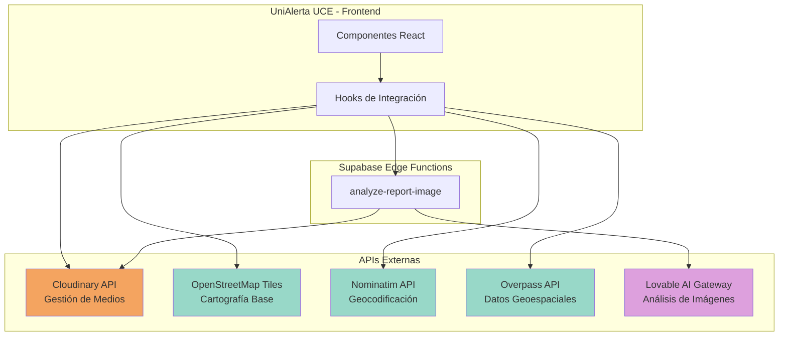
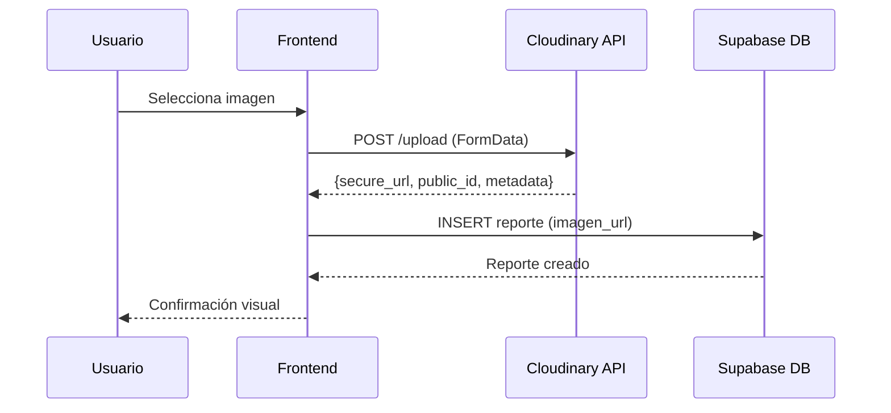
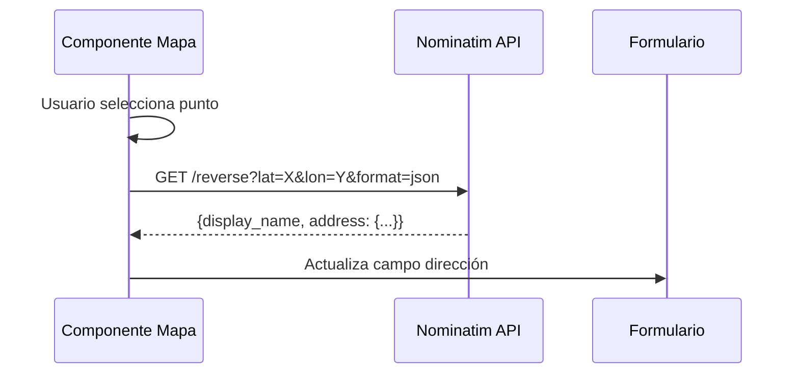
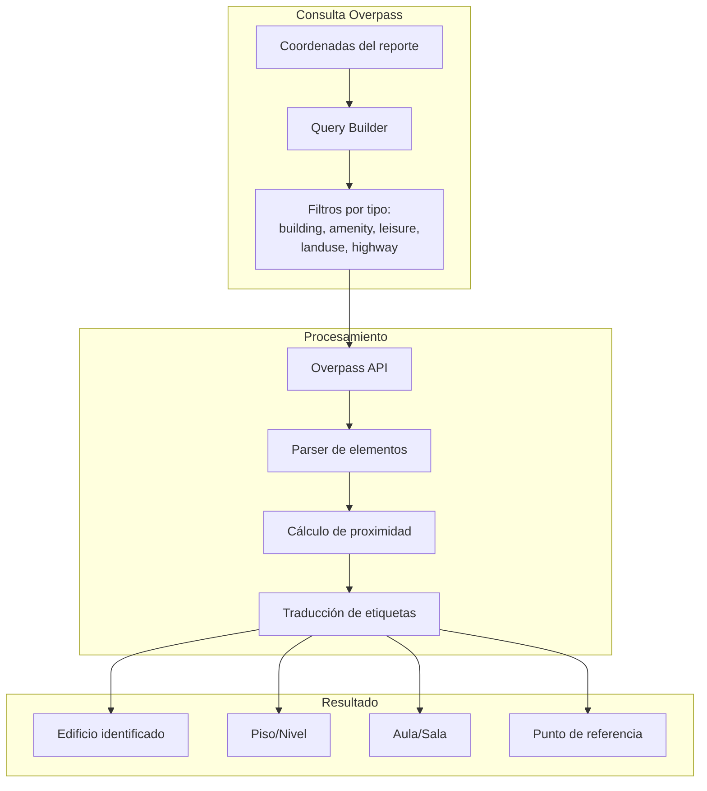
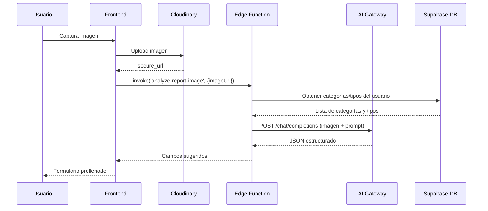
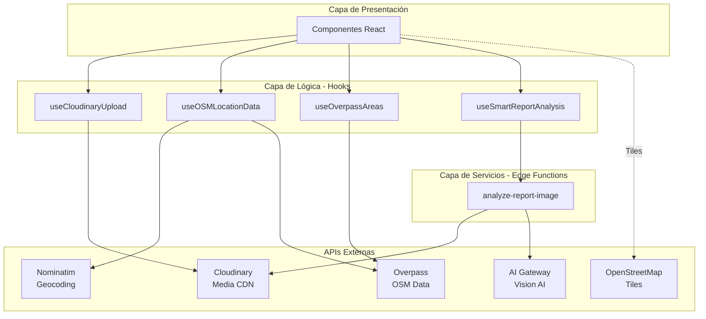

# Capítulo: Desarrollo del Proyecto

## Sección: Integración mediante APIs Externas

### 1. Contextualización de la Problemática

La plataforma UniAlerta UCE, concebida como un sistema integral de gestión de reportes e incidentes universitarios con capacidades de geolocalización en tiempo real, red social y mensajería, enfrenta requisitos funcionales que trascienden las capacidades nativas de una aplicación web frontend. Específicamente, el sistema requiere:

1. **Almacenamiento y procesamiento de contenido multimedia**: Los reportes de incidentes demandan evidencia fotográfica que debe almacenarse de forma segura, accesible y optimizada para diferentes dispositivos y anchos de banda.

2. **Representación cartográfica interactiva**: La naturaleza geoespacial de los reportes universitarios exige visualización en mapas dinámicos con capacidad de georreferenciación precisa dentro del campus.

3. **Geocodificación y geocodificación inversa**: El sistema debe traducir coordenadas GPS a direcciones legibles y viceversa, permitiendo a los usuarios identificar ubicaciones sin conocimientos técnicos de sistemas de coordenadas.

4. **Enriquecimiento semántico de ubicaciones**: Más allá de coordenadas, el contexto universitario requiere identificar elementos específicos del entorno: edificios, aulas, canchas, jardines y puntos de referencia que aporten significado operativo al reporte.

5. **Análisis inteligente de imágenes**: Para optimizar la experiencia del usuario y reducir tiempos de registro, se requiere capacidad de análisis automático de imágenes que sugiera clasificación, prioridad y descripción de incidentes.

Estas funcionalidades representan dominios especializados —procesamiento de imágenes, cartografía digital, inteligencia artificial— cuya implementación interna resultaría prohibitiva en términos de esfuerzo de desarrollo, infraestructura requerida y costos de mantenimiento continuo.

### 2. Justificación de la Estrategia de Integración

La arquitectura de UniAlerta UCE adopta el paradigma de **composición mediante servicios externos**, aprovechando APIs especializadas que proporcionan funcionalidades maduras, escalables y continuamente actualizadas. Esta decisión arquitectónica responde a los siguientes criterios:

| Criterio | Justificación |
|----------|---------------|
| **Especialización** | Cada servicio externo representa años de desarrollo enfocado en su dominio específico |
| **Escalabilidad** | Los proveedores gestionan la infraestructura necesaria para manejar cargas variables |
| **Mantenimiento** | Las actualizaciones, correcciones de seguridad y mejoras son responsabilidad del proveedor |
| **Costo-beneficio** | El modelo de consumo por demanda elimina inversiones iniciales en infraestructura |
| **Tiempo de desarrollo** | La integración mediante APIs reduce significativamente los ciclos de implementación |

### 3. APIs Externas Integradas

El sistema UniAlerta UCE integra cuatro servicios externos principales, cada uno abordando una problemática funcional específica:



*Figura 1: Diagrama de integración de APIs externas en UniAlerta UCE*

#### 3.1 Cloudinary: Gestión de Contenido Multimedia

**Problemática abordada**: Los reportes de incidentes universitarios requieren adjuntar evidencia fotográfica que debe ser:
- Almacenada de forma persistente y segura
- Accesible mediante URLs públicas para visualización
- Optimizada automáticamente según el dispositivo del usuario
- Procesada para extracción de metadatos

**Rol en el sistema**: Cloudinary actúa como Content Delivery Network (CDN) especializado en medios, proporcionando almacenamiento ilimitado, transformación de imágenes bajo demanda y distribución global optimizada.

**Patrón de integración**: El sistema implementa un hook especializado (`useCloudinaryUpload`) que encapsula la comunicación con la API de Cloudinary mediante *unsigned uploads*, permitiendo la carga directa desde el navegador del usuario sin exponer credenciales sensibles.



*Figura 2: Flujo de carga de imágenes mediante Cloudinary*

**Datos intercambiados**:
- **Entrada**: Archivo binario (imagen), preset de configuración, carpeta destino, etiquetas
- **Salida**: URL segura, identificador público, dimensiones, formato, tamaño en bytes

#### 3.2 OpenStreetMap Tiles: Cartografía Base

**Problemática abordada**: La visualización de reportes geolocalizados requiere un mapa base que muestre el contexto geográfico del campus universitario y sus alrededores, sin incurrir en costos de licenciamiento.

**Rol en el sistema**: OpenStreetMap proporciona los *tiles* (teselas) cartográficas que conforman el mapa visual interactivo. Estos tiles son imágenes rasterizadas que representan diferentes niveles de zoom del mapa mundial.

**Patrón de integración**: La biblioteca Leaflet consume directamente los tiles de OpenStreetMap mediante URLs estandarizadas, renderizando el mapa en los componentes de visualización geográfica del sistema.

```mermaid
graph LR
    subgraph "Componente de Mapa"
        A[Leaflet Map]
        B[TileLayer]
    end
    
    subgraph "OpenStreetMap CDN"
        C[Tile Server]
        D[/{z}/{x}/{y}.png]
    end
    
    A --> B
    B -->|HTTP GET| C
    C --> D
    D -->|PNG 256x256| B
```

*Figura 3: Consumo de tiles cartográficos desde OpenStreetMap*

**Características relevantes**:
- Licencia abierta (ODbL) que permite uso comercial y modificación
- Cobertura global con detalle variable según la zona geográfica
- Actualizaciones colaborativas continuas de la comunidad OSM

#### 3.3 Nominatim: Geocodificación y Geocodificación Inversa

**Problemática abordada**: Los usuarios del sistema interactúan con ubicaciones mediante coordenadas GPS (obtenidas automáticamente del dispositivo) o selección en mapa, pero requieren visualizar direcciones textuales comprensibles para validar y comunicar la ubicación del incidente.

**Rol en el sistema**: Nominatim realiza la traducción bidireccional entre coordenadas geográficas (latitud/longitud) y direcciones estructuradas (calle, número, barrio, ciudad).

**Patrón de integración**: El sistema invoca la API REST de Nominatim en los siguientes escenarios:
1. Al capturar la ubicación GPS del usuario para mostrar la dirección correspondiente
2. Al seleccionar un punto en el mapa para obtener su dirección postal
3. Durante el análisis inteligente de reportes para contextualizar la ubicación



*Figura 4: Geocodificación inversa mediante Nominatim*

**Datos intercambiados**:
- **Entrada**: Coordenadas (latitud, longitud), idioma preferido
- **Salida**: Nombre de visualización, componentes de dirección (calle, número, barrio, ciudad, país)

#### 3.4 Overpass API: Enriquecimiento Semántico de Ubicaciones

**Problemática abordada**: En el contexto universitario, una dirección postal resulta insuficiente para identificar con precisión la ubicación de un incidente. Los usuarios necesitan referencias como "Edificio de Ingeniería", "Cancha de fútbol", "Biblioteca Central" o "Parqueadero norte" que aporten significado operativo inmediato.

**Rol en el sistema**: Overpass API permite consultar la base de datos de OpenStreetMap mediante un lenguaje de consulta especializado, extrayendo entidades geográficas (edificios, áreas, puntos de interés) cercanas a una ubicación específica.

**Patrón de integración**: El sistema implementa dos hooks especializados:
- `useOSMLocationData`: Obtiene datos contextuales para autocompletar campos del formulario de reportes
- `useOverpassAreas`: Obtiene polígonos de áreas para visualización en el mapa



*Figura 5: Flujo de enriquecimiento semántico mediante Overpass API*

**Datos intercambiados**:
- **Entrada**: Coordenadas centrales, radio de búsqueda, tipos de elementos a consultar
- **Salida**: Colección de elementos OSM con geometría, etiquetas descriptivas y metadatos

**Procesamiento local**: El sistema realiza cálculos geométricos en el cliente para determinar:
- Si el punto del reporte está contenido dentro de un polígono (algoritmo ray casting)
- La distancia a elementos cercanos para priorizar resultados
- La traducción de etiquetas OSM al español contextualizado

#### 3.5 Lovable AI Gateway: Análisis Inteligente de Imágenes

**Problemática abordada**: El registro manual de reportes requiere que el usuario complete múltiples campos (título, descripción, categoría, tipo, prioridad) basándose en su observación del incidente. Este proceso resulta tedioso y propenso a clasificaciones inconsistentes.

**Rol en el sistema**: El gateway de inteligencia artificial analiza imágenes capturadas por el usuario para sugerir automáticamente:
- Título descriptivo del incidente
- Descripción detallada de la situación observada
- Categoría y tipo de reporte más apropiados
- Nivel de prioridad basado en urgencia visual
- Información adicional relevante

**Patrón de integración**: La funcionalidad se implementa mediante una Edge Function de Supabase que:
1. Recibe la imagen (como URL de Cloudinary)
2. Construye un prompt contextualizado con las categorías y tipos disponibles del usuario
3. Invoca el modelo de visión artificial mediante el gateway
4. Parsea y valida la respuesta estructurada
5. Retorna los campos sugeridos al frontend



*Figura 6: Flujo de análisis inteligente de imágenes*

**Datos intercambiados**:
- **Entrada**: URL de imagen, contexto previo (opcional), lista de categorías/tipos disponibles
- **Salida**: Título, descripción, keywords de categoría/tipo, IDs sugeridos, prioridad, información adicional

### 4. Consideraciones de Implementación

La integración de APIs externas en UniAlerta UCE contempla las siguientes consideraciones técnicas:

| Aspecto | Estrategia Implementada |
|---------|------------------------|
| **Manejo de errores** | Cada integración implementa fallbacks graceful que permiten continuar la operación con funcionalidad reducida |
| **Caché local** | Consultas a Overpass y Nominatim implementan caché temporal para evitar consultas redundantes |
| **Rate limiting** | El sistema respeta los límites de uso de cada API, implementando delays adaptativos cuando es necesario |
| **Timeout** | Todas las peticiones externas incluyen timeouts configurables para evitar bloqueos indefinidos |
| **Cancelación** | Los hooks implementan AbortController para cancelar peticiones pendientes cuando el componente se desmonta |

### 5. Diagrama de Arquitectura de Integraciones



*Figura 7: Arquitectura completa de integraciones externas*

### 6. Síntesis

La estrategia de integración mediante APIs externas adoptada en UniAlerta UCE permite que el sistema ofrezca funcionalidades avanzadas de gestión multimedia, cartografía interactiva, geocodificación semántica y análisis inteligente de imágenes, sin requerir el desarrollo e infraestructura de sistemas especializados propios. Esta arquitectura de composición maximiza el valor entregado al usuario final mientras mantiene la complejidad técnica y los costos operativos en niveles manejables para un proyecto de desarrollo académico.

Las APIs seleccionadas —Cloudinary, OpenStreetMap, Nominatim, Overpass y Lovable AI Gateway— representan soluciones maduras y ampliamente adoptadas en sus respectivos dominios, garantizando estabilidad, documentación adecuada y soporte comunitario para la evolución futura del sistema.
