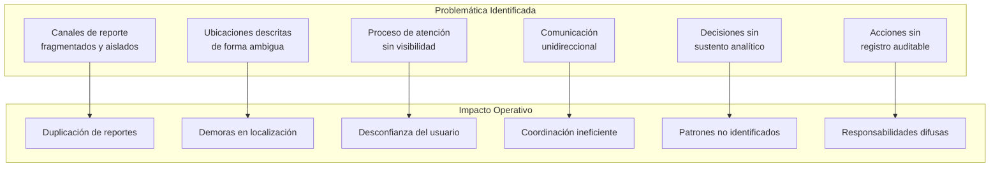
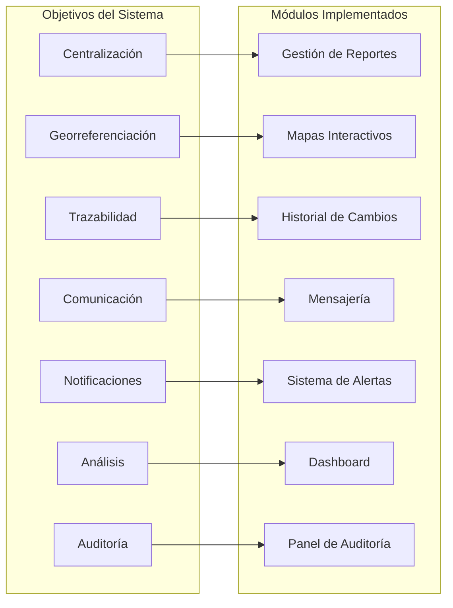
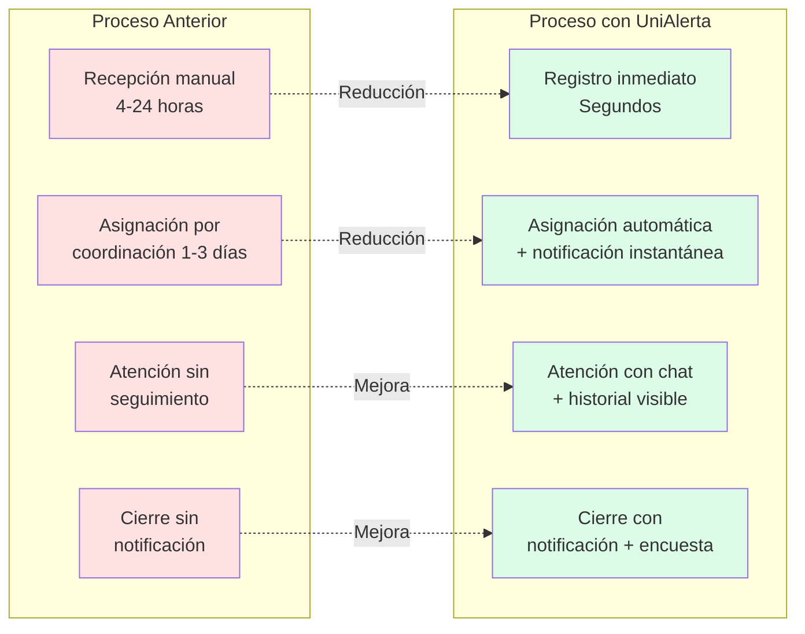
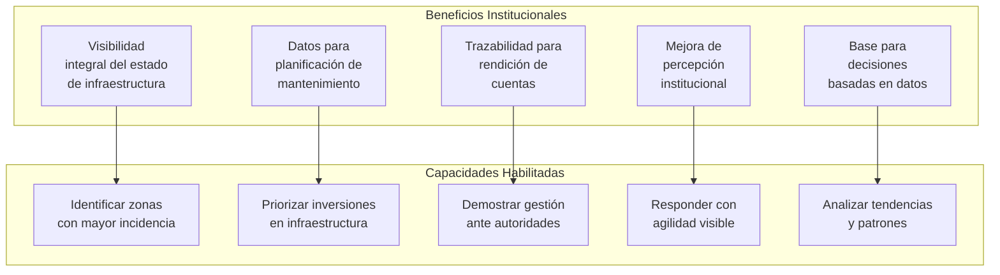

# Capítulo: Desarrollo del Proyecto

## Sección: Objetivos y Beneficios de la Implementación

### 1. Contextualización de la Problemática

La gestión de incidentes en el campus de la Universidad Central del Ecuador operaba bajo un modelo caracterizado por la dispersión de canales, la ausencia de mecanismos de seguimiento y la comunicación fragmentada entre los actores involucrados. Esta situación generaba ineficiencias operativas que afectaban tanto la capacidad de respuesta institucional como la percepción de la comunidad universitaria sobre la efectividad de los procesos de atención.

El escenario previo presentaba las siguientes características problemáticas:

- **Multiplicidad de puntos de entrada**: Cada dependencia institucional mantenía sus propios canales de recepción de reportes, sin integración ni visibilidad cruzada.
- **Desconocimiento del estado de atención**: Los usuarios que reportaban incidentes no disponían de mecanismos para conocer el progreso de su solicitud.
- **Imprecisión en la identificación de ubicaciones**: Las descripciones textuales resultaban insuficientes para localizar incidentes en un campus con múltiples edificios y espacios.
- **Ausencia de registro histórico**: No existía trazabilidad de las acciones realizadas ni capacidad de análisis retrospectivo.
- **Tiempos de respuesta prolongados**: La coordinación manual entre dependencias introducía latencias significativas en el ciclo de atención.

### 2. Problemática Específica que Motivó el Desarrollo

El análisis del contexto operativo identificó deficiencias estructurales que el sistema UniAlerta UCE busca resolver mediante objetivos específicos de implementación:

*Figura 1: Relación entre problemática identificada e impacto operativo*

### 3. Objetivos de la Implementación

Los objetivos del sistema UniAlerta UCE se derivan directamente de la problemática identificada, estableciendo metas funcionales específicas que orientan el desarrollo y permiten evaluar el cumplimiento de los requerimientos.

#### 3.1 Objetivo General

Desarrollar una plataforma web integral de gestión de reportes e incidentes universitarios que centralice el registro, habilite la georreferenciación precisa, garantice la trazabilidad completa del proceso de atención y establezca canales de comunicación bidireccional en tiempo real entre todos los actores involucrados.

#### 3.2 Objetivos Específicos

Los objetivos específicos se organizan en función de las dimensiones funcionales del sistema:

**Objetivo 1: Centralización del Registro de Incidentes**

| Aspecto | Descripción |
|---------|-------------|
| **Meta** | Establecer un punto único de ingreso para todos los tipos de incidentes universitarios |
| **Alcance** | Categorías configurables, tipos de reporte jerárquicos, prioridades diferenciadas |
| **Mecanismo** | Plataforma web accesible desde cualquier dispositivo con navegador |
| **Indicador** | 100% de reportes registrados en la plataforma centralizada |

**Objetivo 2: Georreferenciación de Reportes**

| Aspecto | Descripción |
|---------|-------------|
| **Meta** | Capturar la ubicación geográfica precisa de cada incidente reportado |
| **Alcance** | Coordenadas GPS, dirección textual, contexto de edificio/área |
| **Mecanismo** | Integración con API Geolocation, mapas Leaflet, geocodificación Nominatim |
| **Indicador** | Precisión de ubicación ≤ 10 metros del punto real del incidente |

**Objetivo 3: Trazabilidad del Ciclo de Vida**

| Aspecto | Descripción |
|---------|-------------|
| **Meta** | Registrar automáticamente cada evento del proceso de atención |
| **Alcance** | Estados, asignaciones, comentarios, evidencias, tiempos |
| **Mecanismo** | Historial de cambios con triggers de base de datos |
| **Indicador** | 100% de transiciones de estado registradas con timestamp y responsable |

**Objetivo 4: Comunicación en Tiempo Real**

| Aspecto | Descripción |
|---------|-------------|
| **Meta** | Establecer canales bidireccionales entre reportantes y operadores |
| **Alcance** | Mensajería individual, grupos, compartición de reportes |
| **Mecanismo** | Sistema de conversaciones con suscripciones en tiempo real |
| **Indicador** | Latencia de entrega de mensajes < 1 segundo |

**Objetivo 5: Notificaciones Instantáneas**

| Aspecto | Descripción |
|---------|-------------|
| **Meta** | Mantener informados a los usuarios sobre eventos relevantes |
| **Alcance** | Cambios de estado, asignaciones, menciones, reportes cercanos |
| **Mecanismo** | Sistema de notificaciones con suscripciones Realtime |
| **Indicador** | 100% de eventos críticos notificados en tiempo real |

**Objetivo 6: Análisis y Visualización de Datos**

| Aspecto | Descripción |
|---------|-------------|
| **Meta** | Proveer información analítica para la toma de decisiones |
| **Alcance** | Métricas de distribución, tendencias temporales, mapas de calor |
| **Mecanismo** | Dashboard con gráficos interactivos y filtros dinámicos |
| **Indicador** | Disponibilidad de métricas actualizadas en tiempo real |

**Objetivo 7: Auditoría y Control**

| Aspecto | Descripción |
|---------|-------------|
| **Meta** | Garantizar trazabilidad de todas las acciones del sistema |
| **Alcance** | Registro de actividades, historial de cambios, logs de acceso |
| **Mecanismo** | Módulo de auditoría con consultas y exportación |
| **Indicador** | 100% de acciones críticas registradas en log de auditoría |

*Figura 2: Correspondencia entre objetivos y módulos del sistema*

### 4. Beneficios de la Implementación

La implementación de UniAlerta UCE genera beneficios directos derivados del cumplimiento de los objetivos establecidos. Estos beneficios se manifiestan en las diferentes dimensiones del proceso de gestión de incidentes.

#### 4.1 Beneficios Operativos

Los beneficios operativos impactan directamente en la eficiencia del proceso de atención:

*Figura 3: Comparación de tiempos entre proceso anterior y proceso con UniAlerta UCE*

| Beneficio Operativo | Descripción | Impacto Esperado |
|---------------------|-------------|------------------|
| **Reducción de tiempo de registro** | Eliminación de intermediarios en la recepción de reportes | De horas a segundos |
| **Aceleración de asignación** | Notificación inmediata a operadores disponibles | De días a minutos |
| **Eliminación de duplicados** | Detección automática de reportes similares por proximidad | Reducción de esfuerzo duplicado |
| **Localización precisa** | Coordenadas GPS eliminan ambigüedad de ubicación | Respuesta directa sin clarificaciones |
| **Seguimiento en tiempo real** | Visibilidad del estado para todos los actores | Reducción de consultas de estado |

#### 4.2 Beneficios para el Usuario Reportante

El usuario que reporta incidentes experimenta mejoras significativas en su interacción con el sistema:

| Beneficio | Situación Anterior | Situación con UniAlerta |
|-----------|-------------------|-------------------------|
| **Accesibilidad** | Requería acudir físicamente o conocer canal específico | Acceso desde cualquier dispositivo con internet |
| **Facilidad de reporte** | Formularios extensos sin asistencia | Captura automática de ubicación y análisis de imagen |
| **Visibilidad del proceso** | Desconocimiento total del estado | Notificaciones en cada cambio de estado |
| **Comunicación con operador** | Sin canal estructurado | Mensajería directa integrada |
| **Historial personal** | Sin registro de reportes anteriores | Vista de todos sus reportes con historial |

#### 4.3 Beneficios para el Operador

El personal encargado de atender los incidentes dispone de herramientas que optimizan su trabajo:

| Beneficio | Descripción |
|-----------|-------------|
| **Información contextual completa** | Ubicación en mapa, fotografías, descripción, datos del reportante |
| **Priorización asistida** | Visualización de prioridad, antigüedad y categoría |
| **Comunicación integrada** | Canal directo con reportante sin cambiar de herramienta |
| **Registro automático** | Historial se genera automáticamente sin carga adicional |
| **Navegación asistida** | Mapa con ruta hacia la ubicación del incidente |

#### 4.4 Beneficios para el Supervisor

La capa de supervisión obtiene visibilidad integral del proceso:

| Beneficio | Descripción |
|-----------|-------------|
| **Dashboard en tiempo real** | Métricas actualizadas de reportes por estado, categoría, operador |
| **Identificación de patrones** | Mapas de calor, tendencias temporales, categorías recurrentes |
| **Control de asignaciones** | Visibilidad de carga de trabajo por operador |
| **Auditoría de acciones** | Registro completo de quién hizo qué y cuándo |
| **Indicadores de desempeño** | Tiempos de respuesta, tasas de resolución, satisfacción |

#### 4.5 Beneficios Institucionales

A nivel institucional, el sistema aporta valor estratégico:

*Figura 4: Beneficios institucionales y capacidades habilitadas*

| Beneficio Institucional | Descripción |
|------------------------|-------------|
| **Centralización de información** | Base de datos única con todos los incidentes históricos |
| **Evidencia de gestión** | Registro auditable de todas las acciones realizadas |
| **Insumo para planificación** | Datos georreferenciados para priorizar intervenciones |
| **Mejora de imagen** | Respuesta ágil y visible ante la comunidad |
| **Reducción de costos** | Eliminación de duplicidades y optimización de recursos |

#### 4.6 Beneficios Técnicos

Desde la perspectiva técnica, la arquitectura implementada genera beneficios de largo plazo:

| Beneficio Técnico | Descripción |
|-------------------|-------------|
| **Escalabilidad** | Arquitectura serverless que escala automáticamente según demanda |
| **Mantenibilidad** | Código modular con separación de responsabilidades |
| **Extensibilidad** | APIs documentadas que permiten integraciones futuras |
| **Disponibilidad** | Infraestructura en la nube con alta disponibilidad |
| **Seguridad** | Autenticación robusta, RLS en base de datos, cifrado en tránsito |

### 5. Matriz de Objetivos y Beneficios

La siguiente matriz sintetiza la relación entre objetivos específicos, módulos del sistema y beneficios esperados:

| Objetivo | Módulo Principal | Beneficio Directo | Beneficiario Principal |
|----------|-----------------|-------------------|------------------------|
| Centralización | Gestión de Reportes | Registro único y accesible | Usuario, Institución |
| Georreferenciación | Mapas Interactivos | Localización precisa | Operador, Supervisor |
| Trazabilidad | Historial de Cambios | Auditoría completa | Supervisor, Institución |
| Comunicación | Mensajería | Coordinación efectiva | Usuario, Operador |
| Notificaciones | Sistema de Alertas | Información oportuna | Todos los actores |
| Análisis | Dashboard | Decisiones basadas en datos | Supervisor, Institución |
| Auditoría | Panel de Auditoría | Accountability | Institución |

### 6. Síntesis

La implementación de UniAlerta UCE se orienta al cumplimiento de siete objetivos específicos que abordan directamente las deficiencias identificadas en el proceso de gestión de incidentes universitarios. Cada objetivo se materializa en módulos funcionales concretos que generan beneficios medibles para los diferentes actores del proceso: usuarios reportantes que obtienen visibilidad y comunicación, operadores que disponen de información contextual completa, supervisores que acceden a métricas en tiempo real, y la institución que consolida una base de datos georreferenciada para la toma de decisiones.

Los beneficios de la implementación trascienden la mejora operativa inmediata, estableciendo capacidades institucionales de análisis, planificación y rendición de cuentas que aportan valor estratégico a la gestión universitaria.
