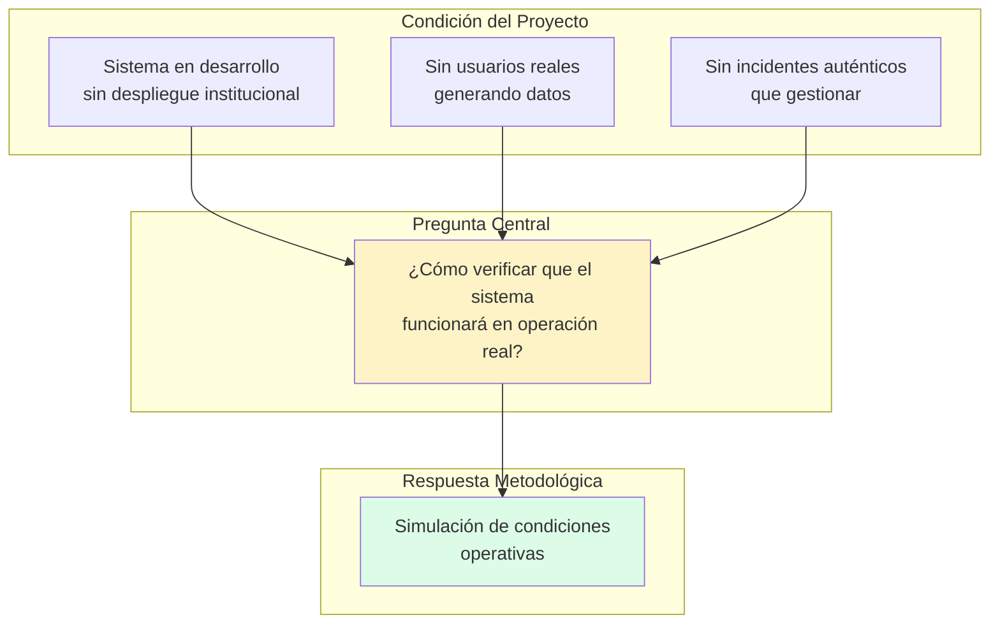
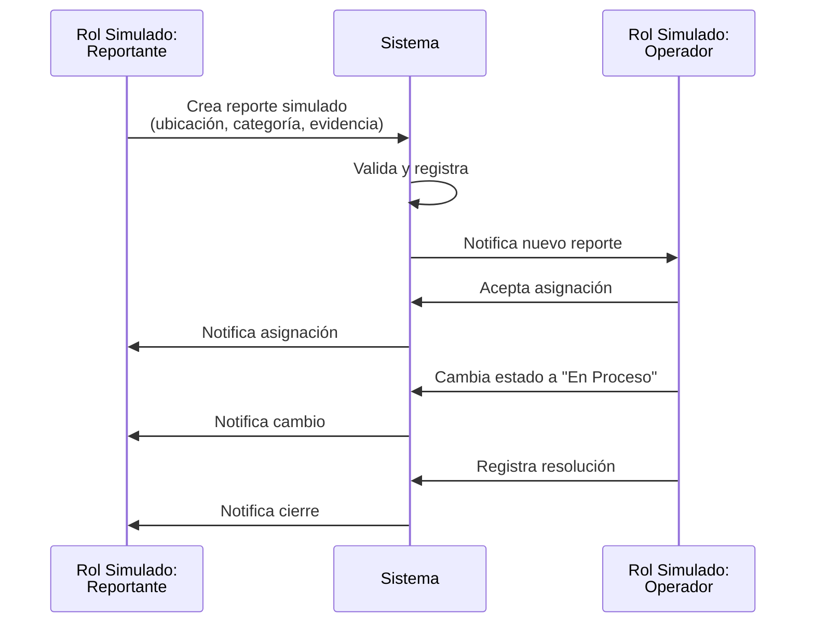
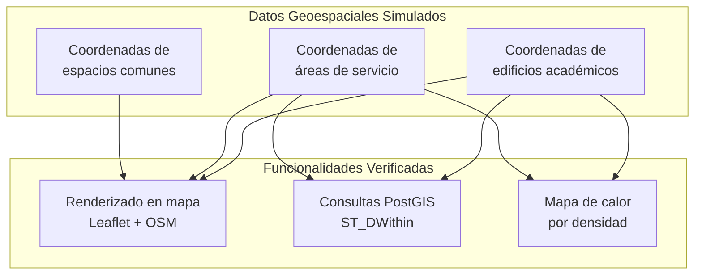
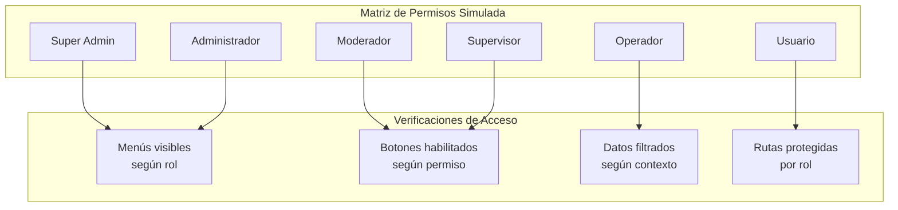
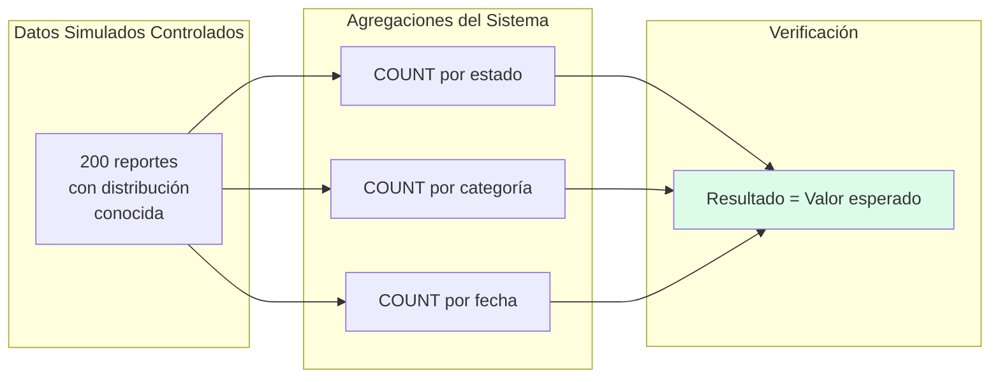
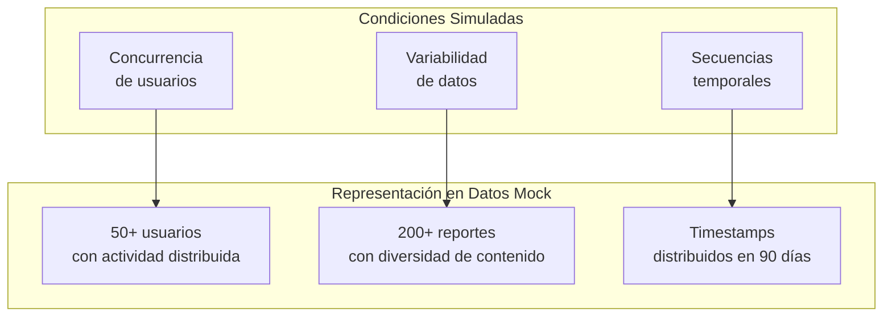
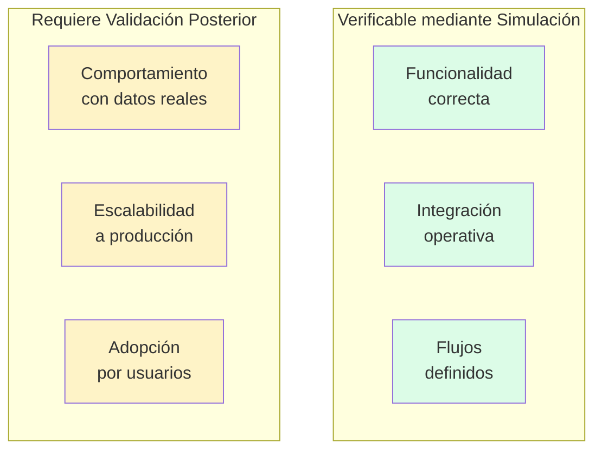

# Capítulo: Desarrollo del Proyecto

## Sección: Objetivos de la Simulación en el Desarrollo de Software

### 1. Contexto de la Simulación en UniAlerta UCE

El desarrollo de UniAlerta UCE como Prueba de Concepto opera bajo una condición estructural: el sistema se construye para resolver una problemática operativa que actualmente no está siendo gestionada mediante software. Esta condición implica que durante el desarrollo no existen usuarios reales operando el sistema, incidentes auténticos siendo reportados ni flujos de atención ejecutándose en producción.

Ante esta realidad, la simulación emerge como mecanismo metodológico que permite reproducir artificialmente las condiciones de operación que el sistema enfrentaría en uso real. Los objetivos de esta simulación no son genéricos; responden a necesidades específicas derivadas de las funcionalidades implementadas en UniAlerta UCE.

*Figura 1: Contexto que fundamenta la necesidad de simulación*

### 2. Objetivos Específicos de la Simulación

La simulación en el desarrollo de UniAlerta UCE persigue objetivos concretos, cada uno asociado a funcionalidades específicas del sistema:

#### 2.1 Objetivo: Verificar el Ciclo Completo de Gestión de Incidentes

El núcleo funcional de UniAlerta UCE es el flujo de gestión de reportes: creación, asignación, atención, resolución y cierre. La simulación permite ejercitar este ciclo completo sin requerir incidentes reales.

**Elementos simulados:**
- Reportes con datos representativos de incidentes universitarios
- Usuarios asumiendo roles de reportante, operador y supervisor
- Transiciones de estado que replican el flujo de atención
- Historial de cambios con timestamps y responsables

**Verificaciones habilitadas:**

| Aspecto del Ciclo | Verificación mediante Simulación |
|-------------------|----------------------------------|
| Creación de reporte | Formulario captura todos los campos requeridos |
| Detección de similares | Sistema identifica reportes próximos existentes |
| Asignación | Operador recibe notificación de asignación |
| Cambio de estado | Historial registra transición con metadata |
| Resolución | Sistema acepta evidencias y comentarios de cierre |

*Figura 2: Flujo simulado de gestión de incidente*

#### 2.2 Objetivo: Validar Funcionalidades Geoespaciales en Contexto del Campus

UniAlerta UCE integra geolocalización como componente central. La simulación permite verificar estas funcionalidades utilizando coordenadas representativas del campus universitario.

**Elementos simulados:**
- Coordenadas GPS correspondientes a edificios y áreas del campus
- Distribución espacial de reportes que replica patrones esperados
- Ubicaciones de operadores para validar asignación por proximidad

**Verificaciones habilitadas:**

| Funcionalidad Geoespacial | Verificación mediante Simulación |
|---------------------------|----------------------------------|
| Captura de ubicación | Mapa centra en coordenadas simuladas correctamente |
| Visualización de reportes | Marcadores aparecen en posiciones esperadas |
| Consulta por proximidad | Sistema retorna reportes dentro del radio definido |
| Mapa de calor | Concentraciones reflejan distribución simulada |
| Rastreo de operadores | Ubicaciones se actualizan en tiempo real |

*Figura 3: Relación entre datos geoespaciales simulados y funcionalidades*

#### 2.3 Objetivo: Ejercitar el Sistema de Roles y Permisos

UniAlerta UCE implementa un modelo de autorización con seis roles y permisos granulares. La simulación permite verificar que las restricciones de acceso operan correctamente.

**Elementos simulados:**
- Usuarios con cada uno de los seis roles definidos
- Sesiones de usuario que ejecutan acciones según su rol
- Intentos de acceso a funcionalidades restringidas

**Verificaciones habilitadas:**

| Rol Simulado | Acciones Permitidas Verificadas | Restricciones Verificadas |
|--------------|--------------------------------|--------------------------|
| Super Admin | Gestión completa de usuarios y roles | Ninguna restricción |
| Administrador | Configuración del sistema | No modifica roles de super admin |
| Moderador | Gestión de contenido público | No accede a auditoría |
| Supervisor | Asignación de reportes | No elimina usuarios |
| Operador | Atención de reportes asignados | No asigna a otros operadores |
| Usuario | Creación de reportes propios | Solo ve sus propios reportes |

*Figura 4: Verificación de permisos mediante roles simulados*

#### 2.4 Objetivo: Validar Comunicación en Tiempo Real

El sistema integra mensajería instantánea y notificaciones basadas en Supabase Realtime. La simulación permite verificar la entrega de mensajes sin requerir múltiples usuarios reales conectados simultáneamente.

**Elementos simulados:**
- Conversaciones entre usuarios simulados
- Mensajes con diferentes tipos de contenido (texto, imágenes, reportes compartidos)
- Eventos que disparan notificaciones

**Verificaciones habilitadas:**

| Funcionalidad de Tiempo Real | Verificación mediante Simulación |
|------------------------------|----------------------------------|
| Entrega de mensajes | Mensaje aparece en conversación del destinatario |
| Indicador de escritura | Estado "escribiendo" se muestra y oculta correctamente |
| Notificación de nuevo mensaje | Badge de conteo se incrementa |
| Notificación de cambio de estado | Usuario reportante recibe alerta |
| Actualización de presencia | Estado online/offline se refleja en UI |

#### 2.5 Objetivo: Verificar Agregaciones y Visualizaciones del Dashboard

El módulo de dashboard presenta métricas agregadas. La simulación con datos controlados permite verificar que las visualizaciones reflejan correctamente los datos subyacentes.

**Elementos simulados:**
- Distribución conocida de reportes por estado, categoría y prioridad
- Timestamps controlados para validar tendencias temporales
- Conteos predefinidos que sirven como valores esperados

**Verificaciones habilitadas:**

| Visualización | Valor Esperado con Simulación | Verificación |
|---------------|------------------------------|--------------|
| Total de reportes | 200 (conteo conocido) | Contador muestra 200 |
| Distribución por estado | 40 pendientes, 50 en proceso, 60 resueltos... | Gráfico circular refleja proporciones |
| Tendencia 7 días | Valores pre-calculados por fecha | Gráfico de líneas coincide |
| Reportes por categoría | Distribución definida | Gráfico de barras coincide |

*Figura 5: Verificación de agregaciones con datos simulados controlados*

### 3. Relación entre Objetivos de Simulación y Requerimientos del Sistema

Cada objetivo de simulación está vinculado a requerimientos funcionales específicos de UniAlerta UCE:

| Objetivo de Simulación | Requerimientos Asociados |
|------------------------|-------------------------|
| Ciclo de gestión de incidentes | RF-REP-001 a RF-REP-018 (Módulo Reportes) |
| Funcionalidades geoespaciales | RF-REP-002 (Geolocalización), RF-REP-004 (Similares) |
| Sistema de roles y permisos | RF-USR-002 (Gestión de Roles), RF-USR-003 (Permisos) |
| Comunicación en tiempo real | RF-MSG-001 a RF-MSG-010 (Mensajería), RF-NOT-001 a RF-NOT-005 (Notificaciones) |
| Dashboard analítico | RF-DASH-001 a RF-DASH-003 (Estadísticas y Gráficos) |

### 4. Condiciones Reproducidas mediante Simulación

La simulación en UniAlerta UCE reproduce condiciones operativas específicas:

#### 4.1 Condición: Múltiples Usuarios Concurrentes

Aunque el desarrollo no cuenta con usuarios reales, la simulación permite reproducir escenarios donde múltiples usuarios interactúan simultáneamente:

- Varios reportantes creando reportes en paralelo
- Operadores atendiendo diferentes incidentes
- Conversaciones activas entre múltiples participantes

#### 4.2 Condición: Variabilidad de Datos de Entrada

La simulación incluye datos que representan la variabilidad esperada en operación real:

- Reportes con descripciones de diferentes longitudes
- Imágenes de diferentes tamaños y formatos
- Ubicaciones distribuidas en todo el campus
- Usuarios con diferentes patrones de actividad

#### 4.3 Condición: Secuencias Temporales

La simulación reproduce secuencias de eventos que ocurrirían en el tiempo:

- Reportes que permanecen pendientes durante períodos prolongados
- Conversaciones con historial de mensajes previos
- Notificaciones acumuladas durante ausencia del usuario

*Figura 6: Correspondencia entre condiciones simuladas y datos mock*

### 5. Alcance de los Objetivos de Simulación

Los objetivos de simulación en UniAlerta UCE tienen un alcance definido que debe explicitarse:

#### 5.1 Lo que la Simulación Permite Verificar

| Aspecto | Capacidad de Verificación |
|---------|--------------------------|
| Funcionalidad implementada | ✓ Completa |
| Integración entre módulos | ✓ Completa |
| Comportamiento con datos válidos | ✓ Completa |
| Flujos de usuario definidos | ✓ Completa |
| Consistencia de datos | ✓ Completa |

#### 5.2 Lo que la Simulación No Permite Verificar

| Aspecto | Razón de Exclusión |
|---------|-------------------|
| Comportamiento con datos reales | Datos generados artificialmente |
| Escalabilidad a producción | Volúmenes no representativos |
| Adopción por usuarios | Sin usuarios reales participando |
| Casos límite no anticipados | Simulación diseñada para casos conocidos |
| Rendimiento bajo carga real | Sin mediciones de producción |

*Figura 7: Alcance y limitaciones de la verificación mediante simulación*

### 6. Criterios de Éxito de la Simulación

Cada objetivo de simulación tiene criterios de éxito definidos:

| Objetivo | Criterio de Éxito |
|----------|-------------------|
| Ciclo de gestión de incidentes | 100% de transiciones de estado ejecutadas sin error |
| Funcionalidades geoespaciales | Coordenadas renderizadas en posiciones correctas del mapa |
| Sistema de roles y permisos | 0 accesos permitidos fuera de permisos asignados |
| Comunicación en tiempo real | Latencia de entrega < 1 segundo en ambiente de desarrollo |
| Dashboard analítico | Valores visualizados coinciden con agregaciones verificables |

### 7. Síntesis de los Objetivos de Simulación

Los objetivos de simulación en el desarrollo de UniAlerta UCE:

1. **Responden a la condición de Prueba de Concepto**: la ausencia de operación real requiere reproducir artificialmente las condiciones que el sistema enfrentaría en uso institucional.

2. **Son específicos a las funcionalidades implementadas**: cada objetivo está vinculado a módulos concretos del sistema (reportes, geolocalización, roles, mensajería, dashboard).

3. **Habilitan verificación controlada**: los datos simulados permiten contrastar resultados observados con valores esperados conocidos.

4. **Tienen alcance definido**: verifican funcionalidad e integración, pero no sustituyen validación con usuarios reales ni garantizan comportamiento a escala de producción.

5. **Establecen criterios de éxito medibles**: cada objetivo tiene condiciones de verificación que determinan si la simulación cumplió su propósito.

La simulación constituye así el mecanismo que permite que UniAlerta UCE demuestre capacidad funcional dentro de las restricciones inherentes a su naturaleza de Prueba de Concepto, sin pretender que esta validación sustituya la verificación que requeriría un despliegue institucional real.
