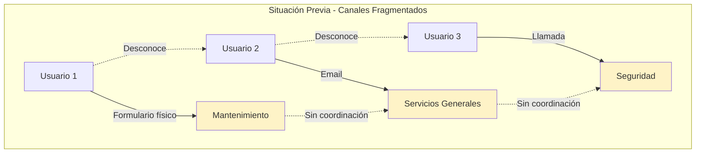
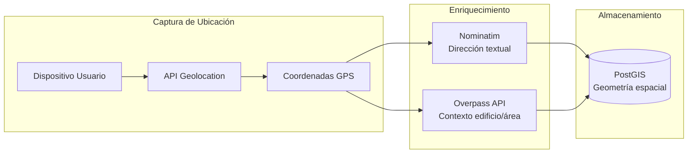
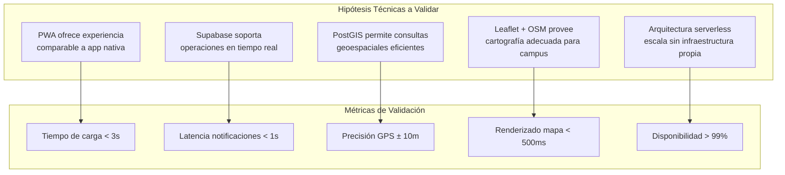
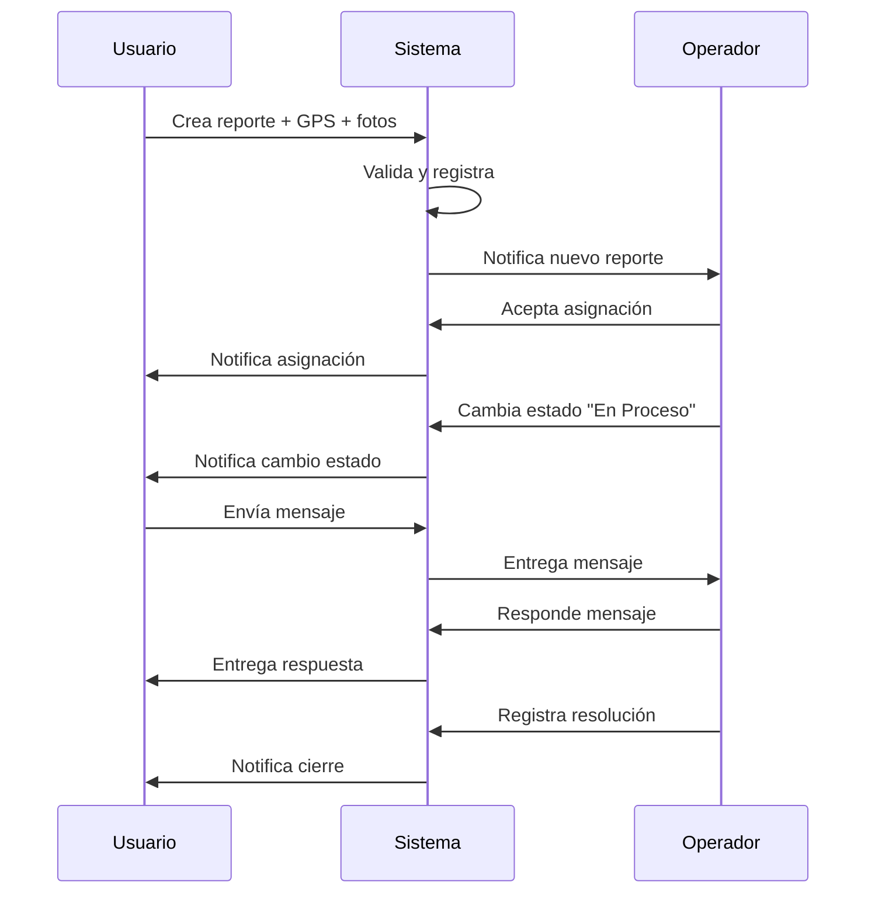
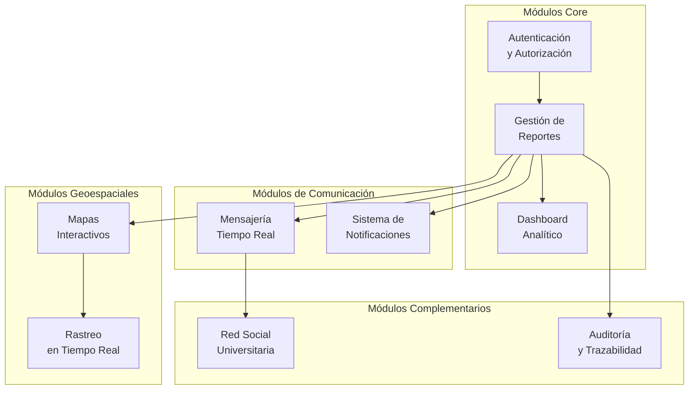

# Capítulo: Desarrollo del Proyecto

## Sección: Pertinencia de la Prueba de Concepto (PoC)

### 1. Contextualización de la Problemática en el Entorno Real

La Universidad Central del Ecuador concentra su actividad académica y administrativa en un campus universitario de considerable extensión territorial, donde convergen diariamente miles de estudiantes, docentes y personal administrativo. Esta dinámica institucional genera continuamente situaciones que requieren intervención oportuna: fallas en infraestructura física, averías en servicios básicos, incidentes de seguridad, obstrucciones en espacios comunes y diversas irregularidades que afectan el normal desenvolvimiento de las actividades universitarias.

Previo al desarrollo de UniAlerta UCE, la atención de estos incidentes operaba bajo un modelo fragmentado donde cada dependencia institucional —mantenimiento, seguridad, servicios generales— gestionaba sus propios canales de recepción: formularios físicos en ventanilla, correos electrónicos departamentales, líneas telefónicas internas y comunicaciones verbales directas. Esta dispersión de canales generaba un escenario operativo caracterizado por:

- **Aislamiento informacional**: Cada dependencia desconocía los reportes recibidos por otras áreas, imposibilitando la identificación de incidentes que requerían coordinación interdepartamental.
- **Opacidad del proceso**: El usuario que emitía un reporte carecía de mecanismos para conocer si su solicitud había sido registrada, asignada o atendida.
- **Pérdida de contexto geográfico**: Las descripciones textuales de ubicaciones resultaban ambiguas en un campus con múltiples edificios, aulas y espacios con denominaciones similares.

### 2. Problemática Específica que Motivó el Desarrollo

El análisis del contexto operativo identificó deficiencias estructurales que fundamentaron la necesidad de un sistema integrado:

#### 2.1 Fragmentación de Canales de Reporte

La multiplicidad de vías para reportar incidentes —cada una con su propio formato, responsable y nivel de formalidad— impedía consolidar una visión institucional del estado de la infraestructura y servicios. Un mismo incidente podía ser reportado simultáneamente por diferentes usuarios a diferentes dependencias, generando duplicación de esfuerzos y confusión sobre la responsabilidad de atención.

*Figura 1: Fragmentación de canales en el modelo operativo previo*

#### 2.2 Ausencia de Georreferenciación Precisa

El campus universitario comprende edificios con nomenclaturas institucionales, aulas identificadas por códigos alfanuméricos, laboratorios especializados, áreas verdes y espacios de circulación. Los reportes tradicionales dependían de descripciones textuales que frecuentemente resultaban insuficientes: "cerca del edificio de ingeniería", "en un baño del segundo piso", "junto a la cafetería". Esta imprecisión demandaba comunicaciones adicionales para clarificar la ubicación exacta, retrasando la respuesta.

#### 2.3 Inexistencia de Trazabilidad del Proceso

Una vez emitido el reporte, el usuario carecía de visibilidad sobre su progreso. No existía registro sistemático de:
- Fecha y hora de recepción efectiva
- Asignación a personal responsable
- Cambios de estado durante la atención
- Acciones realizadas y sus resultados
- Fecha de cierre o resolución

Esta opacidad impedía tanto la rendición de cuentas institucional como la evaluación objetiva de tiempos de respuesta.

#### 2.4 Comunicación Unidireccional

El modelo tradicional establecía un flujo de comunicación en un solo sentido: el usuario emitía el reporte y esperaba pasivamente. No existían mecanismos estructurados para:
- Solicitar información adicional al reportante
- Notificar avances en la atención
- Confirmar la resolución del incidente
- Retroalimentar sobre acciones preventivas adoptadas

### 3. Justificación de la Necesidad del Software

El desarrollo de UniAlerta UCE se fundamenta en la necesidad de establecer un sistema que articule las funcionalidades requeridas para superar las limitaciones identificadas, operando bajo los siguientes principios funcionales:

#### 3.1 Centralización del Registro

El sistema debe constituirse como punto único de ingreso para todos los tipos de incidentes, independientemente de su naturaleza o dependencia responsable. Esta centralización requiere:

- Accesibilidad universal desde cualquier dispositivo con navegador web
- Categorización flexible que abarque los diferentes tipos de incidentes institucionales
- Interfaz intuitiva que minimice barreras de uso para la comunidad universitaria

#### 3.2 Geolocalización Integrada

Cada reporte debe capturar coordenadas geográficas precisas mediante:

- Detección automática de ubicación GPS del dispositivo
- Selección manual sobre mapa interactivo
- Enriquecimiento semántico con identificación de edificios y espacios

Esta información geográfica habilita:
- Visualización cartográfica de la distribución de incidentes
- Asignación de personal por criterio de proximidad
- Identificación de zonas con concentración de reportes

*Figura 2: Flujo de captura y enriquecimiento de ubicación*

#### 3.3 Trazabilidad Completa

El sistema debe registrar automáticamente cada evento del ciclo de vida del reporte:

| Evento | Datos Capturados |
|--------|------------------|
| Creación | Usuario, fecha/hora, ubicación, categoría, descripción, evidencias |
| Cambio de estado | Estado anterior, estado nuevo, responsable, comentario, fecha/hora |
| Asignación | Operador asignado, asignador, criterio de asignación, fecha/hora |
| Resolución | Descripción de solución, evidencias de cierre, fecha/hora |

#### 3.4 Comunicación Bidireccional

El sistema debe establecer canales estructurados que permitan:

- Interacción directa entre reportante y operador asignado
- Notificaciones automáticas ante cambios de estado
- Alertas de proximidad para reportes cercanos a la ubicación del usuario
- Confirmación de recepción y cierre de incidentes

### 4. Pertinencia de la Prueba de Concepto

La implementación de UniAlerta UCE como Prueba de Concepto responde a la necesidad de validar, en condiciones controladas, la viabilidad de la solución propuesta antes de un despliegue institucional completo.

#### 4.1 Validación de Factibilidad Técnica

El PoC permite verificar que las tecnologías seleccionadas satisfacen los requerimientos funcionales del sistema:

*Figura 3: Hipótesis técnicas y métricas de validación del PoC*

#### 4.2 Validación de Flujos Operativos

El PoC implementa el ciclo completo de gestión de incidentes para verificar que los procesos diseñados resuelven efectivamente las limitaciones identificadas:

**Flujo de Creación de Reporte**:
1. Usuario accede a la aplicación desde dispositivo móvil o escritorio
2. Sistema captura ubicación GPS automáticamente
3. Usuario complementa con categoría, descripción y evidencias fotográficas
4. Sistema detecta reportes similares por proximidad (500m, 24h, misma categoría)
5. Reporte se registra con estado inicial "Pendiente"
6. Sistema notifica a operadores disponibles

**Flujo de Atención**:
1. Operador recibe notificación de nuevo reporte
2. Operador visualiza ubicación en mapa con contexto de edificio/área
3. Operador cambia estado a "En Proceso"
4. Sistema notifica al reportante sobre el avance
5. Operador y reportante pueden intercambiar mensajes
6. Operador registra resolución con evidencias
7. Sistema cierra reporte y notifica al reportante

*Figura 4: Secuencia de interacción validada en el PoC*

#### 4.3 Validación de Adopción por Usuarios

El PoC permite evaluar la aceptación del sistema por parte de los diferentes perfiles de usuario:

| Perfil | Aspectos a Validar |
|--------|-------------------|
| **Usuario reportante** | Facilidad de uso, claridad del proceso, satisfacción con retroalimentación |
| **Operador** | Eficiencia del flujo de trabajo, utilidad de información geográfica |
| **Supervisor** | Visibilidad de métricas, capacidad de seguimiento |
| **Administrador** | Flexibilidad de configuración, gestión de usuarios y permisos |

#### 4.4 Alcance Funcional del PoC

La Prueba de Concepto abarca un conjunto de módulos que en conjunto implementan la solución integral:

*Figura 5: Arquitectura modular del PoC*

**Módulo de Autenticación**: Gestión de identidad con registro, inicio de sesión, recuperación de contraseña y control de sesiones. Implementa sistema de roles (administrador, supervisor, operador, usuario) con permisos granulares.

**Módulo de Reportes**: Núcleo funcional que implementa el ciclo CRUD completo de incidentes con geolocalización, evidencias multimedia, estados configurables, asignaciones y historial de cambios.

**Módulo de Dashboard**: Visualización de métricas operativas mediante gráficos interactivos que permiten análisis de distribución por categoría, estado, período temporal y ubicación geográfica.

**Módulo de Mensajería**: Sistema de comunicación en tiempo real con conversaciones individuales y grupales, soporte para texto e imágenes, indicadores de lectura y notificaciones de nuevos mensajes.

**Módulo de Notificaciones**: Alertas instantáneas sobre eventos del sistema: asignaciones, cambios de estado, menciones, mensajes y reportes cercanos a la ubicación del usuario.

**Módulo de Mapas**: Visualización cartográfica interactiva basada en OpenStreetMap con capas de reportes, áreas temáticas y rastreo de operadores.

**Módulo de Red Social**: Espacio complementario de interacción comunitaria con publicaciones, comentarios, reacciones y estados efímeros.

**Módulo de Auditoría**: Registro automático de todas las acciones del sistema con capacidad de consulta histórica y exportación.

### 5. Criterios de Pertinencia

La pertinencia del PoC se fundamenta en los siguientes criterios:

| Criterio | Justificación |
|----------|---------------|
| **Alineación con problemática real** | El sistema responde directamente a deficiencias operativas identificadas en el contexto institucional |
| **Viabilidad tecnológica demostrable** | Las tecnologías seleccionadas son maduras, documentadas y cuentan con soporte activo |
| **Escalabilidad arquitectónica** | El diseño modular permite evolución incremental sin reestructuración mayor |
| **Replicabilidad contextual** | La solución es adaptable a otros contextos universitarios con problemáticas similares |
| **Medibilidad de resultados** | El sistema genera métricas cuantificables que permiten evaluar su efectividad |

### 6. Síntesis de Pertinencia

La implementación de UniAlerta UCE como Prueba de Concepto resulta pertinente en tanto:

1. **Aborda una problemática concreta y documentada** del contexto operativo institucional, no una necesidad hipotética.

2. **Propone una solución técnicamente viable** mediante la integración de tecnologías probadas en contextos similares.

3. **Implementa un alcance funcional suficiente** para validar tanto la factibilidad técnica como la pertinencia operativa de los flujos diseñados.

4. **Genera evidencia verificable** sobre el cumplimiento de los objetivos funcionales mediante métricas operativas capturables.

5. **Establece una base extensible** que permite evolución hacia un sistema de producción institucional sin requerir rediseño fundamental.

La Prueba de Concepto constituye así el mecanismo apropiado para validar, en condiciones controladas, que la solución propuesta satisface los requerimientos derivados de la problemática identificada, minimizando riesgos antes de un eventual despliegue a escala institucional.
