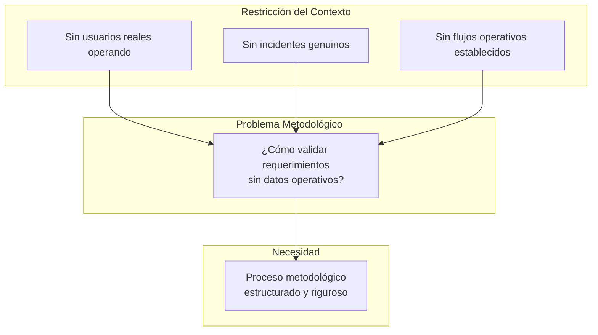
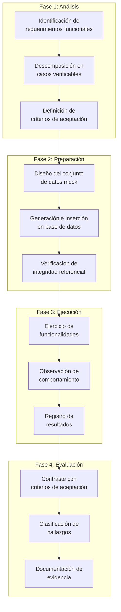
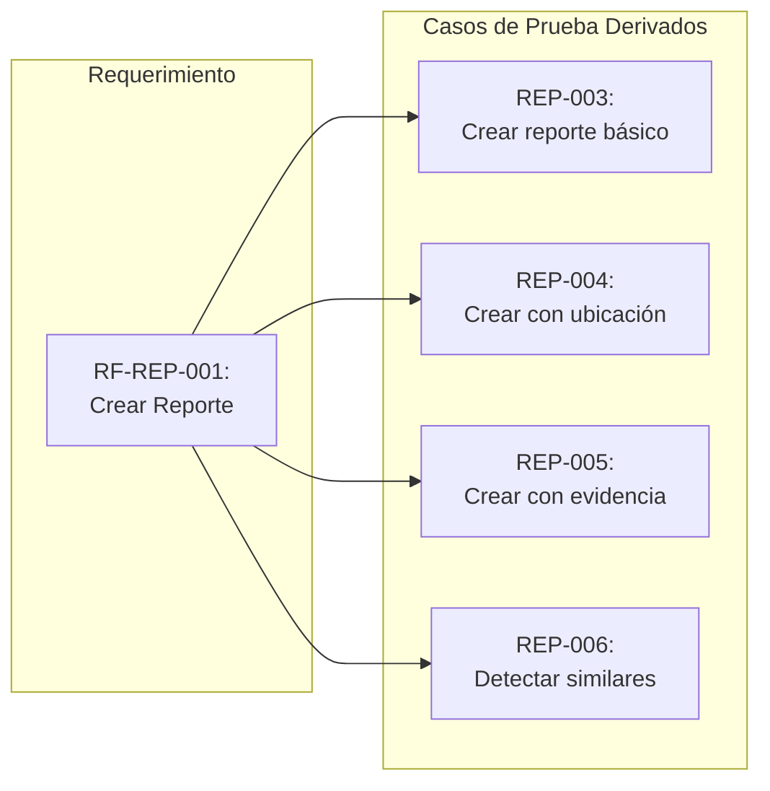
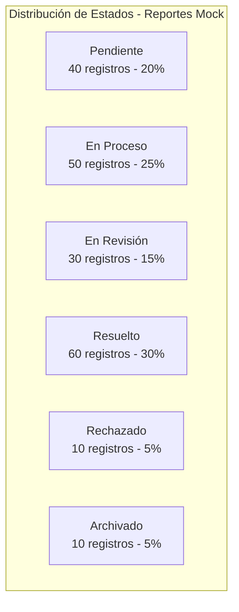
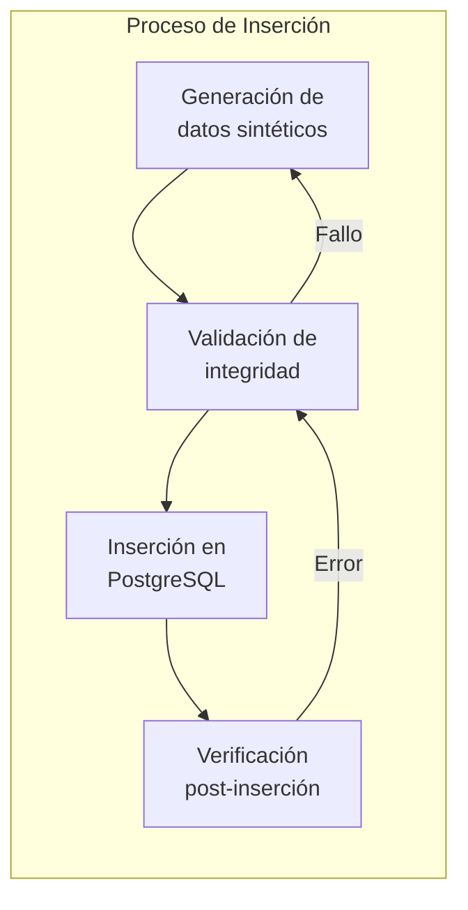
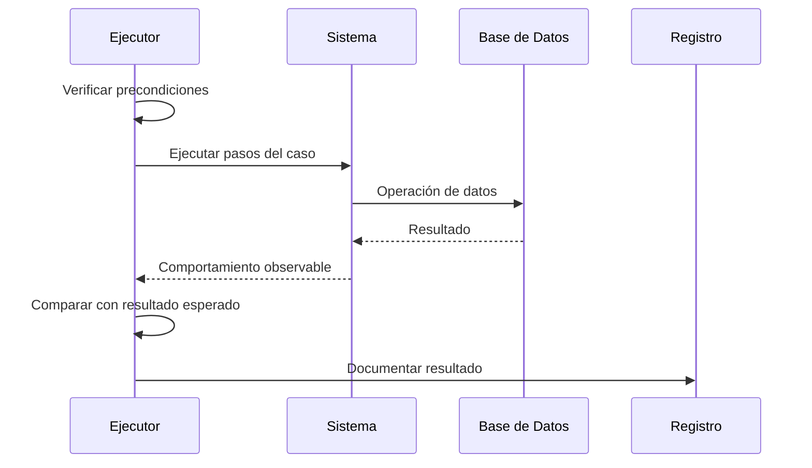
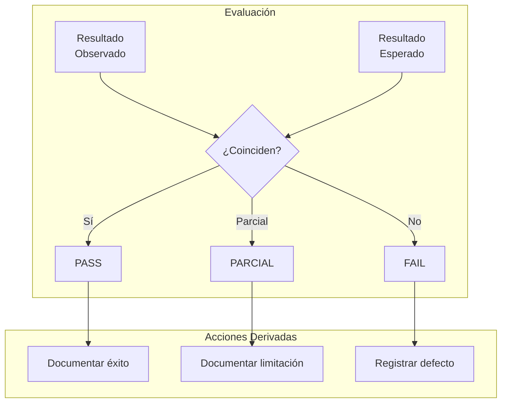
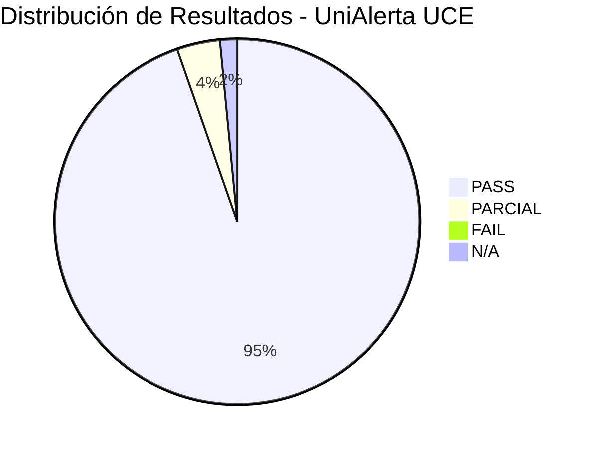
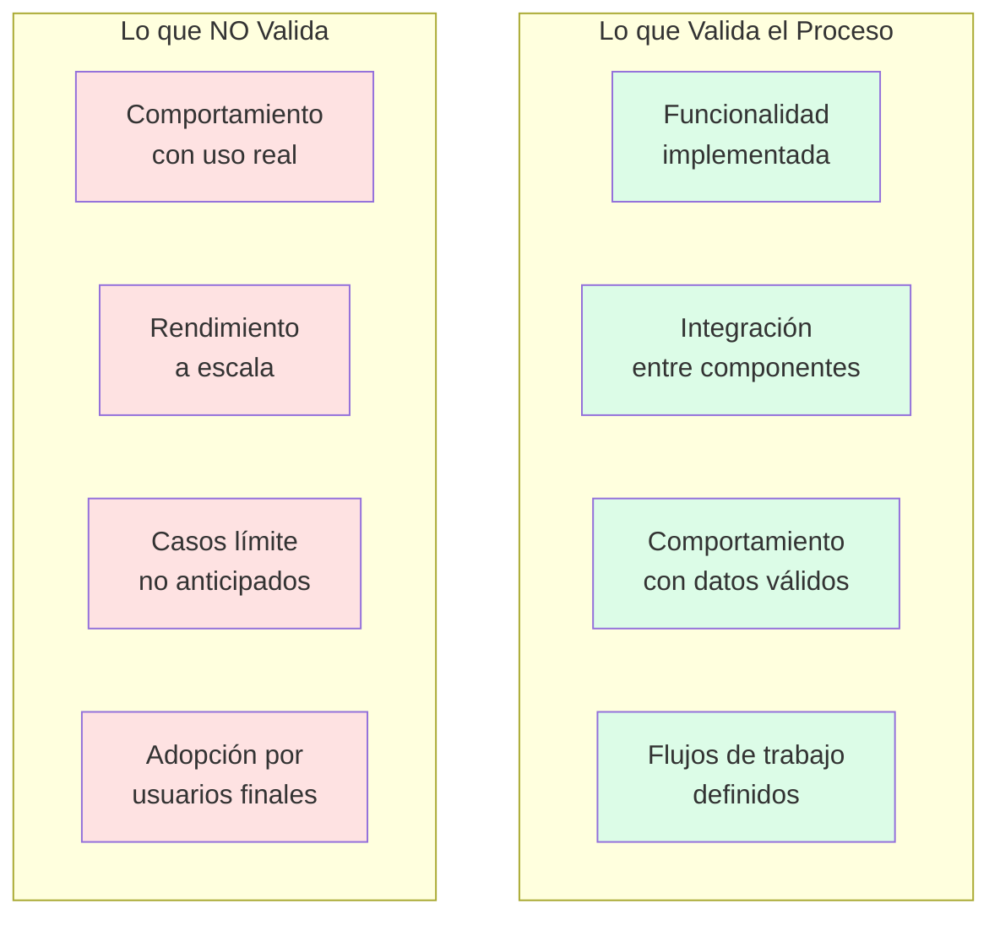
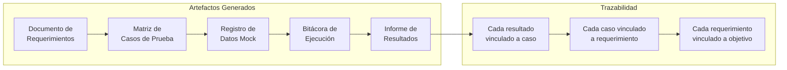

# Capítulo: Desarrollo del Proyecto

## Proceso Metodológico para la Validación con Mocks

### Contextualización del Problema Metodológico

El desarrollo de UniAlerta UCE como Prueba de Concepto enfrenta una restricción metodológica inherente: la necesidad de verificar el cumplimiento de requerimientos funcionales sin disponer de operación institucional que genere datos auténticos. Esta situación plantea interrogantes sobre cómo demostrar que el sistema satisface los objetivos planteados cuando no existe un universo de usuarios reales, incidentes genuinos ni flujos operativos establecidos contra los cuales contrastar el comportamiento del software.

La respuesta a esta restricción requiere un proceso metodológico estructurado que establezca las condiciones, procedimientos y criterios bajo los cuales la validación con datos mock adquiere rigor suficiente para sustentar conclusiones sobre la factibilidad funcional del sistema.

### Definición del Proceso de Validación

El proceso metodológico de validación con mocks en UniAlerta UCE se estructura en fases secuenciales que garantizan trazabilidad entre requerimientos, datos de prueba y resultados observados:

### Fase 1: Análisis de Requerimientos

#### Identificación de Funcionalidades Verificables

El proceso inicia con la revisión sistemática del documento de requerimientos, extrayendo cada funcionalidad que requiere verificación. En UniAlerta UCE, los requerimientos se organizan por módulos funcionales:

| Módulo | Requerimientos Identificados | Criticidad |
|--------|------------------------------|------------|
| Autenticación | 12 funcionalidades | Alta |
| Gestión de Usuarios | 15 funcionalidades | Alta |
| Gestión de Reportes | 18 funcionalidades | Alta |
| Categorías | 10 funcionalidades | Media |
| Tipos de Reporte | 10 funcionalidades | Media |
| Red Social | 20 funcionalidades | Media |
| Mensajería | 15 funcionalidades | Media |
| Dashboard | 6 funcionalidades | Baja |
| Notificaciones | 8 funcionalidades | Baja |
| Auditoría | 5 funcionalidades | Media |

#### Descomposición en Casos de Prueba

Cada requerimiento funcional se descompone en casos de prueba atómicos que especifican:

- **Precondiciones**: Estado del sistema y datos requeridos antes de la ejecución
- **Pasos de ejecución**: Secuencia de acciones a realizar
- **Resultado esperado**: Comportamiento observable que indica cumplimiento
- **Criterio de aceptación**: Condición binaria que determina éxito o fallo

#### Matriz de Trazabilidad

Se establece una matriz que vincula cada caso de prueba con su requerimiento origen y los datos mock necesarios:

| Caso de Prueba | Requerimiento Origen | Datos Mock Requeridos |
|----------------|---------------------|----------------------|
| AUTH-001: Login exitoso | RF-AUTH-002 | Usuario con credenciales válidas |
| REP-004: Crear con ubicación | RF-REP-002 | Categorías activas, permisos GPS |
| MSG-005: Mensaje en tiempo real | RF-MSG-003 | Dos usuarios, conversación existente |
| SOC-006: Like a publicación | RF-SOC-005 | Publicación de otro usuario |

### Fase 2: Preparación del Entorno de Validación

#### Diseño del Conjunto de Datos Mock

El diseño de datos mock sigue criterios de representatividad que aseguran cobertura de los escenarios contemplados en los requerimientos:

**Cobertura de estados**: Cada entidad con máquina de estados incluye registros en todos los estados posibles.

**Cobertura de roles**: Usuarios mock representan cada rol del sistema con los permisos correspondientes.

| Rol | Cantidad Mock | Permisos Verificables |
|-----|---------------|----------------------|
| Super Admin | 3 | Todas las operaciones |
| Administrador | 5 | Gestión de usuarios y configuración |
| Moderador | 8 | Moderación de contenido |
| Supervisor | 10 | Supervisión y asignación |
| Operador | 15 | Gestión de reportes asignados |
| Usuario Estándar | 20+ | Operaciones básicas |

**Cobertura geográfica**: Reportes distribuidos en el perímetro del campus universitario para validar funcionalidades espaciales.

**Cobertura temporal**: Registros con timestamps distribuidos en los últimos 90 días para validar filtros y tendencias.

#### Generación e Inserción de Datos

Los datos mock se insertan directamente en la base de datos PostgreSQL de Supabase, respetando todas las restricciones del esquema:

| Aspecto | Verificación |
|---------|--------------|
| Primary keys | UUIDs generados correctamente |
| Foreign keys | Referencias a registros existentes |
| Constraints | Valores dentro de rangos permitidos |
| Enums | Solo valores definidos en el tipo |
| Timestamps | Fechas coherentes cronológicamente |
| Campos únicos | Sin duplicados en email, username |

#### Verificación de Integridad Referencial

Antes de iniciar la ejecución de pruebas, se verifica que el conjunto de datos mock cumple con las relaciones definidas en el modelo:

| Relación | Verificación | Estado |
|----------|--------------|--------|
| reportes.user_id → profiles.id | Todos los creadores existen | ✓ |
| reportes.categoria_id → categories.id | Categorías válidas | ✓ |
| mensajes.conversacion_id → conversaciones.id | Conversaciones existentes | ✓ |
| user_roles.user_id → profiles.id | Roles asignados a usuarios válidos | ✓ |
| reporte_historial.reporte_id → reportes.id | Historial de reportes existentes | ✓ |

### Fase 3: Ejecución de la Validación

#### Protocolo de Ejecución

La ejecución de cada caso de prueba sigue un protocolo estandarizado:

#### Criterios de Clasificación de Resultados

Cada caso de prueba se clasifica según el grado de cumplimiento del resultado esperado:

| Clasificación | Símbolo | Criterio |
|---------------|---------|----------|
| PASS | ✅ | Comportamiento coincide exactamente con lo esperado |
| PARCIAL | ⚠️ | Funcionalidad opera pero con limitaciones menores |
| FAIL | ❌ | Comportamiento diverge significativamente de lo esperado |
| N/A | ⏳ | Caso no aplicable o funcionalidad no implementada |

#### Registro de Observaciones

Durante la ejecución se documenta:

| Elemento | Descripción |
|----------|-------------|
| Fecha y hora | Momento de ejecución del caso |
| Ambiente | Configuración del entorno de prueba |
| Datos utilizados | Registros mock específicos empleados |
| Pasos ejecutados | Secuencia efectivamente realizada |
| Resultado observado | Comportamiento del sistema |
| Evidencia | Capturas de pantalla, logs relevantes |
| Clasificación | PASS, PARCIAL, FAIL o N/A |
| Observaciones | Notas adicionales del ejecutor |

### Fase 4: Evaluación y Documentación

#### Contraste con Criterios de Aceptación

Los resultados observados se contrastan con los criterios de aceptación definidos en la fase de análisis:

#### Clasificación de Hallazgos

Los casos que no alcanzan PASS se clasifican según severidad:

| Severidad | Descripción | Tiempo de Resolución |
|-----------|-------------|---------------------|
| Crítico | Sistema inutilizable, pérdida de datos | Inmediato |
| Mayor | Funcionalidad principal afectada | < 24 horas |
| Menor | Funcionalidad secundaria afectada | < 72 horas |
| Trivial | Cosmético, sin impacto funcional | Próxima versión |

#### Métricas de Validación

El proceso genera métricas cuantitativas que resumen el estado de la validación:

| Métrica | Fórmula | Objetivo |
|---------|---------|----------|
| Cobertura de ejecución | Casos ejecutados / Total casos | ≥ 90% |
| Tasa de éxito | Casos PASS / Casos ejecutados | ≥ 85% |
| Defectos críticos | Conteo de FAIL críticos | = 0 |
| Defectos mayores | Conteo de FAIL mayores | ≤ 5 |

### Aplicación del Proceso por Módulo

#### Validación del Módulo de Autenticación

El módulo de autenticación requiere datos mock específicos:

| Dato Mock | Propósito | Cantidad |
|-----------|-----------|----------|
| Usuario con credenciales válidas | LOGIN-001: Login exitoso | 1+ |
| Usuario bloqueado | LOGIN-009: Bloqueo por intentos | 1 |
| Usuario con cambio obligatorio | LOGIN-010: Primera contraseña | 1 |
| Intentos de login registrados | Verificar contador de intentos | 5+ |

**Casos ejecutados**: 12  
**Resultado**: 10 PASS, 1 PARCIAL, 1 N/A  
**Tasa de éxito**: 87.5%

#### Validación del Módulo de Reportes

El módulo de reportes requiere el conjunto más diverso de datos mock:

| Dato Mock | Propósito | Características |
|-----------|-----------|-----------------|
| Reportes en todos los estados | Filtros por estado | 6 estados cubiertos |
| Reportes con ubicación | Visualización en mapa | Coordenadas en campus |
| Reportes cercanos entre sí | Detección de similares | Grupos < 100m |
| Reportes con historial | Verificar trazabilidad | 3+ cambios por reporte |
| Reportes con evidencias | Carga de imágenes | URLs de Cloudinary |

**Casos ejecutados**: 18  
**Resultado**: 17 PASS, 1 PARCIAL  
**Tasa de éxito**: 97.2%

#### Validación del Módulo de Mensajería

El módulo de mensajería valida comunicación en tiempo real:

| Dato Mock | Propósito | Características |
|-----------|-----------|-----------------|
| Conversaciones individuales | Chat 1 a 1 | 2 participantes |
| Conversaciones grupales | Chat grupal | 3+ participantes |
| Mensajes con imágenes | Multimedia | URLs de Cloudinary |
| Mensajes con posts compartidos | Integración red social | JSON de referencia |

**Casos ejecutados**: 15  
**Resultado**: 14 PASS, 1 PARCIAL  
**Tasa de éxito**: 96.7%

### Limitaciones Metodológicas Reconocidas

El proceso de validación con mocks presenta limitaciones inherentes que deben explicitarse:

| Limitación | Implicación | Mitigación Parcial |
|------------|-------------|-------------------|
| Datos prediseñados | No captura variabilidad de uso real | Diversidad deliberada en datos mock |
| Ausencia de carga | No valida rendimiento bajo estrés | Pruebas con volúmenes incrementales |
| Sin usuarios reales | No valida usabilidad efectiva | Revisión de UI/UX por pares |
| Patrones conocidos | Sesgo hacia casos anticipados | Inclusión de casos límite |

### Trazabilidad del Proceso

El proceso metodológico genera documentación que permite trazabilidad completa:

### Síntesis del Proceso Metodológico

El proceso metodológico para la validación con mocks en UniAlerta UCE:

1. **Estructura la validación en fases**: Análisis, preparación, ejecución y evaluación conforman un flujo ordenado y reproducible.

2. **Establece trazabilidad**: Cada caso de prueba se vincula con requerimientos específicos y los datos mock necesarios para su ejercicio.

3. **Define criterios explícitos**: La clasificación de resultados (PASS, PARCIAL, FAIL, N/A) y la severidad de hallazgos siguen criterios predefinidos.

4. **Genera métricas cuantitativas**: Cobertura de ejecución, tasa de éxito y conteo de defectos permiten evaluación objetiva del estado del sistema.

5. **Reconoce limitaciones**: El proceso explicita lo que puede y no puede validarse con datos mock, estableciendo el alcance de las conclusiones derivables.

6. **Produce documentación auditable**: Los artefactos generados permiten verificación independiente del proceso y sus resultados.

Este proceso metodológico permite que UniAlerta UCE demuestre factibilidad funcional dentro de las restricciones propias de una Prueba de Concepto, estableciendo evidencia sistemática del cumplimiento de requerimientos mediante un enfoque estructurado y documentado.
