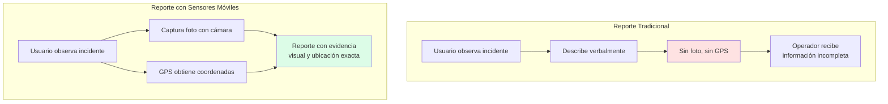
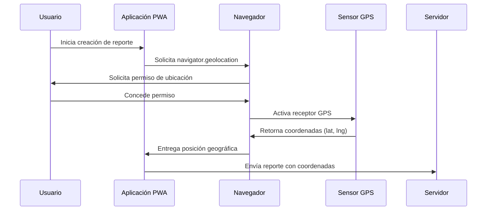
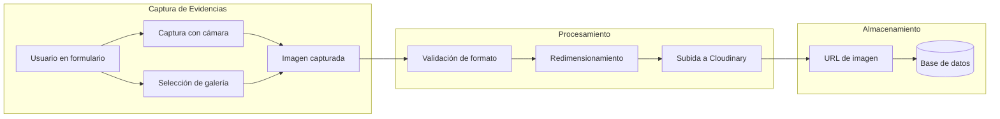
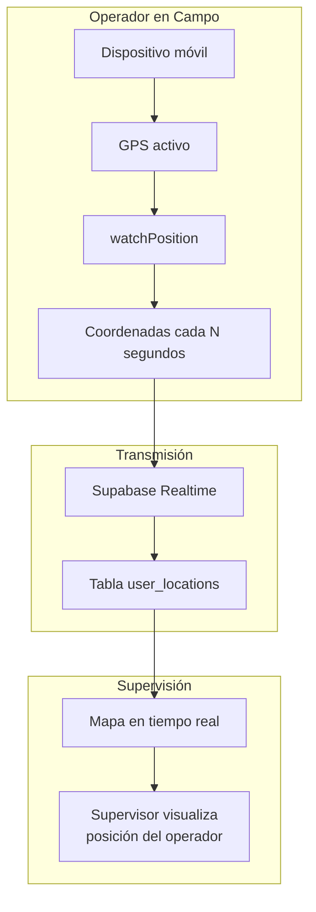
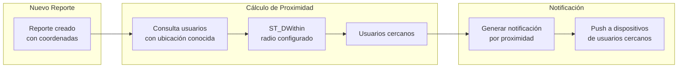
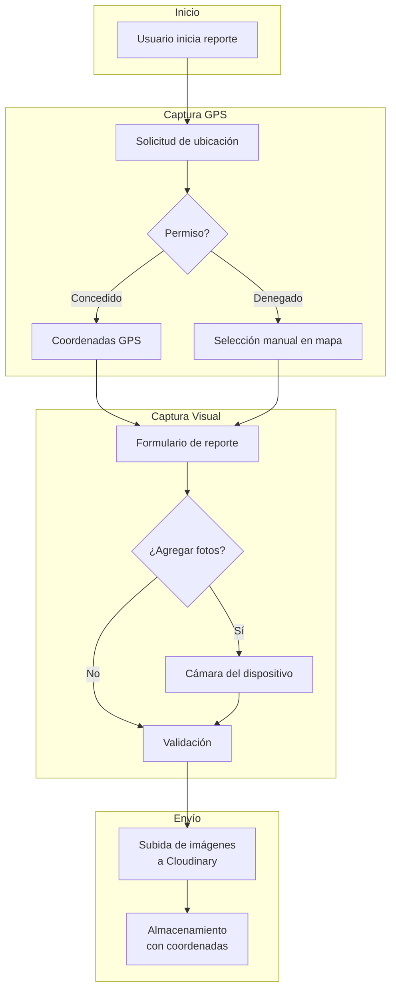

# Capítulo: Desarrollo del Proyecto

## Geolocalización y Sensores en el Ecosistema Móvil

### 1. Contexto de Uso Móvil en el Sistema

UniAlerta UCE opera predominantemente desde dispositivos móviles. Los usuarios que reportan incidentes en el campus universitario se encuentran frecuentemente en el lugar del problema —presenciando una falla de infraestructura, observando una situación de seguridad o identificando una anomalía en servicios— y utilizan sus teléfonos inteligentes para registrar el reporte. Los operadores asignados a la atención de casos se desplazan por el campus con dispositivos móviles que les permiten recibir asignaciones, navegar hacia los incidentes y documentar la resolución.

Este contexto de uso móvil determina que el sistema deba aprovechar las capacidades sensoriales de los dispositivos —geolocalización GPS, cámara fotográfica, almacenamiento local— para capturar información contextual que enriquezca los reportes y facilite la gestión de incidentes.

### 2. Problemática del Reporte sin Capacidades Sensoriales

Previo al desarrollo de UniAlerta UCE, los mecanismos de reporte carecían de integración con las capacidades de los dispositivos móviles modernos:

#### 2.1 Limitaciones en la Captura de Ubicación

Los canales tradicionales (formularios físicos, correos electrónicos, llamadas telefónicas) requerían que el usuario describiera verbalmente la ubicación del incidente. Esta descripción textual presentaba las siguientes deficiencias:

| Limitación | Manifestación | Impacto Operativo |
|-----------|---------------|-------------------|
| Dependencia de conocimiento local | El usuario debía conocer nombres de edificios, zonas o referencias | Usuarios nuevos o visitantes no podían ubicar incidentes con precisión |
| Ambigüedad descriptiva | Expresiones como "cerca de", "frente a", "por el lado de" | Múltiples interpretaciones posibles de la misma descripción |
| Imposibilidad de verificación | No existía forma de validar la ubicación declarada | Operadores llegaban a ubicaciones incorrectas |
| Sin coordenadas procesables | Ubicaciones textuales no permitían cálculos espaciales | Imposibilidad de ordenar por proximidad o detectar duplicados |

Los dispositivos móviles modernos incorporan receptores GPS capaces de determinar la posición geográfica con precisión de metros, capacidad que permanecía sin aprovechar en los flujos de reporte tradicionales.

#### 2.2 Limitaciones en la Captura de Evidencia Visual

Los incidentes frecuentemente requieren evidencia visual para su correcta evaluación y priorización. Una descripción textual de "tubería rota con fuga de agua" no transmite la magnitud del problema con la misma claridad que una fotografía del incidente. Sin embargo:

- Los formularios físicos no admitían adjuntos fotográficos
- Los correos electrónicos requerían procesos manuales de captura, adjunto y envío
- Las llamadas telefónicas no transmitían información visual

Los dispositivos móviles incorporan cámaras de alta resolución que permiten documentar visualmente los incidentes en el momento de su ocurrencia, capacidad que los canales tradicionales no aprovechaban.

### 3. Aprovechamiento de Capacidades Móviles en UniAlerta UCE

El sistema se implementa como Progressive Web Application (PWA), arquitectura que permite acceder a las capacidades sensoriales de los dispositivos móviles directamente desde el navegador web, sin requerir la instalación de una aplicación nativa desde tiendas de aplicaciones.

#### 3.1 API Geolocation para Captura de Ubicación

UniAlerta UCE utiliza la API Geolocation del navegador para obtener las coordenadas geográficas del dispositivo. Esta API proporciona acceso al receptor GPS del dispositivo móvil (o a métodos alternativos de localización como triangulación de antenas o redes WiFi) mediante una interfaz estandarizada.

El flujo de captura de ubicación opera de la siguiente manera:

La aplicación solicita el permiso de ubicación al usuario en el momento de crear un reporte. Una vez concedido, el navegador accede al sensor GPS del dispositivo y obtiene las coordenadas actuales, que se almacenan automáticamente como parte del reporte sin requerir intervención manual del usuario.

#### 3.2 Precisión y Configuración del GPS

El sistema configura la solicitud de ubicación con los siguientes parámetros para optimizar la precisión en el contexto del campus universitario:

| Parámetro | Configuración | Justificación |
|-----------|---------------|---------------|
| `enableHighAccuracy` | `true` | Prioriza precisión sobre consumo de batería, necesario para distinguir ubicaciones dentro del campus |
| `timeout` | 10000 ms | Tiempo máximo de espera para obtener ubicación, evita bloqueos indefinidos |
| `maximumAge` | 0 | No utiliza ubicaciones en caché, garantiza coordenadas actuales |

Esta configuración permite obtener ubicaciones con precisión típica de 5-15 metros en condiciones favorables (cielo abierto), suficiente para identificar el edificio o zona específica del campus donde ocurre el incidente.

#### 3.3 Captura Multimedia con Cámara del Dispositivo

UniAlerta UCE aprovecha la cámara del dispositivo móvil para capturar evidencias fotográficas de los incidentes. El sistema implementa dos mecanismos de captura:

**Captura directa desde cámara**: El usuario puede activar la cámara del dispositivo directamente desde la interfaz de creación de reporte, capturando fotografías del incidente en el momento de su ocurrencia. Esta funcionalidad utiliza el elemento `<input type="file" accept="image/*" capture="environment">` que invoca la cámara nativa del dispositivo.

**Selección desde galería**: Alternativamente, el usuario puede seleccionar fotografías previamente capturadas desde la galería del dispositivo, útil cuando el incidente fue documentado antes de iniciar el proceso de reporte.

Las imágenes capturadas se procesan y almacenan en Cloudinary, servicio de gestión de medios que proporciona almacenamiento en la nube, transformaciones automáticas y entrega optimizada mediante CDN.

### 4. Funcionamiento como Progressive Web Application

La arquitectura PWA de UniAlerta UCE permite que la aplicación web se comporte de manera similar a una aplicación nativa, aprovechando capacidades del dispositivo que tradicionalmente estaban reservadas para aplicaciones instaladas desde tiendas.

#### 4.1 Instalación en Pantalla de Inicio

Los usuarios pueden instalar UniAlerta UCE en la pantalla de inicio de sus dispositivos móviles, accediendo a la aplicación con un solo toque, sin necesidad de abrir el navegador y escribir la URL. Esta instalación:

- Crea un ícono en la pantalla de inicio del dispositivo
- Permite abrir la aplicación en modo de pantalla completa (sin barra de navegador)
- Mantiene la aplicación disponible incluso sin conexión a internet (funcionalidad limitada)

#### 4.2 Permisos de Sensores

La arquitectura PWA gestiona los permisos de acceso a sensores de manera consistente con las aplicaciones nativas:

| Sensor/Capacidad | Permiso Requerido | Momento de Solicitud |
|-----------------|-------------------|---------------------|
| GPS/Ubicación | `geolocation` | Al crear reporte o activar rastreo |
| Cámara | Implícito en `<input capture>` | Al seleccionar captura de foto |
| Almacenamiento local | Automático | Al instalar PWA |
| Notificaciones | `notifications` | Al activar alertas push |

Los permisos se solicitan en el momento de uso, siguiendo el principio de solicitud contextual que mejora la tasa de aceptación por parte de los usuarios.

### 5. Rastreo de Ubicación en Tiempo Real

El módulo de rastreo geográfico de UniAlerta UCE requiere acceso continuo a la ubicación del dispositivo para transmitir la posición de operadores en campo. Esta funcionalidad utiliza el modo de observación continua de la API Geolocation:

El sistema utiliza `navigator.geolocation.watchPosition()` para recibir actualizaciones de ubicación cuando el dispositivo detecta movimiento significativo. Estas coordenadas se transmiten al servidor mediante Supabase Realtime y se almacenan en la tabla `user_locations`, permitiendo a los supervisores visualizar la posición de los operadores en un mapa en tiempo real.

#### 5.1 Consideraciones de Consumo de Batería

El rastreo continuo de ubicación consume recursos de batería del dispositivo móvil. El sistema implementa estrategias para minimizar este impacto:

- El rastreo solo se activa cuando el operador tiene un reporte asignado activo
- Se utiliza el evento de cambio de posición en lugar de polling a intervalo fijo
- El usuario puede desactivar manualmente el rastreo cuando no es necesario

### 6. Notificaciones en Dispositivos Móviles

UniAlerta UCE implementa notificaciones que alertan a los usuarios sobre eventos relevantes: asignación de reportes, cambios de estado, menciones en mensajes y reportes cercanos a su ubicación.

#### 6.1 Notificaciones en Aplicación

El sistema mantiene un centro de notificaciones dentro de la aplicación donde se acumulan todas las alertas. Estas notificaciones se sincronizan en tiempo real mediante Supabase Realtime, apareciendo instantáneamente cuando ocurre el evento que las genera.

#### 6.2 Notificaciones por Proximidad

Una funcionalidad específica del sistema aprovecha la geolocalización para generar notificaciones contextuales: cuando se crea un nuevo reporte, los usuarios que se encuentran geográficamente cerca del incidente reciben una alerta. Esta notificación permite:

- Advertir sobre situaciones que podrían afectar al usuario
- Solicitar confirmación del incidente por parte de testigos cercanos
- Fomentar la participación comunitaria en la identificación de problemas

### 7. Funcionamiento sin Conexión

La arquitectura PWA permite que UniAlerta UCE mantenga funcionalidad limitada cuando el dispositivo pierde conexión a internet, situación frecuente en ciertas zonas del campus universitario:

| Funcionalidad | Con Conexión | Sin Conexión |
|--------------|--------------|--------------|
| Visualizar reportes cacheados | ✓ | ✓ |
| Crear nuevos reportes | ✓ | Almacenamiento local, sincronización posterior |
| Capturar fotos | ✓ | ✓ |
| Obtener ubicación GPS | ✓ | ✓ |
| Enviar mensajes | ✓ | Cola de envío pendiente |
| Recibir notificaciones | ✓ | ✗ |

El Service Worker de la PWA cachea recursos estáticos y datos frecuentemente consultados, permitiendo que la aplicación cargue y funcione incluso sin conectividad. Los reportes creados sin conexión se almacenan localmente y se sincronizan automáticamente cuando se restablece la conexión.

### 8. Integración de Sensores en el Flujo de Reporte

El proceso de creación de un reporte en UniAlerta UCE integra múltiples capacidades sensoriales del dispositivo móvil en un flujo unificado:

Este flujo aprovecha las capacidades del dispositivo móvil para capturar información rica y contextual —ubicación precisa, evidencia visual— que sería imposible obtener mediante canales de reporte tradicionales.

### 9. Síntesis de la Integración Sensorial

El aprovechamiento de las capacidades sensoriales de los dispositivos móviles constituye un diferenciador funcional de UniAlerta UCE respecto a los mecanismos tradicionales de gestión de incidentes:

| Capacidad Sensorial | Uso en el Sistema | Problema Resuelto |
|--------------------|-------------------|-------------------|
| GPS/Geolocalización | Ubicación automática de reportes | Ambigüedad de direcciones textuales |
| Cámara fotográfica | Evidencias visuales de incidentes | Falta de documentación verificable |
| Almacenamiento local | Funcionamiento offline | Dependencia de conectividad constante |
| Sensores de movimiento | Detección de cambio de posición para rastreo | Polling excesivo de ubicación |

La arquitectura Progressive Web Application permite acceder a estas capacidades sin requerir que los usuarios instalen una aplicación nativa desde tiendas de aplicaciones, reduciendo la fricción de adopción mientras se mantiene acceso a las funcionalidades sensoriales necesarias para la operación del sistema.
