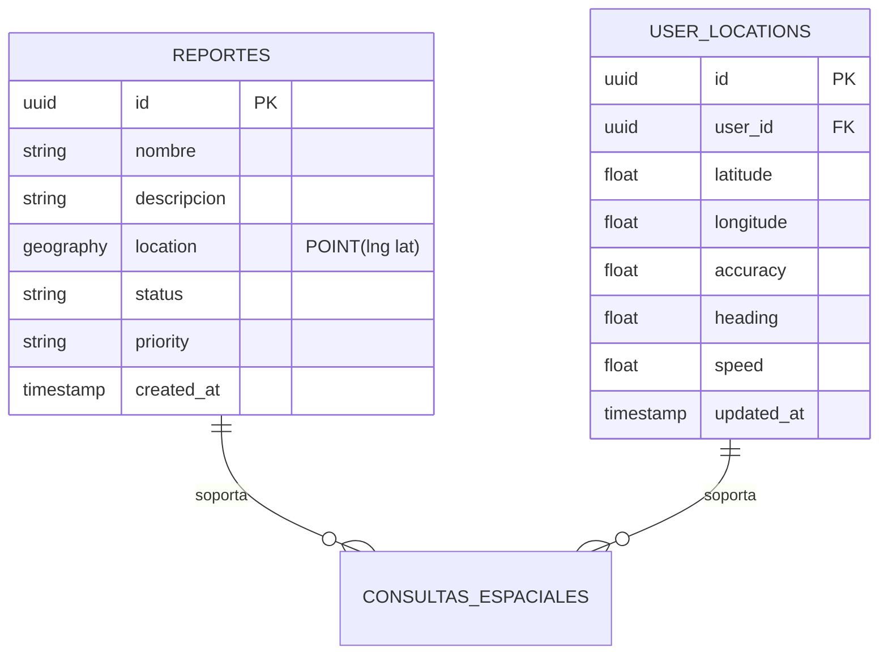
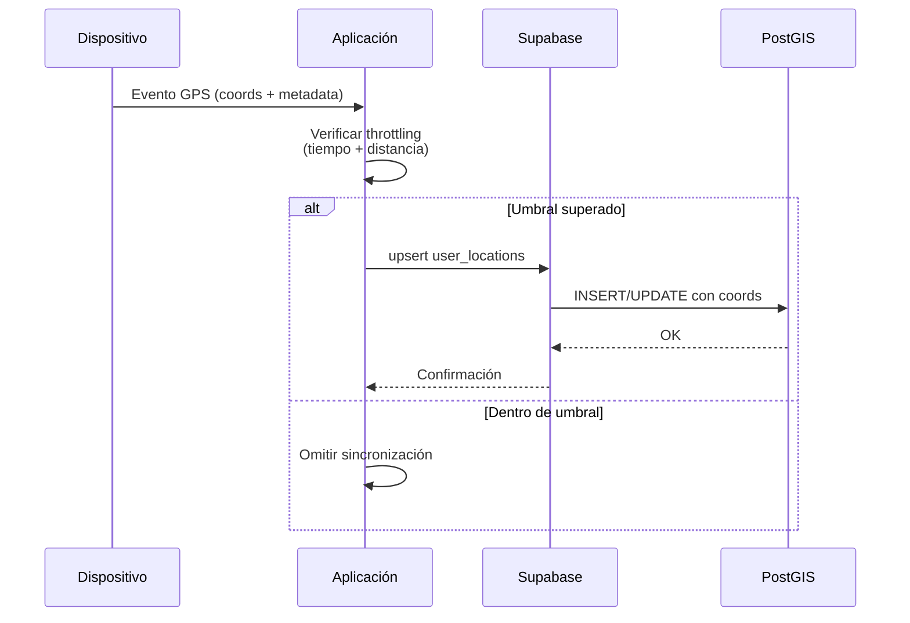
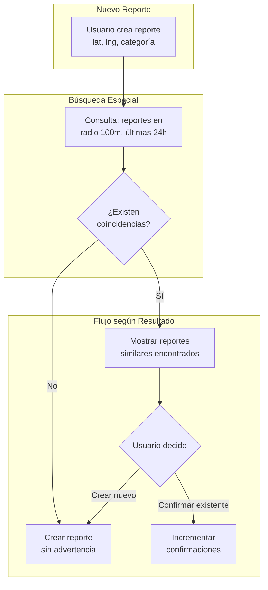
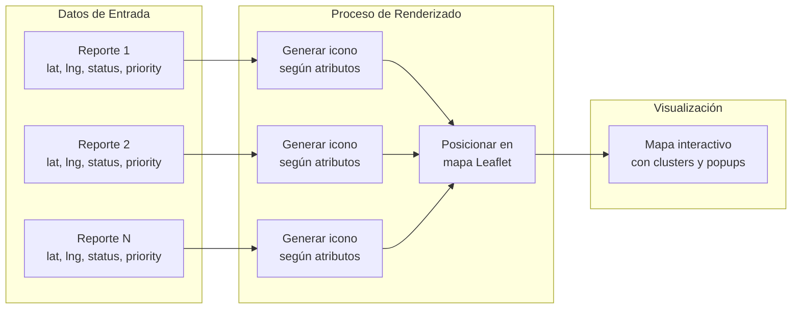
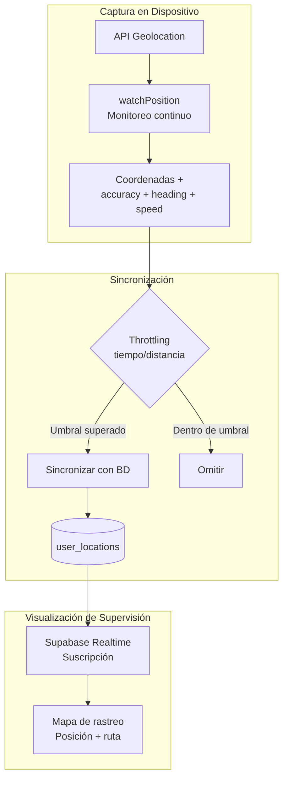
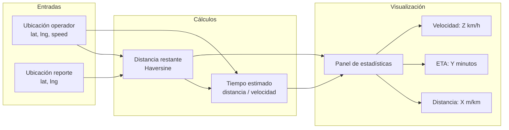
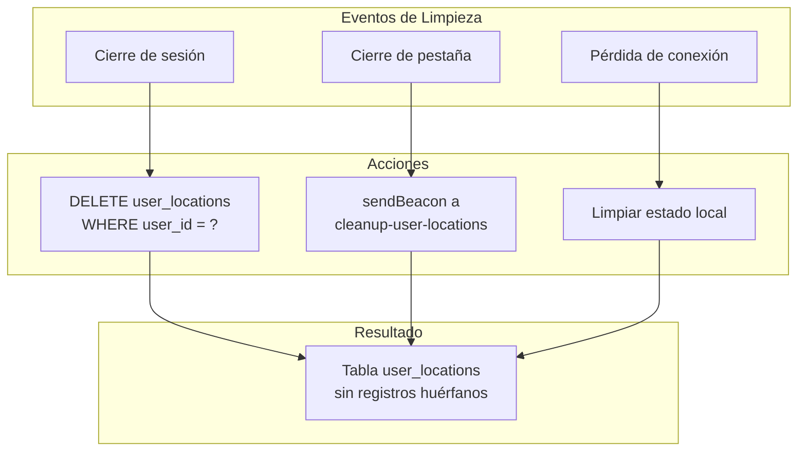

# Capítulo: Desarrollo del Proyecto

## Gestión y Análisis de Datos Espaciales

### 1. Naturaleza Espacial de los Datos en UniAlerta UCE

Los datos gestionados por UniAlerta UCE poseen una dimensión espacial inherente que determina su utilidad operativa. Cada reporte de incidente incluye coordenadas geográficas que representan el punto exacto donde ocurre el problema, transformando registros textuales en entidades georreferenciadas susceptibles de consulta, análisis y visualización espacial.

El campus universitario constituye el ámbito geográfico donde operan estos datos. La extensión del área, la densidad de edificaciones y la movilidad de usuarios generan un volumen continuo de información geolocalizada que requiere mecanismos específicos para su almacenamiento, consulta y representación.

### 2. Problemática de la Gestión de Datos Espaciales

#### 2.1 Limitaciones del Almacenamiento Convencional

El almacenamiento de ubicaciones mediante campos numéricos separados (latitud y longitud como valores independientes) presenta restricciones que afectan la capacidad analítica del sistema:

| Operación Requerida | Con Campos Numéricos | Con Tipo Geográfico |
|---------------------|---------------------|---------------------|
| Buscar reportes en radio de 100m | Cálculo manual en cada consulta | Función nativa `ST_DWithin` |
| Ordenar por proximidad | Implementación cliente-side | Ordenamiento en base de datos |
| Detectar reportes duplicados por ubicación | Comparación punto a punto | Índice espacial optimizado |
| Generar áreas de cobertura | No soportado | Operaciones geométricas nativas |

El procesamiento de consultas espaciales sin soporte nativo de la base de datos transfiere la carga computacional al cliente, incrementando latencia y consumo de recursos en dispositivos móviles.

#### 2.2 Complejidad del Cálculo de Distancias

La determinación de distancias entre puntos geográficos requiere considerar la curvatura terrestre. La distancia euclidiana resulta inadecuada para coordenadas GPS, generando errores que se magnifican con la separación entre puntos.

```mermaid
flowchart TB
    subgraph "Problema: Distancia Euclidiana"
        P1[Punto A: lat₁, lng₁]
        P2[Punto B: lat₂, lng₂]
        P1 --> EUCL[Distancia plana<br/>√((lat₂-lat₁)² + (lng₂-lng₁)²)]
        EUCL --> ERR[❌ Error significativo<br/>No considera curvatura]
    end
    
    subgraph "Solución: Distancia Geodésica"
        P3[Punto A: lat₁, lng₁]
        P4[Punto B: lat₂, lng₂]
        P3 --> HAVER[Fórmula de Haversine<br/>Modelo esférico terrestre]
        P4 --> HAVER
        HAVER --> OK[✅ Distancia real en metros]
    end
```

El sistema requiere cálculos de distancia para múltiples funcionalidades: detección de reportes similares, asignación por proximidad, notificaciones basadas en ubicación y navegación asistida. Sin un mecanismo estandarizado, cada funcionalidad implementaría su propia lógica con posibles inconsistencias.

#### 2.3 Ausencia de Capacidades Analíticas

Los canales tradicionales de gestión de incidentes carecen de herramientas para responder preguntas operativas basadas en la dimensión espacial:

- ¿Cuáles son las zonas con mayor concentración de incidentes?
- ¿Existen patrones geográficos recurrentes por tipo de problema?
- ¿Qué áreas del campus requieren atención prioritaria de mantenimiento?
- ¿Cómo se distribuyen los reportes activos en relación con los operadores disponibles?

Estas interrogantes demandan capacidades de análisis espacial que trascienden el registro y consulta básica de datos.

### 3. Modelo de Datos Espaciales Implementado

UniAlerta UCE almacena la información geográfica utilizando el tipo de dato `geography(POINT, 4326)` proporcionado por PostGIS. Este modelo presenta características específicas:

| Característica | Descripción |
|----------------|-------------|
| Tipo geométrico | POINT (punto bidimensional) |
| Sistema de referencia | WGS84 (SRID 4326) |
| Unidad de coordenadas | Grados decimales |
| Cálculos de distancia | Geodésicos (sobre elipsoide) |
| Compatibilidad | Estándar GPS y servicios de mapas |



### 4. Operaciones Espaciales Fundamentales

El sistema implementa un conjunto de operaciones espaciales que habilitan las funcionalidades de gestión de incidentes:

#### 4.1 Cálculo de Distancia Geodésica

La distancia entre dos puntos se calcula utilizando la fórmula de Haversine, que modela la Tierra como una esfera de radio 6371 km:

```mermaid
flowchart LR
    subgraph "Entrada"
        A[Coordenadas A<br/>lat₁, lng₁]
        B[Coordenadas B<br/>lat₂, lng₂]
    end
    
    subgraph "Proceso Haversine"
        A --> DELTA[Calcular deltas<br/>Δlat, Δlng]
        B --> DELTA
        DELTA --> TRIG[Funciones trigonométricas<br/>sin, cos, atan2]
        TRIG --> DIST[Distancia = 2R × arctan2(√a, √(1-a))]
    end
    
    subgraph "Resultado"
        DIST --> KM[Distancia en km<br/>Precisión métrica]
    end
```

Esta operación se utiliza en:
- Verificación de proximidad para geofencing
- Cálculo de distancia usuario-reporte para navegación
- Ordenamiento de resultados por cercanía

#### 4.2 Consulta de Reportes en Radio

El sistema consulta reportes ubicados dentro de un radio específico respecto a un punto de referencia. Esta operación combina filtrado espacial con criterios temporales y de clasificación:

```mermaid
flowchart TB
    subgraph "Parámetros de Consulta"
        P[Punto de referencia<br/>lat, lng]
        R[Radio: 100 metros]
        T[Ventana: 24 horas]
        C[Categoría: opcional]
    end
    
    subgraph "Proceso de Filtrado"
        P --> SPATIAL[Filtro espacial<br/>ST_DWithin]
        R --> SPATIAL
        SPATIAL --> TEMPORAL[Filtro temporal<br/>created_at > now() - 24h]
        T --> TEMPORAL
        TEMPORAL --> CATEG[Filtro categoría<br/>categoria_id = ?]
        C --> CATEG
    end
    
    subgraph "Resultado"
        CATEG --> SORT[Ordenar por distancia<br/>ASC]
        SORT --> LIST[Lista de reportes<br/>+ distancia calculada]
    end
```

Esta funcionalidad soporta la detección de reportes similares, permitiendo identificar posibles duplicados antes de crear un nuevo registro.

#### 4.3 Sincronización de Ubicaciones en Tiempo Real

El sistema mantiene un registro actualizado de la ubicación de usuarios activos, habilitando consultas de proximidad dinámica:



El throttling aplicado (mínimo 10 segundos y 10 metros de desplazamiento) optimiza el consumo de recursos sin comprometer la precisión del monitoreo.

### 5. Detección de Reportes Similares por Proximidad Espacial

Una funcionalidad crítica del sistema es la identificación de reportes potencialmente duplicados basada en criterios espaciales y temáticos:

| Criterio | Umbral | Justificación |
|----------|--------|---------------|
| Distancia máxima | 100 metros | Radio caminable, mismo punto de incidente |
| Ventana temporal | 24 horas | Vigencia razonable para incidentes activos |
| Coincidencia de categoría | Opcional | Misma clasificación sugiere mismo problema |



Este mecanismo reduce la duplicación de registros sobre un mismo incidente y permite a los usuarios confirmar reportes existentes, agregando peso a la urgencia del problema ya identificado.

### 6. Visualización de Distribución Espacial

El sistema proporciona representaciones visuales de la distribución geográfica de incidentes, habilitando análisis que serían imposibles con listados textuales.

#### 6.1 Mapa de Marcadores

Cada reporte activo se representa como un marcador posicionado en sus coordenadas exactas. La iconografía diferencia estados, prioridades y categorías:



#### 6.2 Mapa de Calor (Heatmap)

Para análisis de densidad, el sistema genera mapas de calor que representan la concentración de incidentes por zona geográfica:

| Aspecto | Implementación |
|---------|----------------|
| Biblioteca | leaflet.heat |
| Datos de entrada | Array de [lat, lng, intensidad] |
| Radio de influencia | 25 píxeles (configurable) |
| Difuminado | 15 píxeles |
| Gradiente de color | Azul → Cyan → Verde → Amarillo → Rojo |

```mermaid
flowchart TB
    subgraph "Origen de Datos"
        REP[(Reportes con<br/>coordenadas)]
    end
    
    subgraph "Procesamiento"
        REP --> FILTER[Filtrar por<br/>categoría/tipo/estado]
        FILTER --> POINTS[Extraer puntos<br/>[lat, lng, intensity]]
        POINTS --> HEAT[Algoritmo de<br/>densidad kernel]
    end
    
    subgraph "Renderizado"
        HEAT --> LAYER[Capa heatmap<br/>sobre mapa base]
        LAYER --> GRADIENT[Aplicar gradiente<br/>de colores]
    end
    
    subgraph "Interpretación"
        GRADIENT --> ZONES[Zonas frías<br/>Baja incidencia]
        GRADIENT --> HOTSPOTS[Zonas calientes<br/>Alta concentración]
    end
```

El mapa de calor permite filtrar por categoría o tipo de reporte, generando visualizaciones específicas que revelan patrones de incidencia diferenciados según la clasificación del problema.

### 7. Rastreo de Ubicación para Operadores

El sistema mantiene un registro continuo de la ubicación de operadores asignados a reportes activos, habilitando supervisión y coordinación en tiempo real:



La información de ubicación incluye metadatos que enriquecen la capacidad de análisis:

| Campo | Descripción | Uso en el Sistema |
|-------|-------------|-------------------|
| latitude, longitude | Coordenadas GPS | Posicionamiento en mapa |
| accuracy | Precisión en metros | Indicador de confiabilidad |
| heading | Dirección de movimiento (grados) | Orientación del icono |
| speed | Velocidad en m/s | Estimación de tiempo de llegada |
| updated_at | Marca temporal | Detección de inactividad |

### 8. Cálculo de Estadísticas de Navegación

Cuando un operador se desplaza hacia un reporte asignado, el sistema calcula estadísticas de navegación en tiempo real:



La velocidad se obtiene del sensor GPS cuando está disponible; en caso contrario, se asume una velocidad peatonal promedio de 1.4 m/s para las estimaciones.

### 9. Limpieza y Mantenimiento de Datos Espaciales

El sistema implementa mecanismos de limpieza para mantener la integridad de los datos de ubicación:

| Evento | Acción | Método |
|--------|--------|--------|
| Cierre de sesión | Eliminar ubicación del usuario | DELETE en user_locations |
| Cierre de pestaña | Notificar servidor para limpieza | navigator.sendBeacon |
| Desconexión de red | Eliminar ubicación localmente | Listener offline |
| Inactividad prolongada | Limpieza programada en servidor | Edge function periódica |



### 10. Síntesis de la Gestión de Datos Espaciales

La gestión y análisis de datos espaciales en UniAlerta UCE constituye un subsistema que transforma coordenadas GPS en información operativa accionable:

| Capacidad | Implementación | Beneficio Operativo |
|-----------|----------------|---------------------|
| Almacenamiento geográfico | PostGIS geography(POINT) | Consultas espaciales nativas |
| Cálculo de distancias | Fórmula de Haversine | Precisión geodésica |
| Detección de similares | Consulta en radio + tiempo + categoría | Reducción de duplicados |
| Visualización de densidad | Heatmap con leaflet.heat | Identificación de zonas críticas |
| Rastreo de operadores | Sincronización en tiempo real | Supervisión de atención |
| Navegación asistida | Cálculo de ruta y ETA | Optimización de desplazamiento |

Esta arquitectura de datos espaciales resuelve las limitaciones identificadas en la gestión convencional de incidentes, proporcionando capacidades analíticas que sustentan la toma de decisiones basada en la dimensión geográfica de los problemas reportados.
