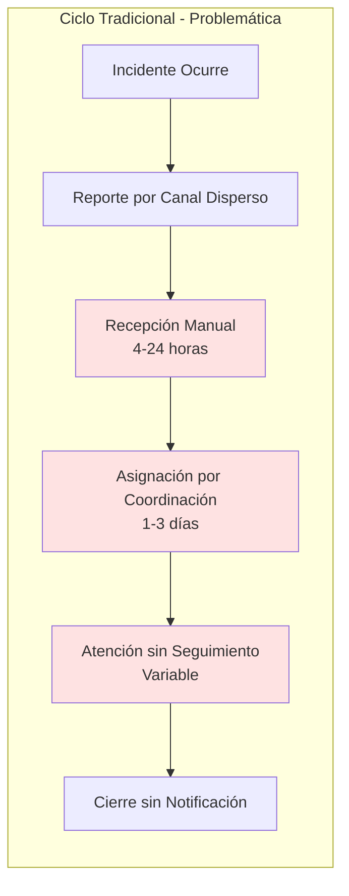
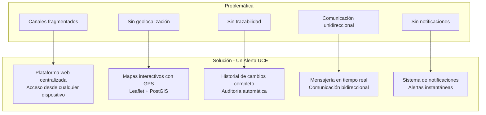
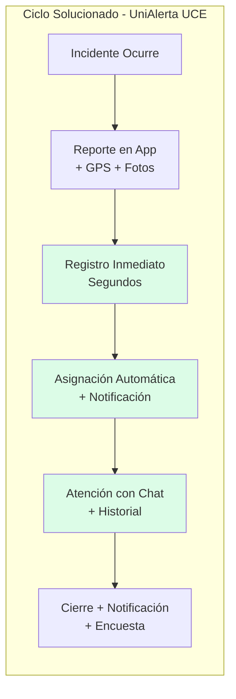
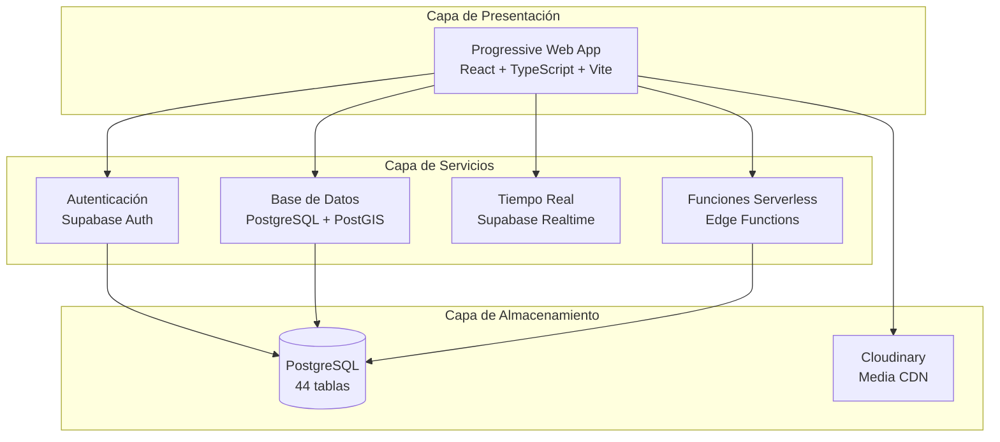

# Capítulo: Desarrollo del Proyecto

## Justificación de la Prueba de Concepto (PoC)

### 1. Contextualización de la Problemática en el Entorno del Software

La Universidad Central del Ecuador opera un campus universitario extenso que genera diariamente múltiples situaciones que requieren atención institucional: incidentes de infraestructura, problemas de seguridad, averías en servicios básicos y diversas irregularidades que afectan el funcionamiento normal de las actividades académicas y administrativas. Antes del desarrollo de UniAlerta UCE, la gestión de estos incidentes se realizaba mediante canales desarticulados —formularios físicos, correos electrónicos, llamadas telefónicas y comunicaciones verbales— que operaban de manera independiente sin un registro centralizado ni mecanismos de seguimiento estructurado.

Esta fragmentación operativa impedía establecer una visión integral del estado de los incidentes reportados, generando vacíos de información que afectaban tanto a los usuarios que desconocían el avance de sus reportes como a los operadores que carecían de herramientas para coordinar respuestas eficientes.

### 2. Problemática Específica que Motivó el Desarrollo

El análisis del contexto operativo previo identificó un conjunto de limitaciones concretas que fundamentaron la necesidad de desarrollar el sistema:

#### 2.1 Limitaciones Funcionales

| Limitación Identificada | Manifestación Operativa | Impacto Directo |
|------------------------|------------------------|-----------------|
| **Ausencia de registro centralizado** | Cada dependencia mantenía registros aislados de los reportes recibidos | Duplicación de casos, inconsistencia en el seguimiento y pérdida de información histórica |
| **Carencia de georreferenciación** | Los reportes describían ubicaciones de forma textual ambigua | Demoras en la localización del incidente y asignación incorrecta de personal por cercanía |
| **Inexistencia de trazabilidad** | No se registraban los cambios de estado ni las acciones realizadas sobre cada reporte | Imposibilidad de auditar procesos, medir tiempos de respuesta y evaluar desempeño |
| **Comunicación unidireccional** | El usuario emitía el reporte y esperaba pasivamente sin retroalimentación | Duplicación de reportes, percepción de ineficiencia y desconocimiento del estado de atención |
| **Clasificación manual inconsistente** | La categorización dependía del criterio del receptor | Estadísticas poco confiables y dificultad para identificar patrones de incidencia |

#### 2.2 Limitaciones Operativas

El ciclo de atención de incidentes presentaba demoras estructurales en cada etapa:

La naturaleza asíncrona de los canales tradicionales introducía latencias significativas: desde la recepción del reporte hasta su registro formal podían transcurrir horas; la asignación a un operador requería coordinación manual entre dependencias; y el seguimiento del avance demandaba consultas directas sin visibilidad para supervisores ni usuarios reportantes.

#### 2.3 Limitaciones Técnicas

Desde la perspectiva técnica, el escenario previo carecía de:

- **Infraestructura de tiempo real**: No existían mecanismos para notificar instantáneamente cambios de estado o asignaciones.
- **Capacidad de captura multimedia**: Los canales tradicionales no soportaban evidencias fotográficas georreferenciadas.
- **Almacenamiento geoespacial**: Sin soporte para consultas por proximidad geográfica.
- **Auditoría sistemática**: Ausencia de registro automático de acciones sobre los datos.

### 3. Justificación de la Necesidad del Software

El desarrollo de UniAlerta UCE responde directamente a los requerimientos derivados de las limitaciones identificadas, articulando una solución que aborda cada deficiencia específica:

#### 3.1 Correspondencia entre Problemática y Solución

#### 3.2 Objetivos Funcionales Cubiertos

El sistema implementado satisface los siguientes objetivos derivados de la problemática:

**Objetivo de Centralización**: Unificar el registro de todos los tipos de incidentes en una plataforma única, accesible desde cualquier dispositivo con navegador web, eliminando la dependencia de formularios físicos o canales dispersos. El sistema opera como Progressive Web Application (PWA), permitiendo instalación en dispositivos móviles y funcionamiento offline parcial.

**Objetivo de Georreferenciación**: Incorporar la ubicación exacta de cada incidente mediante mapas interactivos, capturando coordenadas GPS del dispositivo o permitiendo selección manual sobre el mapa. Esta información se almacena en formato geográfico estandarizado (PostGIS) y habilita consultas por proximidad, visualización en mapas de calor y asignación de operadores por cercanía.

**Objetivo de Trazabilidad**: Implementar un registro completo del historial de cambios, estados y asignaciones de cada reporte. La tabla `reporte_historial` captura cada modificación con marca temporal, usuario responsable, estado anterior y nuevo, comentarios asociados y evidencias adjuntas.

**Objetivo de Comunicación Bidireccional**: Establecer un sistema de mensajería en tiempo real integrado al flujo de gestión, permitiendo conversaciones individuales y grupales entre reportantes, operadores y supervisores. Los mensajes soportan texto, imágenes y referencias a reportes compartidos.

**Objetivo de Notificaciones**: Mantener informados a los usuarios mediante alertas instantáneas sobre cambios de estado, asignaciones, menciones y reportes cercanos a su ubicación. El sistema utiliza suscripciones en tiempo real (Supabase Realtime) para entregar notificaciones sin latencia perceptible.

#### 3.3 Procesos del Sistema que Atienden la Problemática

El software implementa procesos específicos que resuelven cada aspecto de la problemática identificada:

| Proceso Implementado | Problemática Atendida | Mecanismo Técnico |
|---------------------|----------------------|-------------------|
| Creación de reportes con geolocalización | Ubicaciones ambiguas | API Geolocation + Leaflet + PostGIS |
| Flujo de estados con historial | Falta de trazabilidad | Tabla `reporte_historial` con triggers |
| Asignación con notificación | Demoras en asignación | Realtime subscriptions + notificaciones push |
| Mensajería integrada | Comunicación fragmentada | Sistema de conversaciones con WebSocket |
| Dashboard analítico | Estadísticas inconsistentes | Consultas agregadas + visualización Recharts |
| Confirmación de reportes | Reportes duplicados | Detección por proximidad (500m, 24h, misma categoría) |

### 4. Pertinencia de la Prueba de Concepto

La implementación de UniAlerta UCE como Prueba de Concepto se justifica por los siguientes factores:

#### 4.1 Validación de Viabilidad Técnica

El sistema demuestra la factibilidad de integrar tecnologías modernas para resolver la problemática institucional:

- **Arquitectura PWA**: Verificación de que una aplicación web puede ofrecer experiencia similar a aplicaciones nativas, incluyendo instalación, notificaciones y funcionamiento offline.
- **Backend-as-a-Service**: Validación de Supabase como plataforma que provee autenticación, base de datos, tiempo real y funciones serverless sin requerir infraestructura propia.
- **Geolocalización en tiempo real**: Comprobación de la precisión y rendimiento de la captura GPS en dispositivos móviles para el contexto del campus universitario.

#### 4.2 Validación de Flujos Operativos

El PoC permite verificar que los flujos diseñados resuelven efectivamente las limitaciones identificadas:

#### 4.3 Alcance Modular del Sistema

El software desarrollado abarca módulos funcionales que en conjunto atienden la problemática de manera integral:

- **Módulo de Reportes**: Núcleo del sistema que implementa el ciclo completo de gestión de incidentes con geolocalización, evidencias multimedia, estados, asignaciones e historial.
- **Módulo de Dashboard**: Visualización de métricas operativas que permite identificar patrones, medir tiempos de respuesta y tomar decisiones basadas en datos.
- **Módulo de Mensajería**: Canal de comunicación estructurado que elimina la dispersión de medios tradicionales.
- **Módulo de Notificaciones**: Mecanismo de retroalimentación que mantiene informados a todos los actores del proceso.
- **Módulo de Auditoría**: Registro exhaustivo que garantiza trazabilidad y accountability de las acciones realizadas.
- **Módulo de Rastreo**: Seguimiento en tiempo real de operadores asignados para coordinar respuestas in situ.
- **Módulo de Red Social**: Espacio complementario de interacción comunitaria que fomenta la participación activa de la comunidad universitaria.

### 5. Contexto Técnico de la Implementación

El sistema se implementó sobre una arquitectura de tres capas que aprovecha tecnologías modernas para garantizar escalabilidad y mantenibilidad:

La elección de estas tecnologías responde a requerimientos específicos del contexto:

| Tecnología | Justificación en el Contexto |
|------------|------------------------------|
| **React + Vite** | Framework de componentes que permite desarrollo modular y mantenible |
| **TypeScript** | Tipado estático que reduce errores en tiempo de desarrollo |
| **Supabase** | Backend completo sin requerir infraestructura dedicada |
| **PostGIS** | Extensión geoespacial para consultas de proximidad y almacenamiento de coordenadas |
| **Leaflet + OpenStreetMap** | Mapas interactivos sin costos de licenciamiento |
| **Cloudinary** | CDN para almacenamiento y procesamiento de evidencias multimedia |

### 6. Síntesis de la Justificación

El desarrollo de UniAlerta UCE como Prueba de Concepto se fundamenta en la necesidad de resolver una problemática operativa concreta: la gestión fragmentada de incidentes universitarios que generaba demoras, pérdida de información y falta de trazabilidad. El sistema implementado demuestra que mediante la integración de tecnologías modernas —aplicaciones web progresivas, bases de datos geoespaciales, comunicación en tiempo real y arquitecturas serverless— es posible establecer un flujo de gestión centralizado, georreferenciado, trazable y con retroalimentación continua.

La Prueba de Concepto valida tanto la viabilidad técnica de la solución como la pertinencia funcional de los procesos implementados para atender las limitaciones identificadas en el contexto operativo de la institución.
