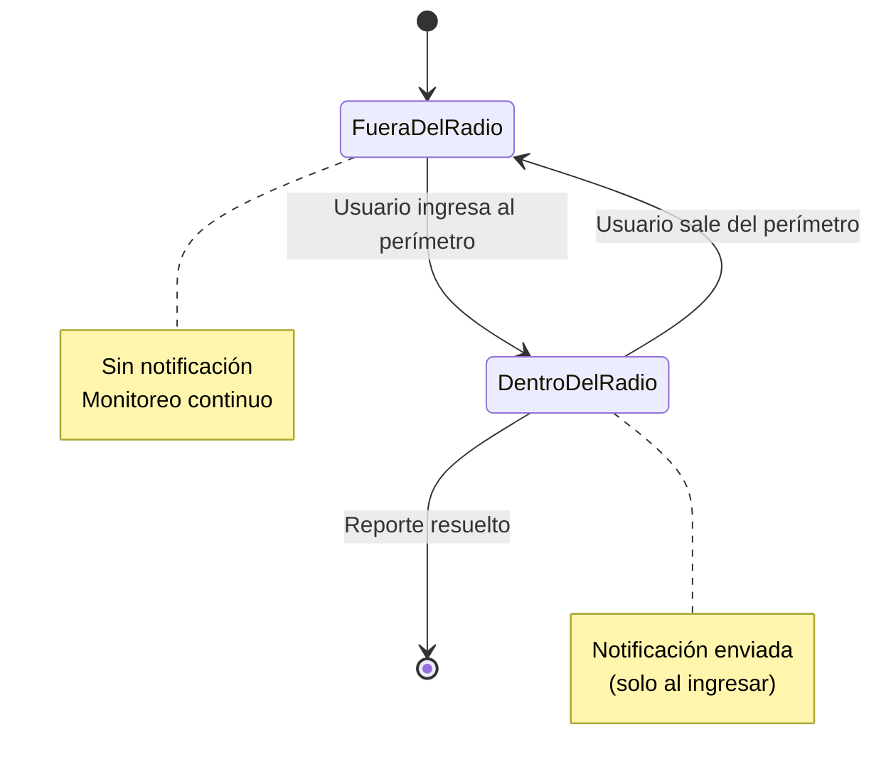
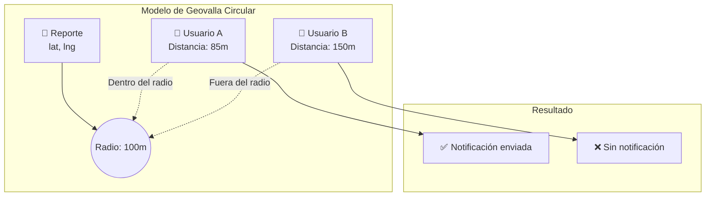
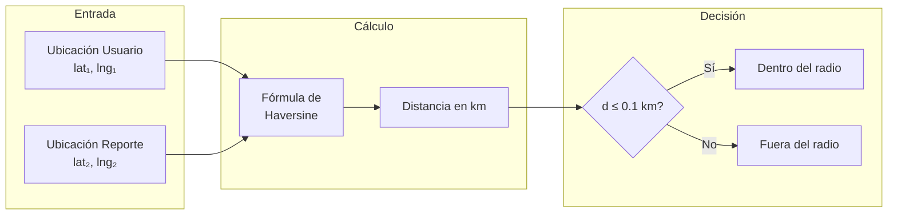
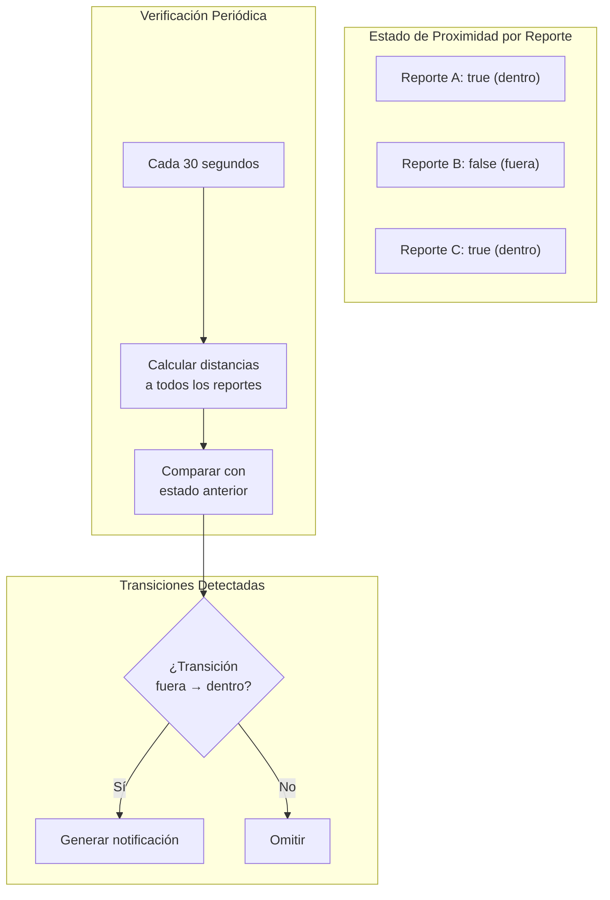
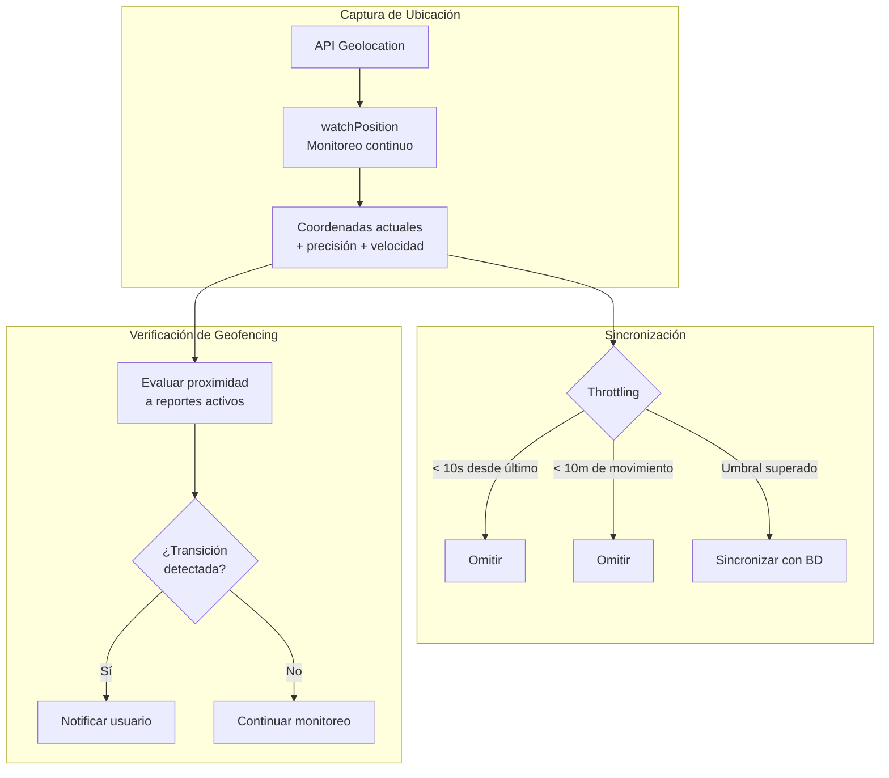
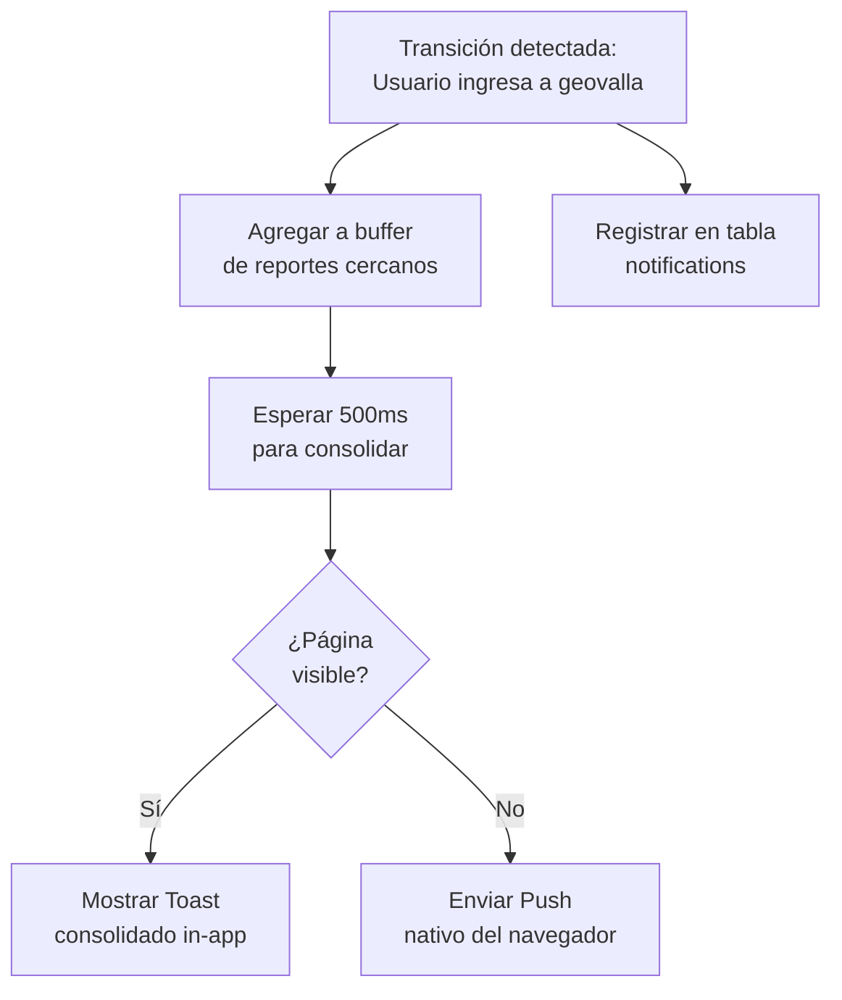
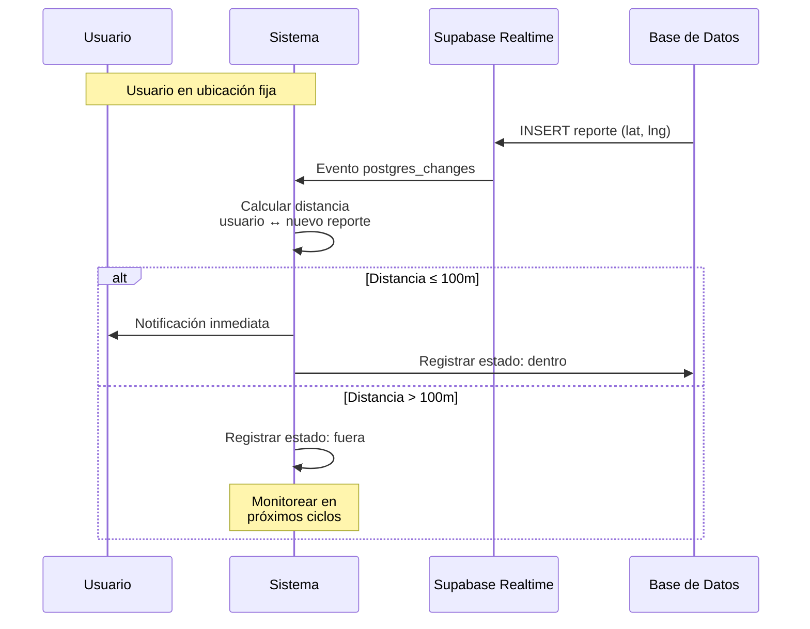
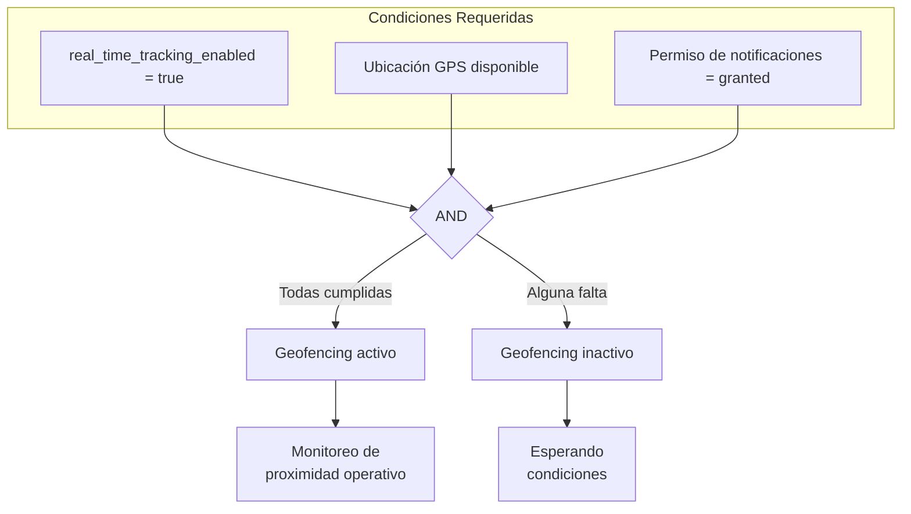

# Capítulo: Desarrollo del Proyecto

## Principios de Geofencing (Geovallas)

### 1. Contextualización del Geofencing en UniAlerta UCE

El sistema UniAlerta UCE requiere notificar a los usuarios sobre incidentes que ocurren en su proximidad física. Esta necesidad surge de la naturaleza espacial-temporal de los reportes gestionados: un incidente de seguridad, una falla de infraestructura o una situación de riesgo en el campus universitario tiene relevancia directa para quienes se encuentran geográficamente cerca del evento.

El concepto de geofencing —establecimiento de perímetros virtuales sobre ubicaciones geográficas reales— constituye el mecanismo técnico que permite al sistema determinar cuándo un usuario ingresa a la zona de influencia de un reporte y, en consecuencia, activar notificaciones contextualizadas.

### 2. Problemática que Motiva la Implementación de Geovallas

#### 2.1 Desconexión entre Usuarios y su Entorno Inmediato

Sin un mecanismo de geofencing, los usuarios del sistema recibirían notificaciones de todos los reportes activos independientemente de su ubicación física. Esta aproximación presenta deficiencias operativas significativas:

| Escenario | Sin Geofencing | Con Geofencing |
|-----------|---------------|----------------|
| Usuario en Facultad de Ingeniería | Recibe reportes de todo el campus | Recibe solo reportes cercanos (≤100m) |
| Volumen de notificaciones | Alto, indiscriminado | Bajo, contextualizado |
| Relevancia del contenido | Variable | Alta (proximidad garantizada) |
| Fatiga de notificaciones | Probable | Minimizada |
| Acción del usuario | Incierta | Posible (está físicamente cerca) |

La sobrecarga de notificaciones irrelevantes conduce a que los usuarios desactiven las alertas del sistema, anulando el propósito fundamental de mantenerlos informados sobre situaciones que los afectan directamente.

#### 2.2 Imposibilidad de Detectar Transiciones Espaciales

El sistema requiere distinguir entre dos estados para cada par usuario-reporte:

1. **Fuera del radio**: El usuario no está en proximidad del incidente
2. **Dentro del radio**: El usuario se encuentra en la zona de influencia

La transición del estado 1 al estado 2 constituye el evento que debe disparar la notificación. Sin geofencing, esta detección resulta imposible ya que no existe monitoreo continuo de la relación espacial entre usuarios y reportes.

#### 2.3 Ausencia de Conciencia Situacional

Los usuarios que transitan por el campus universitario carecen de información sobre incidentes activos en su trayectoria. Un estudiante podría dirigirse hacia un área con un problema de seguridad reportado sin recibir advertencia alguna. El geofencing transforma al sistema de una herramienta pasiva de consulta a un mecanismo activo de alerta contextual.

### 3. Modelo de Geovallas Implementado

UniAlerta UCE implementa geovallas circulares centradas en cada reporte activo. Este modelo fue seleccionado por las siguientes razones técnicas:

- **Simplicidad computacional**: La verificación de pertenencia requiere únicamente calcular la distancia entre dos puntos
- **Uniformidad del radio**: Todos los reportes utilizan el mismo umbral de proximidad, simplificando la configuración
- **Compatibilidad con GPS**: Las coordenadas del dispositivo móvil se comparan directamente con las coordenadas del reporte

### 4. Parámetros de Configuración del Geofencing

El sistema define constantes que determinan el comportamiento del geofencing:

| Parámetro | Valor | Justificación |
|-----------|-------|---------------|
| Radio de detección | 100 metros | Distancia caminable en ~1 minuto, permite reacción del usuario |
| Intervalo de verificación | 30 segundos | Balance entre responsividad y consumo de recursos |
| Duración de notificación | 15 segundos | Tiempo suficiente para lectura y decisión |

Estos valores fueron establecidos considerando:

1. **Contexto universitario**: El campus presenta alta densidad de edificios y puntos de interés en áreas compactas
2. **Movilidad peatonal**: Los usuarios se desplazan principalmente a pie, con velocidades típicas de 1-1.5 m/s
3. **Capacidad de respuesta**: Un radio de 100 metros permite al usuario decidir si evitar el área o acudir a verificar el incidente

### 5. Mecanismo de Detección de Proximidad

La verificación de geofencing opera mediante el cálculo de distancia geodésica utilizando la fórmula de Haversine, que considera la curvatura terrestre para obtener distancias precisas entre coordenadas GPS:

La fórmula implementada calcula:

$$d = 2R \cdot \arctan2\left(\sqrt{a}, \sqrt{1-a}\right)$$

Donde:
- $R$ = Radio de la Tierra (6371 km)
- $a = \sin²(\Delta lat/2) + \cos(lat₁) \cdot \cos(lat₂) \cdot \sin²(\Delta lng/2)$

### 6. Gestión de Estado de Proximidad

El sistema mantiene un registro del estado de proximidad para cada par usuario-reporte. Este estado permite distinguir entre:

- **Primer ingreso**: El usuario entra al radio por primera vez → Generar notificación
- **Permanencia**: El usuario continúa dentro del radio → No generar notificación duplicada
- **Reingreso**: El usuario salió y volvió a entrar → Evaluar según política

Esta arquitectura de estados evita la generación de notificaciones redundantes cuando el usuario permanece en la misma ubicación o se mueve dentro del radio de un reporte ya notificado.

### 7. Integración con el Flujo de Ubicación del Usuario

El geofencing depende del monitoreo continuo de la posición del usuario. El sistema obtiene las coordenadas mediante la API Geolocation del navegador y las procesa de manera optimizada:

El throttling aplicado (mínimo 10 segundos entre actualizaciones y 10 metros de desplazamiento) reduce el consumo de batería y ancho de banda sin comprometer la capacidad de detección de geofencing.

### 8. Notificaciones Basadas en Geofencing

Cuando se detecta una transición de ingreso al radio de un reporte, el sistema genera notificaciones mediante dos canales complementarios:

| Canal | Condición de Uso | Comportamiento |
|-------|------------------|----------------|
| Toast in-app | Página visible (primer plano) | Notificación visual dentro de la aplicación |
| Push nativo | Página en segundo plano | Notificación del sistema operativo |

El buffer de consolidación (500ms) permite agrupar múltiples detecciones simultáneas en una única notificación, evitando saturar al usuario cuando ingresa a una zona con varios reportes cercanos.

### 9. Suscripción en Tiempo Real a Nuevos Reportes

Además de la verificación periódica, el sistema implementa detección inmediata cuando se crea un nuevo reporte. Si el usuario ya se encuentra dentro del radio del reporte recién creado, recibe notificación sin esperar el siguiente ciclo de verificación:

Este mecanismo de tiempo real complementa la verificación periódica, garantizando que el usuario sea notificado tanto de reportes preexistentes (al acercarse) como de nuevos reportes (al ser creados en su proximidad).

### 10. Requisitos de Habilitación del Geofencing

El funcionamiento del geofencing requiere la convergencia de tres condiciones:

1. **Configuración habilitada**: El usuario debe tener activa la opción `real_time_tracking_enabled` en sus preferencias
2. **Ubicación disponible**: El dispositivo debe proporcionar coordenadas GPS válidas
3. **Permisos concedidos**: El navegador debe tener autorización para enviar notificaciones

Si alguna de estas condiciones no se cumple, el sistema suspende el monitoreo de geofencing sin afectar otras funcionalidades de la aplicación.

### 11. Síntesis de la Arquitectura de Geofencing

El geofencing en UniAlerta UCE constituye un subsistema que transforma la relación entre usuarios y reportes de consulta pasiva a alerta proactiva. La arquitectura implementada presenta las siguientes características:

| Aspecto | Implementación |
|---------|----------------|
| Geometría de geovalla | Circular, radio fijo de 100 metros |
| Frecuencia de verificación | Cada 30 segundos + tiempo real para nuevos reportes |
| Cálculo de distancia | Fórmula de Haversine (precisión geodésica) |
| Gestión de estados | Registro por par usuario-reporte para evitar duplicados |
| Canales de notificación | Toast in-app + Push nativo según visibilidad |
| Consolidación | Buffer de 500ms para agrupar detecciones simultáneas |
| Dependencias | GPS del dispositivo + permisos del navegador + configuración de usuario |

Esta implementación resuelve la desconexión identificada entre los usuarios y su entorno físico, proporcionando alertas contextualizadas que incrementan la utilidad del sistema de gestión de incidentes en el contexto del campus universitario.
