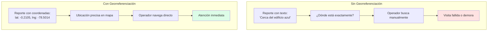
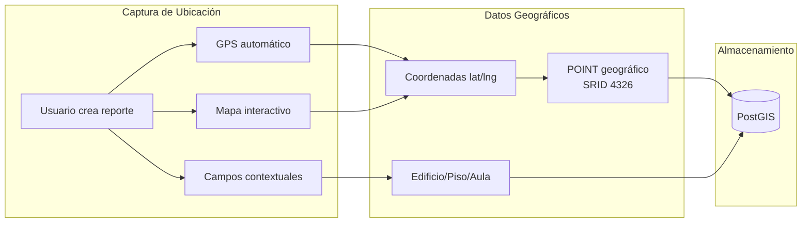
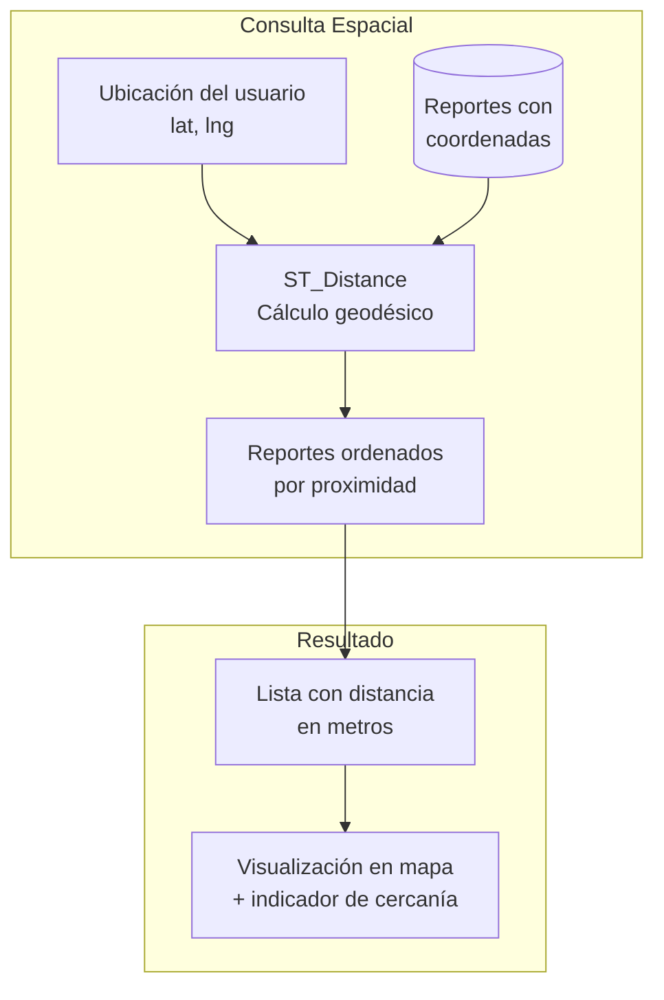
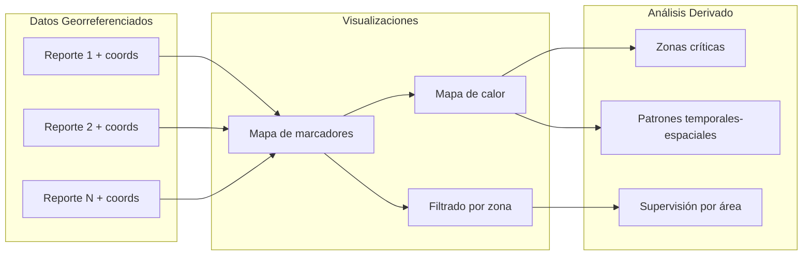
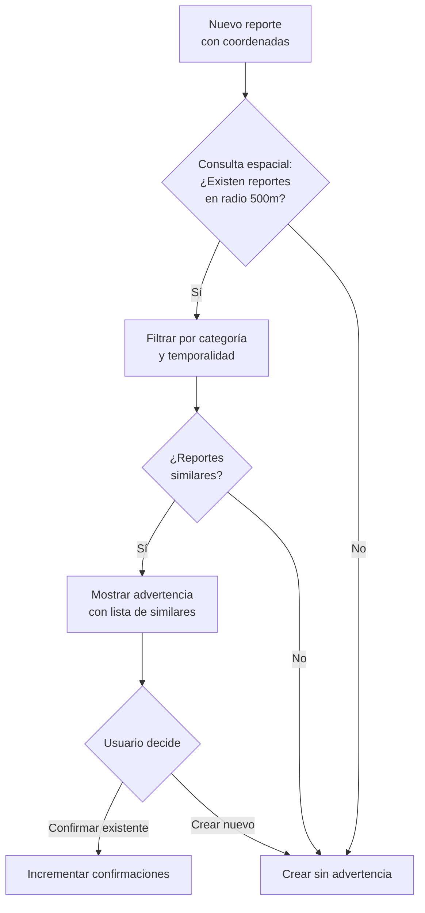
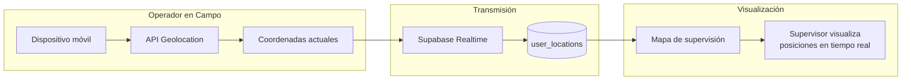

# Capítulo: Desarrollo del Proyecto

## Relevancia de las Tecnologías GIS y Geolocalización

### 1. Naturaleza Espacial de los Incidentes en el Contexto del Software

Los incidentes gestionados por UniAlerta UCE poseen una dimensión inherentemente espacial: cada reporte —ya sea una falla de infraestructura, un problema de seguridad o una anomalía en servicios— ocurre en una ubicación física específica dentro del campus universitario. Esta ubicación determina la jurisdicción del caso, los recursos necesarios para atenderlo, el personal más adecuado según proximidad y la posibilidad de identificar patrones geográficos de incidencia.

El campus de la Universidad Central del Ecuador abarca un área extensa con múltiples edificios, áreas verdes, estacionamientos y vías de circulación. La gestión eficiente de incidentes en este contexto requiere la capacidad de capturar, almacenar, consultar y visualizar información georreferenciada con precisión métrica, funcionalidad que los canales tradicionales de reporte no proporcionaban.

### 2. Problemática del Direccionamiento Descriptivo

Previo al desarrollo de UniAlerta UCE, los reportes de incidentes dependían de descripciones textuales para indicar la ubicación del problema. Este enfoque presentaba deficiencias estructurales que afectaban directamente la operación del sistema de atención:

#### 2.1 Ambigüedad Locacional

Las descripciones textuales generaban interpretaciones múltiples que dificultaban la localización precisa:

| Descripción Tradicional | Ambigüedad Resultante | Consecuencia Operativa |
|------------------------|----------------------|------------------------|
| "Baño del segundo piso" | ¿De qué edificio? ¿Ala norte o sur? | Visita fallida del operador |
| "Cerca de la cancha" | Múltiples canchas en el campus | Demora en localización |
| "Pasillo de Ingeniería" | ¿Civil, Sistemas, Eléctrica? | Asignación incorrecta de dependencia |
| "Estacionamiento de profesores" | Sin referencia a zona específica | Búsqueda extendida |
| "Frente a la biblioteca" | ¿Entrada principal, lateral, posterior? | Interpretación subjetiva |

Estas ambigüedades no constituían casos excepcionales sino la norma operativa, ya que el lenguaje natural carece de la precisión requerida para identificar puntos específicos en un espacio geográfico extenso.

#### 2.2 Imposibilidad de Consultas Espaciales

Sin coordenadas geográficas almacenadas, resultaba imposible realizar operaciones que el sistema requería:

- Identificar reportes cercanos a un punto dado para detectar duplicados
- Asignar operadores según proximidad geográfica al incidente
- Generar mapas de calor que revelaran zonas con alta concentración de problemas
- Filtrar reportes por área geográfica para supervisores de zonas específicas
- Calcular distancias entre la ubicación del usuario y los incidentes activos

### 3. Requerimientos de Geolocalización en UniAlerta UCE

El sistema implementa capacidades de geolocalización que resuelven las limitaciones del direccionamiento descriptivo mediante tres mecanismos complementarios:

#### 3.1 Captura Automática de Coordenadas GPS

Al crear un reporte, el usuario puede autorizar el acceso a la ubicación de su dispositivo. El sistema utiliza la API Geolocation del navegador para obtener las coordenadas precisas (latitud y longitud) del punto donde se encuentra el usuario. Esta información se registra automáticamente sin requerir intervención manual, eliminando la ambigüedad inherente a las descripciones textuales.

#### 3.2 Selección Manual en Mapa Interactivo

Para incidentes donde el usuario no se encuentra físicamente en el lugar del problema, el sistema proporciona un mapa interactivo (Leaflet + OpenStreetMap) que permite señalar la ubicación exacta mediante interacción táctil o con cursor. El usuario visualiza el campus universitario y puede hacer zoom para identificar con precisión el punto del incidente.

#### 3.3 Información Contextual Complementaria

Las coordenadas geográficas se complementan con campos estructurados opcionales —edificio, piso, aula/sala, punto de referencia— que combinan precisión geométrica con contexto semántico comprensible para los operadores.

### 4. Almacenamiento Geoespacial con PostGIS

El sistema almacena la información de ubicación utilizando PostGIS, extensión geoespacial de PostgreSQL que proporciona tipos de datos geográficos y funciones espaciales. Esta elección tecnológica responde a requerimientos específicos del software:

#### 4.1 Tipo de Dato Geográfico

Los reportes almacenan su ubicación en campos de tipo `geography(POINT, 4326)`, que representa un punto sobre el modelo elipsoidal de la Tierra utilizando el sistema de referencia espacial WGS84 (SRID 4326). Este formato es compatible con las coordenadas proporcionadas por dispositivos GPS y permite cálculos de distancia geodésica precisos.

#### 4.2 Funciones Espaciales Implementadas

El sistema utiliza funciones de PostGIS para operaciones que serían imposibles con almacenamiento textual:

| Función Espacial | Uso en UniAlerta UCE |
|-----------------|---------------------|
| `ST_DWithin()` | Detectar reportes similares en radio de 500 metros |
| `ST_Distance()` | Calcular distancia entre usuario y cada reporte |
| `ST_MakePoint()` | Construir puntos geográficos desde coordenadas |
| `ST_AsGeoJSON()` | Exportar geometrías para visualización en Leaflet |
| `ST_SetSRID()` | Asignar sistema de referencia a coordenadas |

#### 4.3 Consulta de Reportes con Distancia

El sistema implementa una función de base de datos (`get_reportes_with_distance`) que retorna los reportes ordenados por proximidad al usuario, calculando la distancia geodésica en metros:

### 5. Visualización Espacial de Reportes

La dimensión geográfica de los datos habilita visualizaciones que serían imposibles con información puramente textual:

#### 5.1 Mapa de Distribución

El sistema presenta todos los reportes activos sobre un mapa del campus universitario. Cada reporte se representa como un marcador en su ubicación exacta, con iconografía diferenciada según categoría, estado o prioridad. Esta visualización permite a supervisores identificar rápidamente la distribución espacial de incidentes sin necesidad de revisar listados textuales.

#### 5.2 Mapa de Calor (Heatmap)

Para análisis de patrones, el sistema genera mapas de calor que representan la densidad de incidentes por zona. Las áreas con mayor concentración de reportes se visualizan con colores más intensos, facilitando la identificación de puntos críticos recurrentes. Esta información resulta valiosa para:

- Planificación preventiva de mantenimiento
- Asignación estratégica de recursos humanos
- Detección de problemas estructurales por zona

#### 5.3 Navegación Asistida

Para operadores asignados a un reporte, el sistema proporciona funcionalidad de navegación que calcula la ruta desde su ubicación actual hasta el punto del incidente. Esta característica reduce el tiempo de desplazamiento y elimina la incertidumbre sobre la ubicación exacta del problema a atender.

### 6. Detección de Reportes Similares por Proximidad

Una funcionalidad crítica habilitada por la geolocalización es la detección automática de reportes potencialmente duplicados. Cuando un usuario crea un nuevo reporte, el sistema consulta si existen reportes previos que cumplan los siguientes criterios:

- **Proximidad geográfica**: Ubicados a menos de 500 metros del nuevo reporte
- **Categoría coincidente**: Clasificados en la misma categoría de incidente
- **Temporalidad reciente**: Creados en las últimas 24 horas

Esta funcionalidad reduce la duplicación de casos sobre un mismo incidente y permite a los usuarios confirmar reportes existentes en lugar de crear nuevos, agregando peso a la urgencia del problema ya registrado.

### 7. Asignación de Operadores por Proximidad

El sistema utiliza la información geográfica para optimizar la asignación de reportes a operadores. Cuando un supervisor asigna un caso, puede visualizar la ubicación de los operadores disponibles (aquellos que han compartido su ubicación mediante el módulo de rastreo) y seleccionar al más cercano al punto del incidente.

Esta capacidad transforma la asignación de un proceso basado en disponibilidad general a uno basado en proximidad geográfica, reduciendo tiempos de desplazamiento y mejorando la eficiencia operativa.

| Criterio de Asignación | Sin Geolocalización | Con Geolocalización |
|-----------------------|---------------------|---------------------|
| Base de decisión | Disponibilidad declarada | Proximidad calculada |
| Tiempo de desplazamiento | Variable e impredecible | Minimizado por cercanía |
| Visualización | Lista de nombres | Mapa con posiciones |
| Precisión | Estimación subjetiva | Cálculo geodésico |

### 8. Notificaciones por Cercanía Geográfica

El sistema implementa un mecanismo de notificaciones basado en proximidad: cuando se crea un nuevo reporte, los usuarios que se encuentran geográficamente cerca del incidente reciben una alerta. Esta funcionalidad:

- Permite a usuarios cercanos confirmar la existencia del problema
- Advierte sobre situaciones que podrían afectarlos directamente
- Fomenta la participación comunitaria en la identificación de incidentes

El cálculo de proximidad se realiza comparando las coordenadas del nuevo reporte con la última ubicación conocida de cada usuario, utilizando las funciones espaciales de PostGIS para determinar quiénes se encuentran dentro del radio de notificación configurado.

### 9. Rastreo en Tiempo Real de Operadores

El módulo de rastreo geográfico (`GeoTracking`) permite visualizar en tiempo real la ubicación de operadores asignados a reportes activos. Esta funcionalidad está diseñada para:

- **Coordinación de respuestas**: Supervisores pueden observar el desplazamiento de operadores hacia los incidentes
- **Verificación de atención**: Confirmar que el operador llegó a la ubicación del reporte
- **Optimización de rutas**: Reasignar casos si un operador cercano queda disponible

El sistema almacena las ubicaciones en la tabla `user_locations` con marca temporal, permitiendo reconstruir la trayectoria del operador durante la atención de un reporte.

### 10. Síntesis de la Relevancia GIS en el Sistema

Las tecnologías de geolocalización y sistemas de información geográfica constituyen un componente estructural de UniAlerta UCE, no un añadido opcional. La problemática que motivó el desarrollo del sistema —gestión fragmentada de incidentes con ubicaciones ambiguas— requería necesariamente la incorporación de capacidades espaciales para:

| Capacidad Espacial | Problema Resuelto |
|-------------------|-------------------|
| Captura GPS/mapa | Ambigüedad de direcciones textuales |
| Almacenamiento PostGIS | Imposibilidad de consultas por proximidad |
| Visualización en mapas | Falta de visión espacial de incidentes |
| Detección de similares | Duplicación de reportes |
| Asignación por cercanía | Asignación ineficiente de operadores |
| Notificaciones por proximidad | Desconexión entre usuarios y entorno |
| Rastreo de operadores | Falta de visibilidad sobre atención en campo |

La integración de Leaflet para visualización, OpenStreetMap para cartografía base y PostGIS para almacenamiento y consultas espaciales configura una arquitectura geoespacial coherente que resuelve las limitaciones identificadas en el contexto operativo del campus universitario.
