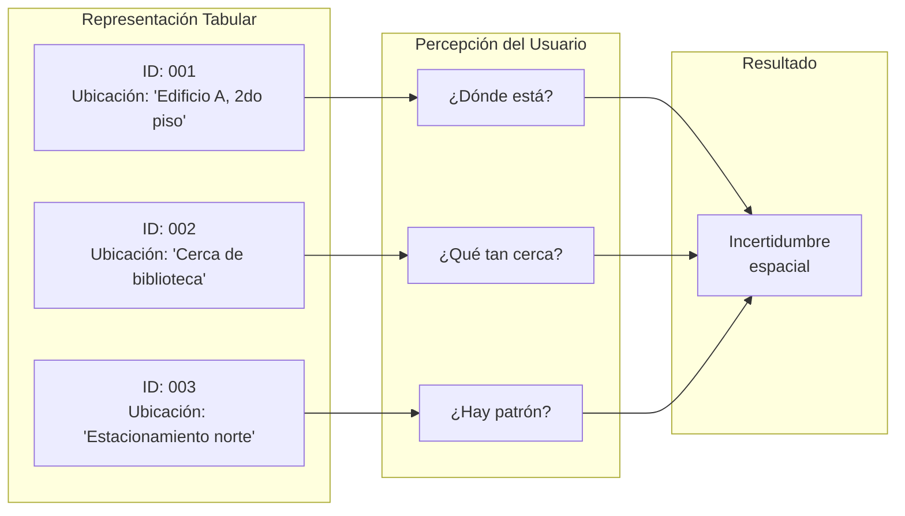
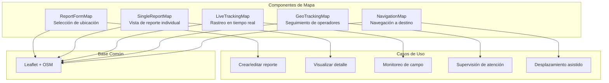
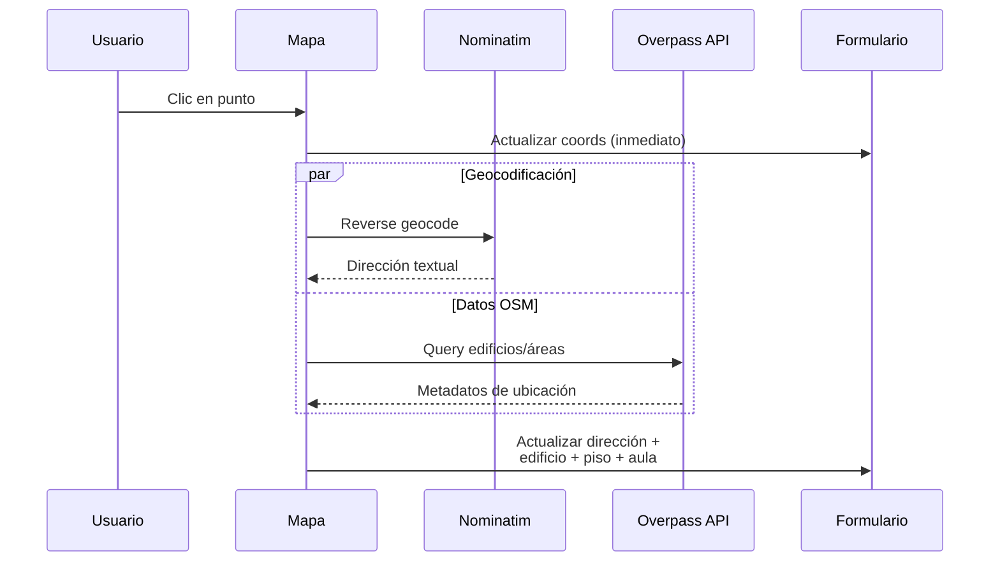
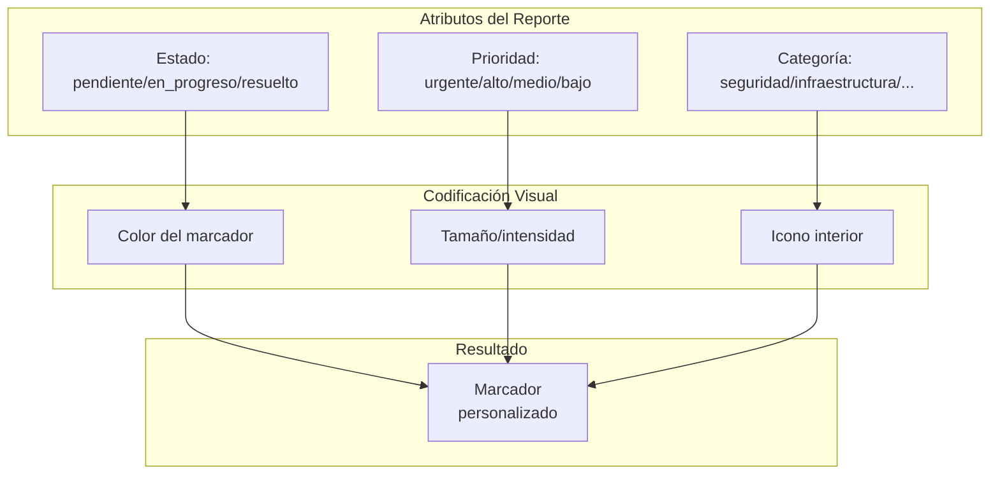
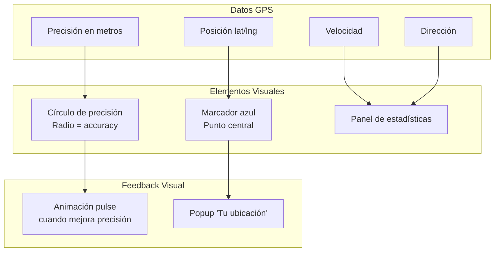
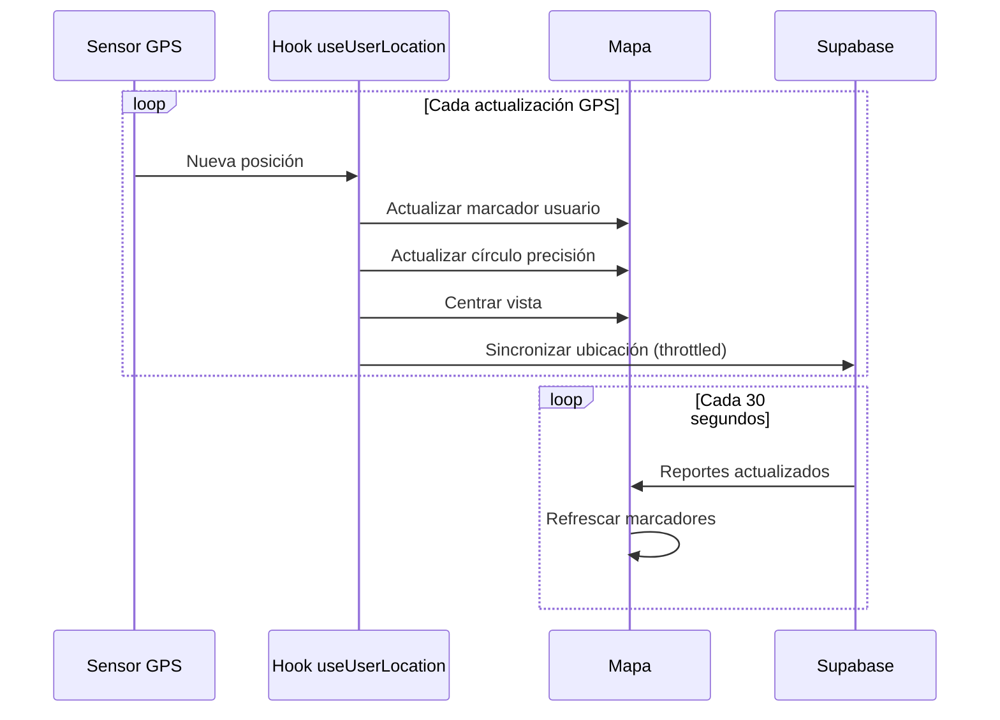
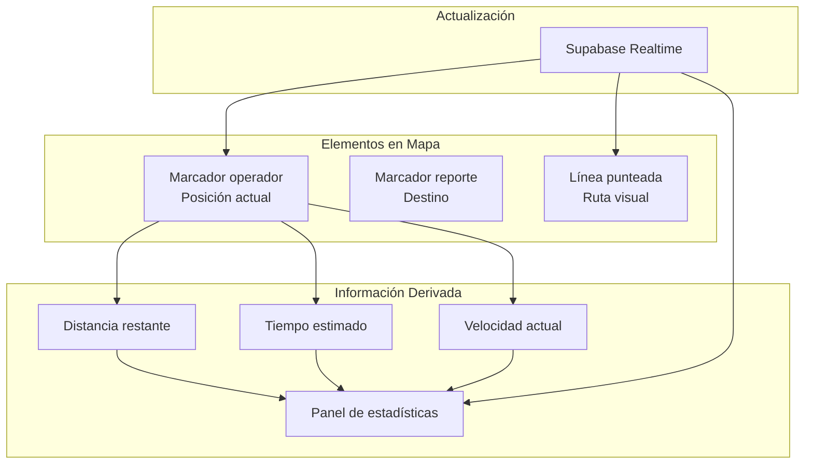
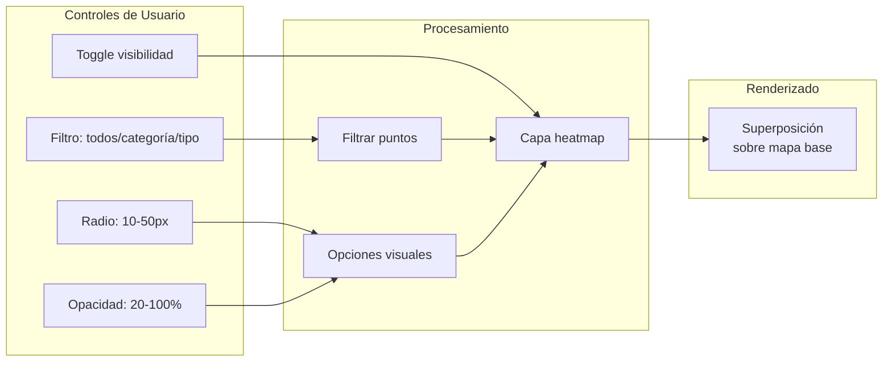
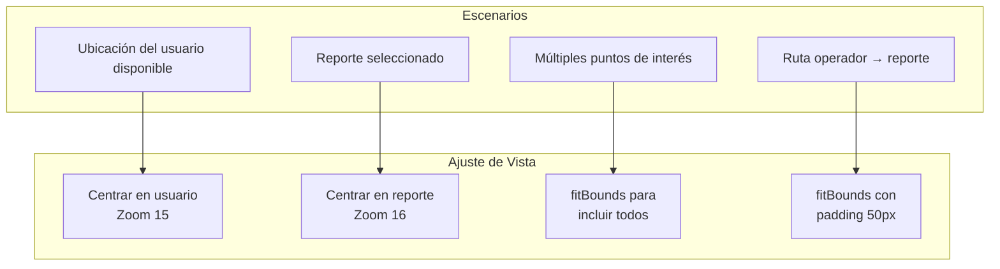

# Capítulo: Desarrollo del Proyecto

## Visualización Cartográfica Interactiva

### 1. Necesidad de Representación Espacial en UniAlerta UCE

La gestión de incidentes en el campus universitario demanda visualización geográfica que trascienda las representaciones tabulares o textuales. Los listados de reportes, independientemente de su ordenamiento o filtrado, carecen de la capacidad de comunicar la dimensión espacial que determina la relevancia operativa de cada incidente.

La visualización cartográfica interactiva responde a requerimientos específicos del sistema:

- Usuarios necesitan identificar la ubicación exacta de un incidente para evitarlo o confirmarlo
- Operadores requieren visualizar la distribución de reportes asignados para planificar desplazamientos
- Supervisores demandan visión panorámica de la situación del campus para asignación estratégica de recursos
- El proceso de creación de reportes necesita un mecanismo de selección de ubicación que no dependa de descripciones textuales

### 2. Problemática de la Visualización Tradicional

#### 2.1 Limitaciones de las Interfaces Tabulares

Los sistemas de gestión de incidentes basados en listados presentan deficiencias que afectan la comprensión espacial:

| Aspecto | Representación Tabular | Representación Cartográfica |
|---------|------------------------|----------------------------|
| Ubicación | Texto descriptivo | Posición visual exacta |
| Proximidad | No perceptible | Inmediatamente visible |
| Distribución | Requiere análisis mental | Patrón visual directo |
| Navegación | Búsqueda por texto | Exploración espacial |
| Contexto geográfico | Ausente | Edificios, calles, áreas verdes |



#### 2.2 Dificultad de Selección de Ubicación

La captura de ubicación mediante formularios textuales genera ambigüedad y errores:

- Usuarios describen ubicaciones con terminología inconsistente
- Referencias relativas ("cerca de", "frente a") dependen de perspectiva
- Nombres de edificios o áreas pueden ser desconocidos para nuevos usuarios
- No existe validación de que la ubicación descrita exista físicamente

El sistema requiere un mecanismo de selección que garantice precisión geográfica independientemente del conocimiento previo del usuario sobre la nomenclatura del campus.

### 3. Arquitectura de Visualización Cartográfica

UniAlerta UCE implementa múltiples componentes de mapa que atienden distintos casos de uso dentro del sistema:



### 4. Mapa de Selección de Ubicación

El componente de selección de ubicación constituye el mecanismo principal para capturar coordenadas precisas durante la creación de reportes.

#### 4.1 Interacciones Soportadas

| Interacción | Resultado | Datos Generados |
|-------------|-----------|-----------------|
| Clic en mapa | Seleccionar punto | Coordenadas + geocodificación inversa |
| Arrastrar marcador | Ajustar posición | Nuevas coordenadas + actualización de dirección |
| Botón "Mi ubicación" | Centrar en GPS | Coordenadas del dispositivo |
| Zoom/pan | Explorar área | Sin cambios en selección |



#### 4.2 Integración con OpenStreetMap

El sistema enriquece la ubicación seleccionada con datos contextuales de OpenStreetMap:

| Campo | Fuente | Ejemplo |
|-------|--------|---------|
| Dirección | Nominatim (geocodificación inversa) | "Av. Universitaria, Quito" |
| Edificio | Overpass API (building) | "Facultad de Ingeniería" |
| Piso | Atributo level del edificio | "2" |
| Aula/Sala | Amenity/room cercano | "Laboratorio 201" |
| Punto de referencia | POI próximo | "Junto a biblioteca" |

Esta información se presenta como sugerencia en el formulario, permitiendo al usuario confirmar o modificar según corresponda.

### 5. Visualización de Reportes en Mapa

Los reportes activos se representan como marcadores posicionados en sus coordenadas exactas, con iconografía que comunica atributos relevantes.

#### 5.1 Codificación Visual de Marcadores



| Estado | Color | Significado Visual |
|--------|-------|-------------------|
| Pendiente | Amarillo (#f59e0b) | Requiere atención |
| En progreso | Azul (#3b82f6) | Siendo atendido |
| Resuelto | Verde (#22c55e) | Completado |
| Rechazado | Rojo (#ef4444) | No procede |
| Cancelado | Gris (#6b7280) | Inactivo |

#### 5.2 Popups Informativos

Al interactuar con un marcador, se despliega un popup con información resumida del reporte:

- Título del reporte
- Estado actual
- Prioridad asignada
- Dirección o referencia
- Acceso al detalle completo

### 6. Visualización de Ubicación del Usuario

El sistema representa la posición del usuario en el mapa con elementos visuales que comunican precisión y estado:



| Elemento | Representación | Propósito |
|----------|----------------|-----------|
| Marcador del usuario | Círculo azul con borde blanco | Posición actual |
| Círculo de precisión | Área semitransparente | Margen de error GPS |
| Animación pulse | Expansión visual al mejorar | Feedback de calidad |
| Panel de estadísticas | Tarjeta con datos | Información técnica |

### 7. Mapa de Rastreo en Tiempo Real

El componente de rastreo permite visualizar simultáneamente la ubicación del usuario y los reportes activos, con actualización continua:

#### 7.1 Flujo de Actualización



#### 7.2 Controles de Rastreo

| Control | Función | Estado Visual |
|---------|---------|---------------|
| Iniciar/Detener | Toggle del tracking GPS | Botón verde/rojo |
| Centrar | Reposicionar vista en usuario | Habilitado cuando hay ubicación |
| Panel de stats | Mostrar precisión/velocidad/altitud | Visible durante tracking |

### 8. Mapa de Seguimiento de Operadores

Para supervisión de atención a incidentes, el sistema proporciona visualización del desplazamiento de operadores hacia reportes asignados:



| Estadística | Cálculo | Visualización |
|-------------|---------|---------------|
| Distancia | Haversine(operador, reporte) | "X metros" o "X km" |
| ETA | distancia / velocidad | "~Y minutos" |
| Velocidad | GPS speed × 3.6 | "Z km/h" |
| Última actualización | Timestamp de sync | "Hace N segundos" |

### 9. Mapa de Calor (Heatmap)

La visualización de densidad permite identificar patrones espaciales de incidencia mediante representación térmica:

#### 9.1 Configuración del Heatmap



#### 9.2 Gradiente de Intensidad

El gradiente de color comunica la densidad de reportes por zona:

| Intensidad | Color | Significado |
|------------|-------|-------------|
| 0% - 20% | Azul transparente | Incidencia mínima |
| 20% - 40% | Cyan | Incidencia baja |
| 40% - 60% | Verde | Incidencia moderada |
| 60% - 80% | Amarillo | Incidencia alta |
| 80% - 100% | Rojo | Zona crítica |

Cuando se filtra por categoría o tipo específico, el gradiente adopta el color asociado a dicha clasificación, manteniendo la escala de intensidad.

### 10. Capas de Áreas OSM

El sistema integra información de OpenStreetMap sobre edificios, instalaciones y áreas del campus mediante la API Overpass:

```mermaid
flowchart TB
    subgraph "Consulta Overpass"
        CENTER[Centro del mapa]
        RADIUS[Radio: 500m]
        TYPES[Tipos: building, amenity,<br/>leisure, landuse]
        
        CENTER --> QUERY[Query Overpass QL]
        RADIUS --> QUERY
        TYPES --> QUERY
    end
    
    subgraph "Procesamiento"
        QUERY --> NODES[Nodos (puntos)]
        QUERY --> WAYS[Ways (polígonos)]
        
        NODES --> FILTER[Filtrar por tipo<br/>visible]
        WAYS --> FILTER
    end
    
    subgraph "Renderizado"
        FILTER --> POLY[Polígonos coloreados<br/>por tipo de área]
        FILTER --> LABELS[Etiquetas con<br/>nombres]
        
        POLY --> MAP[Capa sobre<br/>mapa base]
        LABELS --> MAP
    end
```

| Tipo de Área | Color | Ejemplo |
|--------------|-------|---------|
| Edificios | Naranja (#f59e0b) | Facultades, laboratorios |
| Servicios | Azul (#3b82f6) | Bibliotecas, cafeterías |
| Áreas verdes | Verde (#22c55e) | Jardines, parques |
| Estacionamientos | Gris (#6b7280) | Parqueaderos |
| Deportivas | Púrpura (#8b5cf6) | Canchas, gimnasios |

### 11. Interactividad y Navegación

El sistema de mapas implementa patrones de interacción consistentes:

#### 11.1 Gestos Soportados

| Gesto | Escritorio | Móvil | Efecto |
|-------|------------|-------|--------|
| Clic/Tap | Clic izquierdo | Tap | Selección/info |
| Arrastrar | Clic + mover | Un dedo + mover | Pan del mapa |
| Zoom | Scroll/botones | Pinch | Acercar/alejar |
| Doble clic | Doble clic | Doble tap | Zoom in |

#### 11.2 Ajuste Automático de Vista

El mapa ajusta su encuadre automáticamente según el contexto:



### 12. Síntesis de la Visualización Cartográfica

La visualización cartográfica interactiva en UniAlerta UCE transforma datos georreferenciados en representaciones visuales que soportan la operación del sistema de gestión de incidentes:

| Componente | Propósito | Interacciones Clave |
|------------|-----------|---------------------|
| Mapa de formulario | Captura de ubicación precisa | Clic para seleccionar, arrastre para ajustar |
| Mapa de detalle | Visualización de reporte individual | Popup con información, navegación a destino |
| Mapa de rastreo | Monitoreo de posición del usuario | Seguimiento continuo, estadísticas en vivo |
| Mapa de supervisión | Seguimiento de operadores | Ruta visual, ETA, distancia |
| Capa de heatmap | Análisis de densidad | Filtros por categoría/tipo, ajuste de parámetros |
| Capas OSM | Contexto de infraestructura | Toggle de tipos de área, etiquetas |

Esta arquitectura de visualización resuelve las limitaciones de las interfaces tabulares, proporcionando comprensión espacial inmediata que sustenta la toma de decisiones en la gestión de incidentes del campus universitario.
